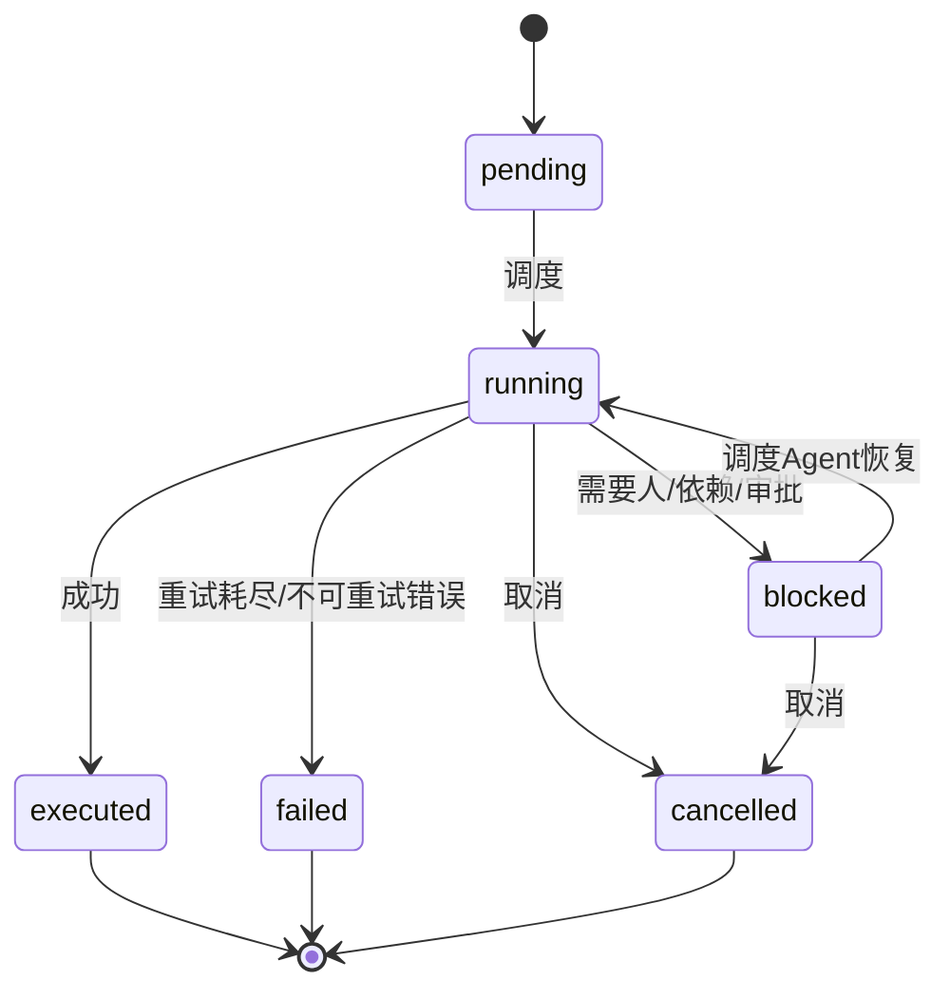

# Graph Run State Machine Design（收敛版）

**Status**: DRAFT (side-conversation proposal, non-authoritative)
**Date**: 2026-08-13
**Related**: `docs/architecture/attempt-tool-loop.md`, `docs/adr/0014-agent-scheduling-framework.md`, `.loom-drafts/loom-graph-engineering-plan.md`, `.loom-drafts/loom-scheduler-supplement-2026-07-27.md`

## 1. 目的

在 Loom 现有状态机之上，落一个最小可用的 Graph Run 执行语义：

- 节点状态机只保留最小集合；
- join 默认 `all_of`；
- 暂停/继续通过受治理的调度 Agent 对话管理；
- 结构性失败通过显式修复节点处理，并携带结构化 RepairContext；
- 不新增第二套状态机，不复用 Graph Harness 论文的完整承诺。

## 2. 设计决策

从 [Graph Harness](https://arxiv.org/html/2604.11378) 只吸收：

- 节点状态机（简化版）；
- `all_of` join 语义；
- 有界执行（timeout + retry budget）；
- 执行上下文与诊断上下文分离（对应 Loom Context Capsule 的 trust 分类）。

明确不吸收：

- `waiting_human` 独立状态（统一用 `blocked`）；
- `first_of` 竞速并行（需要补偿协议，不做）；
- 静态不可变 DAG / 三层分离 / 三级 escalation ladder；
- 确定性 ready-set 调度（Loom 保留事件驱动 Scheduler 权威）。

## 3. 节点状态机



- 终态吸收：`executed / failed / cancelled` 一旦进入不再离开。
- `blocked` 是唯一等待态；`pending` 由确定性 Scheduler 决定何时进 `running`。
- 自动重试是动作不是状态：失败时若错误 `retryable=true` 且 `retry_count < retry_budget`，记 Journal 后重新调度 `running`；否则进 `failed`。

## 4. Join 语义

默认 `all_of`：后继节点在所有前置节点 `executed` 后才进入 ready/pending。`any_of` 作为可选能力保留；不做 `first_of`。

## 5. 失败分类

每个错误携带结构化字段：

```text
error_code
stage
retryable: bool
message（脱敏）
retry_count
```

- 瞬时错误（timeout / rate_limit / 网络）→ `retryable=true`，预算内自动重试；
- 结构性错误（binding/credential/schema/plan 无效）→ `retryable=false`，进 `failed` 并上报调度 Agent。

## 6. 调度 Agent 对话控制

调度 Agent 是用户与确定性 Scheduler 之间的受限指令接口，**不是第二 Scheduler**：

```text
用户对话 → 调度Agent（受限）→ 指令(pause/resume/cancel/approve) → Journal CAS
                                                    ↓
                                    确定性 Scheduler 执行（唯一权威）
```

调度 Agent 只输出受限动作，不认领 Run、不产生 WorkItem、不接触 secret、不修改 plan。所有指令写入 Event Journal 并附 Incident ID。

## 7. 修复节点与 RepairContext

结构性失败不重试原节点，而是创建修复节点（普通节点，复用同一状态机）：

```text
节点A failed → 上报调度Agent → 创建修复节点R → R executed → 新 plan version 重新调度
```

RepairContext 固定结构：

```text
original_node_id, plan_version, incident_id
input_contract（原节点输入中修复所需的部分）
output_refs（已产出 artifact 引用，不复制正文）
error { code, stage, retryable, message(脱敏), retry_count }
user_intent / goal
diagnostic_ref（Journal/诊断记录引用，不是内容）
```

- 错误原因/路径从结构化记录组装，不经调度 Agent 转述；
- 失败历史可以引用，不隐式混入执行上下文；
- 修复节点同样有界：失败可再上报，但修复深度封顶，超过后整个 Run failed 交给人。

## 8. 与现有 Loom 状态机的映射

| 本设计 | 现有实现 |
|---|---|
| pending/running/blocked | `TeamNodeRecord.status`（internal/work/team_execution_authority.go） |
| 默认 all_of | `dependsOn + dependencySatisfied` |
| retry budget + retryable | `maxAttempts / retryAt / initialBlockRetryable` |
| 显式 fallback 审批 | `TeamFallbackApprovalInput / fallbackConsumed` |
| RepairContext | `contextcapsule`（authoritative/observed/untrusted）+ `initialBlock*` |
| 审批等待/过期 | Attempt Tool Loop `WaitingForApproval → expired` |
| 调度 Agent 对话 | 新增受限接口，位于确定性 Scheduler 之上 |

## 9. 落位建议

1. 不新增执行器：在现有 TeamNodeRecord / Attempt 层之上做 Graph Run 视图投影。
2. 调度 Agent 只发受限指令事件，Scheduler 以 CAS 消费。
3. RepairContext 由 `build_repair_context(node, error_record, user_goal)` 组装，不引入新存储。
4. 修复节点用现有 recovery 语义表达（retry_at / fallback / recovery_action）。
5. 验收可用 Graph Harness 七组归因实验的最小子集（G0/G4/G6）量化 graph gain 与 replan gain。
