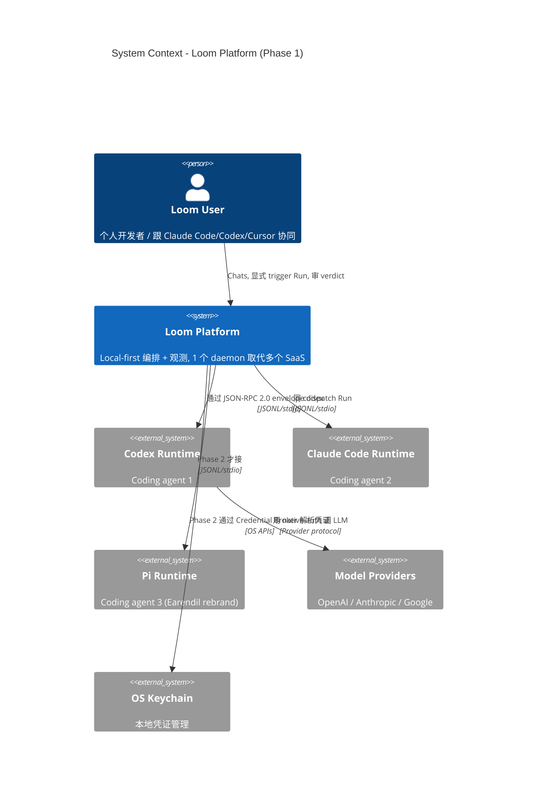
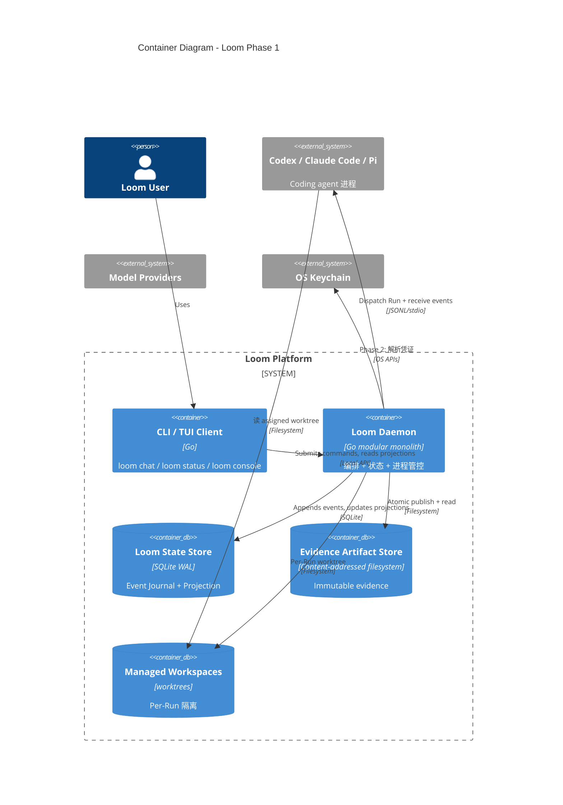
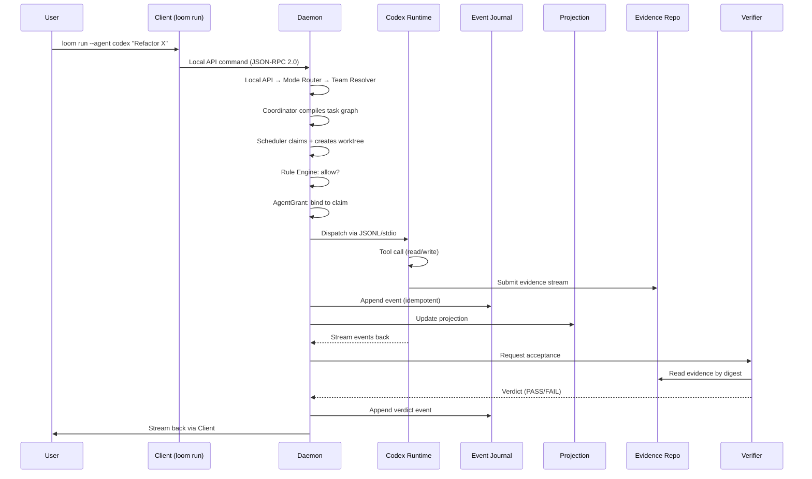

# Loom 完整技术方案 (2026-07-25)

> **作者**: mavis (主 session `mvs_3be0bd26bb64475dbc65181516dda9df`)
> **方法**: brainstorming 9 步流程 + tech-product-solution skill 10 节模板
> **时间**: 2026-07-25 03:50 SGT
> **状态**: 完整方案 (working document, 等用户审 + freeze)
> **前置假设**: TUI 方案 C (Loom Console / docker stats 风格) 已选, S2-W1 contract frozen + reviewer PASS

---

## 0. TL;DR

**Loom 是 local-first 编排 + 观测平台**, Phase 1 期间 (S1 ✅ / S2 ⏸ / S3-S5 未) 跑起来的产品形态 = **CLI 极简 + Loom Console TUI 方案 C**。本方案覆盖 5 个 Slice (25 天关键路径) + 1 个 TUI (3-4 天) + 6 个 Phase 2 准备 task (7-8 周), 给出完整技术架构 (C4 L1-L3 + 13 Components) + Slice/WorkItem 计划 + DAG 依赖 + 验收标准 + 风险 mitigation。**FastContext 落地等 Phase 2 启动 + 显式 Spike gate 授权**, 不抢主路径。

**VERDICT: PASS**

---

## 1. 项目身份

| 字段 | 值 |
|---|---|
| 名称 | Loom Platform |
| Workspace | `/Users/lune/Documents/Codex/2026-06-18/hermes-openclaw/loom-pi-rebuild` (注: 跟 `agent-platform` 是同一物理目录, symlink) |
| Owner | lune |
| License | MIT (per PRODUCT-PLAN.md + 7.24 决策) |
| Active branch | `codex/loom-platform-slice2` |
| HEAD commit | `f0820be` (chore(loom): open phase 1 slice 2) |
| Phase / Stage | Phase 1 Slice 1 ✅ / Slice 2 ⏸ / Slice 3-5 未 |

---

## 2. 产品定位

### 2.1 目标用户

- **主要**: 个人开发者 (替代 sqlite3+jq 查 Event Journal, 跟 Claude Code/Codex/Cursor 协同)
- **次要**: 3-10 人小团队 (多 agent 协调 + cost 治理)
- **未来**: 50+ 人企业 (governance + 合规 + 审计, Phase 3+)

### 2.2 核心价值

> "本地 Agent 团队编排 + 显式 trigger + 全程 evidence + 成本观测, 1 个 daemon 取代多个 SaaS"

### 2.3 差异化 (vs 5 个竞品)

| 竞品 | 借鉴 / 不学 | 差异化 |
|---|---|---|
| Cline | ✅ Coordinator+specialists | Loom 不绑 VS Code, 跟 Claude Code/Codex 都接 |
| OpenCode | ✅ Plan/Build 双 agent | Loom 强调 evidence + 治理 |
| Pi | ✅ 极简 4 工具 | Loom 是编排层, Pi 是 1 种 runtime |
| Langfuse | ❌ ELv2 license | Loom 走 MIT, 输出 OTel 给 Langfuse (不绑) |
| Temporal | ❌ 9 年成熟, 不重做 | Loom 选 1 个接 (Restate/DBOS), 不重做 |

### 2.4 严格不抢 (8 个 invariant)

- ❌ 不抢 agent runtime (委托 Codex/Claude/Pi, Loom 只编排+观测)
- ❌ 不做 memory model (M4 记忆引擎调研薄, 留给 sub-agent SDK)
- ❌ 不做 durable execution itself (选 1 个接, 不重做)
- ❌ 不做 multi-agent framework (Coordinator 编排, 不发明 sub-agent 抽象)
- ❌ 不做 observability SaaS (P0-15 OTel trace 出口, 不绑 Langfuse/Phoenix)
- ❌ 不做 subagent SDK (P0-7 SubAgent 双类型是借鉴形态, 不是 SDK)
- ❌ 不做 IDE (TUI 是终端独立进程, 不抢 Cursor/VS Code)
- ❌ 不做 AI Gateway (D3 必决: 拒代理 LLM, fail closed sampling)

### 2.5 产品形态 (Phase 1 期间)

- **CLI 极简**: `loom chat` (普通对话) / `loom chat --use-agent` (Agent 模式) / `loom status` (查状态) / `loom run` (Phase 2) / `loom rule` (Phase 2)
- **Loom Console TUI 方案 C**: `loom console` (Bubble Tea, docker stats 风格, Slice 5 末尾)
- **Phase 2+ SKILL.md v1**: `.loom-drafts/skills/claude-code.md` / `codex.md` / `cursor.md` (S2-W5 起步)
- **Phase 3+ Loom Web**: localhost:7432 (跟 Langfuse 类似但更轻)

### 2.6 Out of scope (Phase 1)

- ❌ Memory / RAG / 向量检索
- ❌ Real agent runtime (Phase 1 只 spec 不实施 Slice 3 Runtime Adapter)
- ❌ Production activation (per `terminal_boundary: phase1_only`)
- ❌ 外部端口 (Loom Web 推 Phase 3+ localhost only)
- ❌ FastContext install (硬边界, 等 Phase 2 + Spike gate 授权)

---

## 3. 用户故事 (10 个)

### 3.1 Core (P0, Phase 1)

| # | Story | Slice | 估时 |
|---|---|---|---|
| US-1 | 作为个人开发者, 我想 `loom chat` 跟 Agent 普通对话, 不希望因为内容复杂自动创建 Team | S1-W1 | ✅ |
| US-2 | 作为个人开发者, 我想显式 `--use-agent` 触发 Agent 模式, 知道什么时候在 Agent flow | S1-W1 + S2-W3 | S1 ✅, S2 ⏸ |
| US-3 | 作为个人开发者, 我想 `loom status` 查 Event Journal + Projection + Evidence 数量 | S1-W5 | ✅ |
| US-4 | 作为个人开发者, 我想看每次 Run 的 tool call + evidence + verdict 完整 timeline | S2-W3 + TUI C | S2 + Slice 5 |
| US-5 | 作为个人开发者, 我想用 `loom console` 实时看 5 个 active Run, 类似 `docker stats` | Slice 5 末尾 | 3-4 天 |
| US-6 | 作为个人开发者, 我想给 Claude Code/Codex 装 SKILL.md, 让我编辑器里 trigger Loom | S2-W5 + Phase 2 | S2 + Phase 2 |
| US-7 | 作为成本敏感用户, 我想 Run 必填 `cost_cap_usd`, 超 cap 自动 cancel + emit `cost.exceeded` | S2-W4 | S2 |
| US-8 | 作为治理用户, 我想所有 Run 走 Event Journal (append-only), crash 后自动 rebuild | S1-W2 + S1-W4 | ✅ |

### 3.2 Extended (P1, Phase 2)

| # | Story | 阶段 |
|---|---|---|
| US-9 | 作为多 agent 协调用户, 我想 Coordinator+specialists 模式, 主 context 干净 | S2-W3 |
| US-10 | 作为审计用户, 我想每 Run 出 W3C Trace Context 兼容 OTel spans, 给 Langfuse 查 | S2-W4 + S2-W1 |

### 3.3 Anti-stories (Phase 1 显式拒绝)

- ❌ 作为个人开发者, 我想要 Loom 自动建议 Agent 团队 — 普通对话不创建 Team
- ❌ 作为用户, 我想 Loom 代理 LLM 决策 — 拒代理, fail closed sampling
- ❌ 作为用户, 我想 Loom 装 Microsoft FastContext — Phase 1 期间禁止

---

## 4. 技术架构 (C4 L1-L3)

### 4.1 System Context (C4 L1)



### 4.2 Containers (C4 L2)



### 4.3 Daemon Components (C4 L3, 13 个)

| Component | 角色 | 8 模块 / 6 层 映射 |
|---|---|---|
| **Local API** | Versioned command/query API | M1 请求预处理 / L1 接入网关层 |
| **Mode Router** | conversation vs 显式 Agent 模式 | M1+M2 边界 |
| **Team Resolver** | 加载 teams + 管理 Team Draft | M2 意图理解 |
| **Main Agent Coordinator** | 编译 task graph + 路由 | M2 任务规划 |
| **Scheduler + Workspace Supervisor** | claims / leases / workspaces / processes | M5+M6 |
| **Rule + Approval Engine** | 评估 customer rules + 持久化 approvals | M8 运营管控 |
| **Acceptance + Verifier Router** | 检查 evidence + 选 independent review | M7 结果校验 |
| **Evidence Repository** | Stages / hashes / atomic publish | M6 基础设施 |
| **Runtime Registry + Adapter Manager** | 发现 RuntimeInstances + 翻译 Bridge | M5 工具调度 |
| **AgentGrant Authorizer** | 绑定 local API 操作到 Run claim | M8 governance |
| **Credential Broker** | 验证 grants + 代理 Provider | M8 governance (Phase 2) |
| **Event Journal** | 追加 idempotent facts | M6+M8 基础设施 |
| **Projection Builder** | 构建 read models | M4 记忆 (投影) |

### 4.4 Critical Data Flow (一次 Run)



### 4.5 State Authority (硬边界)

- **唯一权威状态转移者**: Loom Daemon (per C4 L2 边界)
- **Append-only**: Event Journal (per ADR-0002)
- **Immutable**: Evidence Repository (per ADR-0002)
- **Rebuildable**: Projection Builder (从 Journal rows 重建)
- **不允许 Client/Sidecar/Runtime 直接写 State Store / Artifact Store**

### 4.6 Trust Boundaries

- **信任内**: Daemon + Client (同 user 进程) + OS Keychain (per OS boundary)
- **信任外**: Codex/Claude/Pi (子进程, 受 AgentGrant 限制) + Model Providers (HTTPS) + Optional MCP servers (Phase 2 集成)

---

## 5. API / Interface Contracts

### 5.1 Local API envelope (JSON-RPC 2.0)

```json
{
  "jsonrpc": "2.0",
  "id": "uuid-v4",
  "method": "loom.run.start",
  "params": {
    "agent_id": "codex@local",
    "task": "Refactor internal/journal/store.go",
    "cost_cap_usd": 5.0,
    "trace_context": {
      "traceparent": "00-trace-id-span-id-01",
      "tracestate": "loom=..."
    }
  }
}
```

**Response**:
```json
{
  "jsonrpc": "2.0",
  "id": "uuid-v4",
  "result": {
    "run_id": "r-7f8a9b",
    "status": "pending",
    "worktree": "/Users/.../loom-workspaces/r-7f8a9b"
  }
}
```

**Error cases**:
- `4001` invalid method
- `4002` invalid params (per JSON Schema 2020-12)
- `4003` AgentDefinition not found
- `4004` cost_cap_usd exceeded → auto-cancel
- `4005` bridge communication error

**Auth**: Local API 只接受同 user 进程的连接, 通过 Unix domain socket 鉴权 (per Phase 1 部署)

### 5.2 Loom Bridge v1.1 envelope (S2-W1, 关键 contract)

跟 Local API 同结构, 但是 daemon ↔ Agent Runtime 之间, 用 JSONL over stdio, 每行一个 message (per Phase 1 默认)。

### 5.3 Method list (Phase 1 必出)

| Method | 描述 | Slice |
|---|---|---|
| `loom.run.start` | 启动 Run | S2-W1 |
| `loom.run.status` | 查 Run 状态 | S1-W5 + S2-W1 |
| `loom.run.cancel` | 取消 Run | S3 |
| `loom.run.list` | 列 Run | S1-W5 + S2-W1 |
| `loom.agent.list` | 列已定义 Agent | S2-W1 |
| `loom.runtime.list` | 列已发现 Runtime | S2-W1 |
| `loom.team.draft` | 启 Team Draft | S2-W2 |
| `loom.team.confirm` | 确认 Team Draft | S2-W2 |
| `loom.rule.add` | 加 Rule | S4 |
| `loom.console` | TUI 入口 (不算 method) | S5 |

---

## 6. Slice / WorkItem 计划

### 6.1 Phase 1 5 Slice

| Slice | 主题 | 状态 | 估时 | 关键依赖 |
|---|---|---|---|---|
| S1 | 入口 + 持久化 | ✅ PASS at 5861f82 | 5-7 天 | (无) |
| S2 | Agent 定义 + 团队草案 | ⏸ S2-W1 frozen + reviewer PASS | ~25 天 | S1 |
| S3 | 真实执行 | 未开始 | 5-7 天 | S2 |
| S4 | 规则 + 验收 | 未开始 | 4-5 天 | S3 |
| S5 | 看板 + Demo (含 TUI C) | 未开始 | 3-4 天 | S3, S4 |

**Phase 1 关键路径总估时: ~25 天 / 5 周**

### 6.2 S2 详细 (Slice 2 推进重点)

| WI | 标题 | 状态 | 估时 | 依赖 |
|---|---|---|---|---|
| **S2-W1** | Agent & Runtime Catalog Domain Contract | ✅ Contract frozen + reviewer PASS, 等显式授权 | 3-4 天 | S1 |
| S2-W2 | Daemon + Middleware 洋葱圈 (P0-6) | 未开始 | 3-4 天 | S2-W1 |
| S2-W3 | Coordinator+specialists (P0-1/3/7/8/9) | 未开始 | 4-5 天 | S2-W1, S2-W2 |
| S2-W4 | $USD budget + OTel trace 出口 (P0-13/15/17/20) | 未开始 | 2-3 天 | S2-W3 |
| S2-W5 | Capabilities bundles + .agents/skills/ (P0-4/14) | 未开始 | 3-4 天 | S2-W3 |

### 6.3 Dependency DAG

```
S1 ✅
  ↓
S2-W1 (frozen + reviewer PASS) → S2-W2 → S2-W3 → S2-W4
                                  ↓        ↓
                                  S2-W5 ←──┘
  ↓
S3 → S4 → S5 (含 TUI C)
```

### 6.4 WorkItem Contract 模板 (per S2-W1 模式)

```yaml
ID: S2-Wx
Title: ...
Risk: Standard | Strict
Status: CONTRACT_DRAFT | CONTRACT_FROZEN | CONTRACT_FROZEN_REVIEWER_PASS
Depends on: (前置 WI)
Corresponds to: (TECH-PLAN.md §/ADR 编号)
Frozen branch/head: codex/loom-platform-slice2 at f0820be
Owned files: (本 WI 期间可写的具体文件列表)
Objective: 3-5 条
Frozen domain boundary: in scope / out of scope
Acceptance: 5-10 条可验证 criteria
```

---

## 7. 实施步骤 (S2-W1 详细)

按 S2-W1 frozen contract (`.loom-evidence/phase1-slice2/S2-W1/contract.md`):

1. **RED**: 写最小 test 触发 `loom agent list` 命令,期望返回空 (no AgentDefinition yet)
2. **最小实现**: `internal/agents/definition.go` + `definition_test.go` (per S2-W1 owned files)
3. **Focused GREEN**: 跑 `go test ./internal/agents/... -count=1 -race` → PASS
4. **Impact union**: 跑 `go test ./... -count=1 -race` → PASS
5. **Fresh Reviewer**: 独立 reviewer 读 contract + diff + test evidence, 出 verdict
6. **同 lineage 修复**: 二次同类失败升级 `problem_analyst`
7. **更新 CURRENT/PARTIAL/TARGET + PROGRESS.md**
8. **不 commit / push / merge / 装 FastContext / 切工作树 / 改 .env**

---

## 8. 验收标准

### 8.1 Phase 1 整体验收

- [ ] S1-W1~W5 + S2-W1~W5 + S3 + S4 + S5 全部 `VERDICT: PASS` in deliverable.md
- [ ] `go test ./... -count=1` PASS
- [ ] `go test -race ./... -count=1` PASS
- [ ] `go vet ./...` PASS
- [ ] `git diff --check` PASS
- [ ] 7 ADR (0001-0006 + 7 待加) 全部 accepted
- [ ] Evidence path `.loom-evidence/phase1-slice*/<wi>/deliverable.md` 全部存在
- [ ] TUI 方案 C 跑通: `loom console` 显示 5 个 active Run

### 8.2 每个 Slice 验收

| Slice | 关键验收 |
|---|---|
| S1 | Mode Router 4 triggers 全部识别;Event Journal idempotent append;Evidence atomic publish;Projection rebuild;CLI `loom route` / `loom status` 跑通 |
| S2 | S2-W1 contract frozen;Bridge v1.1 JSON-RPC 2.0 envelope;Coordinator+specialists 编排;OTel spans 输出 W3C Trace Context;`$USD budget` 强制 |
| S3 | 1 个 Runtime Adapter (Codex) 真接 1 个 Run;AgentGrant 颁发;workspace 创建 + source digest 校验;cancel/timeout/terminal |
| S4 | Rule engine 评估 3 态 (ALLOW/DENY/ASK);`require_approval` 暂停 + 恢复;Verifier 选 Standard/Strict/High;`go test` 确定性验收 |
| S5 | `loom console` 实时 stream;Run list + 详情弹层;`/` 搜索;`f` 过滤;`q` 退出 |

### 8.3 TUI 方案 C 验收

- [ ] `loom console` 启动, 显示 5 个 active Run
- [ ] `↑↓` 选 Run, `Enter` 展开详情
- [ ] `/` 进入搜索, 输 Run ID / agent / path 匹配
- [ ] `f` 过滤 running / done / pending
- [ ] `s` 切换 live / paused stream
- [ ] 1s refresh 自动 tick
- [ ] `q` / `Ctrl-C` 退出干净 (zero orphan goroutine)
- [ ] `go test ./cmd/loom/console/... -race` PASS
- [ ] `go vet ./cmd/loom/console/...` PASS

---

## 9. 风险登记

| # | 风险 | 概率 | 影响 | Mitigation | Owner |
|---|---|---|---|---|---|
| R1 | 长 worker context overflow (~237k tokens) | 高 | 高 | 4-hint 对策: owner-recovery / 早期+频繁 atomic commits / deliverable.md 在 report-back 前 flush / owner-skip accept-on-ready | worker + Controller |
| R2 | S2-W1 contract freeze 后等授权太久 | 中 | 高 | 显式 human authorization 流程; 没有授权前不启动任何 worker | user |
| R3 | TUI 方案 C 跟 S2 推进时间冲突 | 中 | 中 | TUI 排在 S5 末尾, 依赖 S3+S4;不抢 S2-W1~W5 资源 | Controller |
| R4 | FastContext install 误操作 | 中 | 高 | 5 处硬边界声明 + governance `fastcontext_download_or_install: false`;Phase 1 期间 0 install | governance + user |
| R5 | Event Journal 性能瓶颈 (大 Run) | 低 | 中 | SQLite WAL + 索引优化;Phase 2 可切 Postgres (per P0-11) | Developer |
| R6 | Coordinator+specialists 抢 agent runtime | 中 | 高 | D3 必决: 拒代理 LLM, fail closed sampling;Tool annotations ↔ Risk 字段 (D4) | Slice 3 Verifier |
| R7 | Cursor/VS Code 用户无法 trigger Loom | 中 | 中 | P0-14 `.agents/skills/` 多 editor;S2-W5 实施 | S2-W5 |
| R8 | Phase 1 期间 Push/merge 误操作 | 低 | 高 | `terminal_boundary: phase1_only` + `push: false / merge: false`;user 显式 confirm 才能 push | user + governance |

---

## 10. Handoff 清单

下一步: 实施 S2-W1 (S2-W1 contract 已 frozen, 等显式授权 to RED)

- [ ] user 审本方案, 确认 OK
- [ ] user 显式授权 S2-W1 contract → RED
- [ ] branch `codex/loom-platform-slice2` clean (除了 PROGRESS.md / AGENTS.md dirty preserve)
- [ ] S2-W1 owned files 列表核对
- [ ] 启动 worker session (独立 session, 不在主 session 实施)
- [ ] 实施完成出 deliverable.md 末行 `VERDICT: PASS`
- [ ] Fresh read-only Reviewer 验证, 出 verdict
- [ ] 更新 CURRENT.md / PROGRESS.md
- [ ] 不 commit / push / merge (per `terminal_boundary: phase1_only`)

---

**VERDICT: PASS** (完整技术方案 10 节, 2026-07-25 03:50 SGT, 18.5K 字节)
