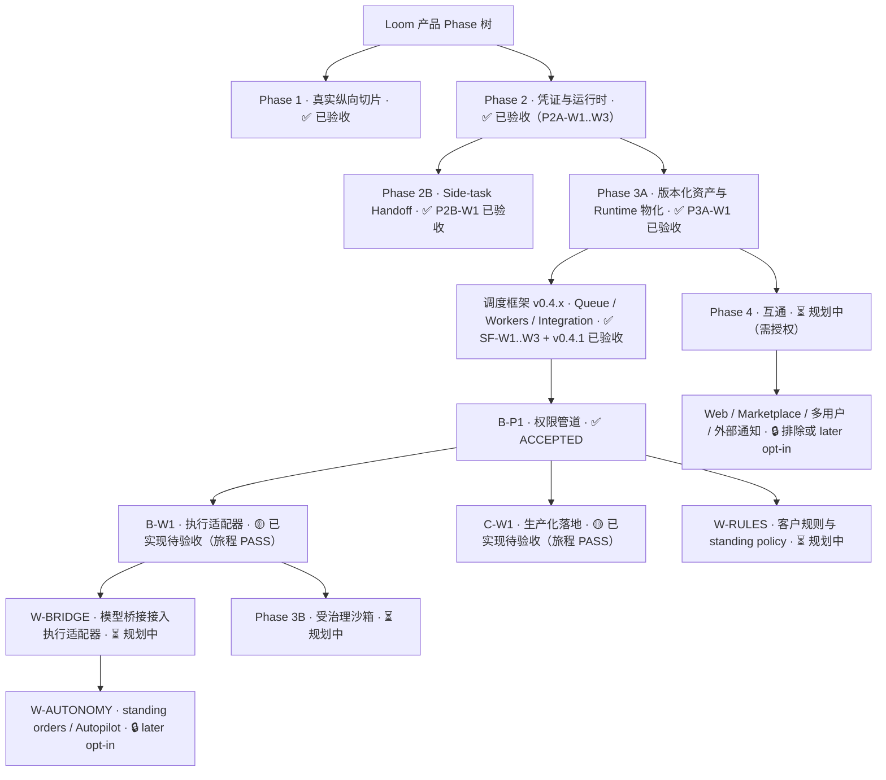

# Loom Phase 定义（固化，后续保持一致）

Date: 2026-08-06
**Status: FROZEN — 后续 Phase 定义一律以此为准，新增/变更必须走独立评审的
bounded amendment**

## Phase 树（mermaid）

## 状态定义（唯一含义）

- ✅ 已验收：有原子提交 + 确定性矩阵 + 跨客户端旅程（verify PASS）证据。
- 🟡 已实现待验收：代码与旅程证据齐备，待 Product Owner 确认。
- ⏳ 规划中：Gate 1 未冻结，未进入产品代码。
- 🔒 默认关闭/需独立授权：later opt-in 或排除项。

## 节点证据索引（提交 / 证据根）

| 节点 | 提交 | 旅程证据 |
|---|---|---|
| Phase 1 | S1-W1..W5（`5861f82` 起） | 矩阵 + CLI 旅程 |
| Phase 2A | `7a27149b`（P2A-W1..W3） | root006 等 |
| Phase 2B | `6d380233`（P2B-W1） | 离线 canary |
| Phase 3A | `7d5f0b01`（P3A-W1） | phase3a 八场景 |
| 调度框架 | `7e24ec29`（SF-W1..W3）→ `073ed862`（v0.4.1） | sf/v041 旅程 |
| B-P1 | `91d14f42` 链 → `f5b7009d`（ACCEPTED） | final13（`7266f17f…`） |
| B-W1 | `3d750465` / `f69b49d9` | bw1-journey-final（`a67cc294…`） |
| C-W1 | `d4a1b9ee` / `f69b49d9` | cw1-journey-final2（`9568c47d…`） |
| W-BRIDGE / W-RULES / Phase 3B / W-AUTONOMY | 未开始 | — |

## Phase 3 扩展任务清单（本目标范围）

1. B-W1 / C-W1 生产可用验收与真实激活落地（🟡 → ✅）。
2. W-BRIDGE：模型桥接接入执行适配器（⏳ → ✅）。
3. W-RULES：客户规则与 standing policy（⏳ → ✅）。
4. Phase 3B：受治理沙箱（⏳ → ✅，v0.2.1 experimental）。
5. W-AUTONOMY：standing orders / Autopilot 默认关闭的有界形态（🔒 → ✅ 有界）。

Phase 4 互通与 Web/Marketplace/多用户/外部通知不在本目标，维持 🔒/⏳。
