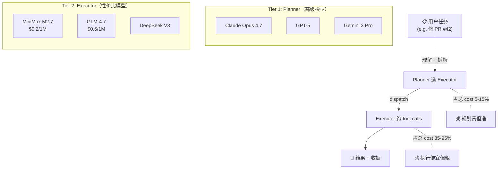

# Loom 产品方案

> 草稿 v0.1 · 2026-07-24
> Customer #0: lune（你本人）
> 状态: 等待 review。确认后开始落地方案。

## 1. 问题

跑 AI 编码 agent 的开发者 / 小团队，普遍遇到三件烦心事：

1. **成本不可控**：用 Claude Opus 跑一周账单 $200+，换 MiniMax 又怕质量崩。没有"质 + 价"同时可见的视图。
2. **过程黑盒**：agent 自己跑、跑完给结果。中间做了什么、为什么选这条路、试了哪些 fallback，全看不见。出事没法复盘。
3. **治理靠自己拼**：每个 agent CLI 各管各的（Codex 一个规矩、Pi 一个规矩）。想加个"auth 改动需要 2 reviewer"或者"单任务 cost > $0.10 告警"这种横切规则，没地方下手。

## 2. 目标用户

- **Customer #0**：lune 本人（personal Agent Cluster + 开源社区推广）
- **后续用户**：AI 编码工具的重度用户，5-50 人小团队的技术 lead
- **不做**：to-C 普通用户、ML 研究员、不写代码的内容创作者

## 3. 产品形态（一句话）

**Loom = 一个本地 daemon + 3 个 view（observation / cost / governance）+ 用户自己定义的规则**。

底层不动 agent CLI（Codex / Pi / Claude Code / OpenClaw / Hermes 都用），只在它们外面挂一层透明 + 调度。

## 4. 核心机制：2-tier 模型分层

| 角色 | 谁来当 | 干什么 |
|---|---|---|
| **Planner** | 高级模型（Claude Opus / GPT-5 / Gemini Pro 等） | 读懂问题、规划步骤、选 executor、监控进度 |
| **Executor** | 性价比模型（MiniMax M2.7 / GLM-4.7 / DeepSeek 等） | 真正执行 tool calls、写代码、跑命令 |
| **AgentKey** | Loom 自带的 vault | 保管 provider API key，executor 永远不直接拿 key，只拿到 scoped token（per-task / per-provider / time-bounded） |
| **Bridge** | Loom daemon | 在 planner 和 executor 之间传递消息、抓 events |
| **View engines** | Loom daemon | 3 个 view 从同一份 event stream 切出不同视角 |

> 关键点：**planner / executor / rules 全部由用户定义**。Loom 不硬编码"应该用哪个模型"。可以是一次性 pin，也可以写进 per-project 配置。



完整架构图、流程图、时序图见 [docs/ARCHITECTURE.md](./docs/ARCHITECTURE.md)。

**为什么 2-tier**：高级模型做规划贵但准，便宜模型做执行便宜但粗。混着用能拿到 90% 的高级质量 + 10% 的成本。Together AI 的 Mixture-of-Agents 论文已经证明这个 pattern，LangGraph 的 planner-worker 模式也是。社区里有 pattern，没有产品。**Loom 的位置**：把这个 pattern 做成对用户透明的产品。

## 5. 用户体验（标准 demo："修 PR #42"）

```
┌─────────────────────────────────────────────────────────┐
│ Fix auth bug in PR #42                                  │
│                                                         │
│ 🧠 规划 (Claude Opus 4.7)                                │
│   11:42:01  计划: 读 → 改 → 测                          │
│   11:42:02  选 Executor: MiniMax M2.7 (便宜)             │
│   11:42:03  Fallback: GLM-4.7                            │
│                                                         │
│ 🔧 执行 (MiniMax M2.7)                                   │
│   11:42:08  read: src/auth/login.ts                     │
│   11:42:15  edit: +3 -1                                 │
│   11:42:30  run: npm test → ✓ 12/12                    │
│   11:42:48  run: eslint → ✗ 2 errors                   │
│                                                         │
│ 🔁 调度 (Loom)                                            │
│   11:42:51  调度: linter agent 介入 (GLM-4.7)            │
│                                                         │
│ 🔧 执行 (GLM-4.7)                                         │
│   11:43:30  edit: src/auth/login.ts +2 -1                │
│   11:43:31  edit: .eslintrc +1 -0                       │
│   11:43:35  run: npm test && eslint → ✓                 │
│                                                         │
│ ── 3 个 view ───────────────────────────────────────     │
│ 📋 Observation: 上面整个时间线                            │
│ 💰 Cost: $0.030 (vs 全 Opus $0.450, 省 93%)              │
│ 🛡 Governance: ✓ auth 改动需 2 reviewer (告警)         │
│                                                         │
│ ✅ 期望状态已达成                                         │
│   [收据] [批准发布] [回滚] [换成 Opus 执行试试]           │
└─────────────────────────────────────────────────────────┘
```

3 个 view 同源数据（agent 的 event stream），不同切片。**用户自己定 governance 规则**，Loom 只匹配 + 告警，不强制。

## 6. 跟竞品的差异

| 竞品 | 它做 | Loom 多 |
|---|---|---|
| **Multica** | 协作外壳，看板 + agent 当队友 | 2-tier 模型分层显式可见 + cost view + governance rules |
| **9Router** | Provider 路由 + 配额 + RTK token saver | 路由"角色"（planner vs executor）不只路由 Provider |
| **Pi / Codex / Claude Code** | 单个 agent CLI | 多 agent 协同的 view + 桥接层 |
| **Together MoA / LangGraph** | 2-tier 模式的技术 demo | 模式 + 产品 + UX + 透明 + 治理 |
| **Cursor / Copilot** | IDE 集成 | 平台级，CLI/IDE/Web 都接 |

**核心故事**：社区里有"高级 + 便宜"模式的研究和 demo，但是**没有人把它做成一个产品平台**。这是 Loom 的位置。

## 7. 不做什么（non-goals）

明确划界，避免重做别人已经做好的事：

- ❌ 不做 agent 底层（Codex / Pi / Claude Code 已经做得很好了）
- ❌ 不做 Provider 路由（9Router 已经做）
- ❌ 不做协作 UI（Multica 已经做）
- ❌ 不强制 governance 规则（用户自己定义，Loom 只匹配 + 告警）
- ❌ 不做云端 SaaS（v1.0 之前只做本地 daemon）
- ❌ 不做 capability admission（agent CLI 自己管）
- ❌ 不重做 K8s control plane（只拿 pattern：reconciliation / health probe / desired state，不搬 etcd / API server）
- ❌ 不做 OpenSpec / lifecycle guard / 30-change program / role authority 那套 spec-first 治理（被证明太重，不发到用户）

## 8. 成功指标

| 阶段 | 指标 |
|---|---|
| **Week 1 demo** | 1 个真实任务跑通（修 PR / 写 feature），3 view 都出图 |
| **Month 1 MVP** | 自己用一周，10+ 任务，单任务 cost < $0.10，质量不掉 |
| **Month 3 alpha** | 10 个外部用户，每个跑过 ≥ 5 个真实任务 |
| **Month 6 v1.0** | 跟 9Router / Multica 互通，AgentKey 多 provider，bridge 协议稳定 |

## 9. 路线图

### Phase 1: hello world（1 周）
- Mock planner + mock executor（脚本即可）
- Bridge 用 stdio JSON
- 3 view 渲染在 CLI（text output）
- 跑 1 个真实任务 demo

### Phase 2: 真模型 + AgentKey（2-4 周）
- 接 Opus 当 planner，M2.7 当 executor
- AgentKey 加密存 key（age encryption），scoped token 注入到 executor env
- SQLite 存 event stream
- 3 view 改成 TUI（bubbletea）

### Phase 3: governance 引擎（1-2 个月）
- 用户自定义 rules（YAML）
- Rule 匹配 event，触发告警 / hook
- 与 9Router 集成（tier fallback 数据喂给 cost view）

### Phase 4: 互通（2-3 个月）
- Multica plugin 模式
- 9Router cost 数据桥接
- 视需要加 web UI

### Phase 5: v1.0（3-6 个月）
- Bridge 协议稳定（MCP 兼容）
- 完整文档
- 社区推广
- 跟 9Router / Multica 互通

## 10. 关键决策记录

本次方案确立的几个关键决策（对话过程沉淀）：

1. **不是新 spec-first 治理产品**：原 Loom 的 OpenSpec / 30-change / lifecycle guard 太重，**全部丢弃**。
2. **不是新 agent 运行时**：Codex / Pi 已经做得好，Loom 不重做。
3. **不是 controller / 调度器**：Loom 是 view layer，不是 K8s controller。**观察 + 透明，不指挥**。
4. **不是路由器**：9Router 已经在做 Provider 路由，Loom 路由的是"角色"（planner vs executor），不重复。
5. **不是 K8s clone**：K8s 拿 pattern（reconciliation、health probe、desired state），不搬 control plane。
6. **planner / executor / rules 全部用户定义**：不硬编码。
7. **AgentKey 必做**：provider API key 永远不让 agent 直接拿，scoped token 注入。
