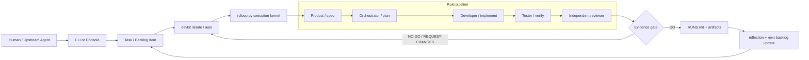
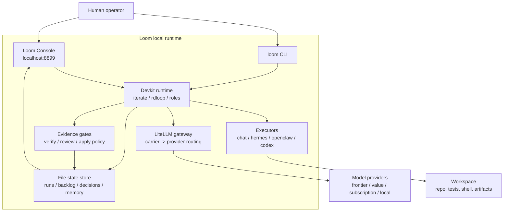
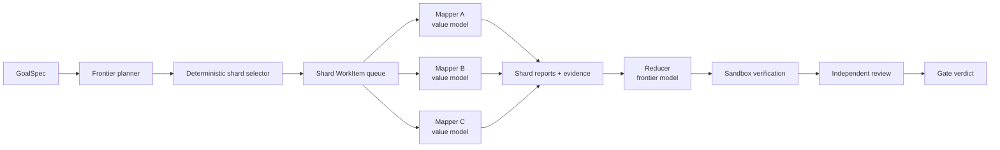

# Loom

### 本地可运行的多模型 Agent Runtime，把软件研发 loop 变成可观测、可验证、可恢复的控制系统。

Loom 不是普通聊天工具，也不是线上产品 runtime。它是一套本地优先的 Agent 研发控制台：你给一个开发目标，Loom 调度规划、实现、验证、审查等角色，在预算内调用不同模型和执行器，最后把产物、证据、成本和 gate 结论落盘。

更短的说法：

> Loom 是一座本地、免费、可无人值守的自治软件工厂。你给愿景，一支多厂商 AI 开发组在预算内、可验证地把软件建出来，并持续迭代自己。

## Why Loom?

Loom 关注的是“Agent Team 怎么稳定地把任务做完”，而不是只把多个模型接进来。

| 你想要 | Loom 提供 |
| --- | --- |
| 任务不要丢 | backlog、run ledger、stage artifacts、decision log 都落盘 |
| 结果可信 | 测试、contract、golden eval、独立 review、gate verdict |
| 模型可替换 | LiteLLM 统一入口，角色只绑定稳定 carrier，不绑定具体厂商 |
| 成本可控 | 每阶段 token / cost / served model 记录，可做 cascade 和 fallback |
| 本地先跑起来 | `./loom up` 启动本地控制台、模型网关和订阅代理 |
| 后续可自治 | `iterate` / `autopilot` 让 backlog 持续推进，异常进入修复通道 |

## Quick Start

### 1. Start Loom locally

```bash
cd agent-platform

./loom up
./loom doctor
./loom open
```

这会启动 lite 核心：

| 服务 | 地址 / 命令 | 用途 |
| --- | --- | --- |
| Loom Console | http://localhost:8899 | 发起运行、看产物、看用量、编辑角色 |
| LiteLLM Gateway | http://localhost:4000/ui | 模型调用、成本、fallback |
| Subscription Proxy | http://localhost:8317 | Claude / ChatGPT 订阅本地代理 |

需要聊天 UI / Agno API 时再启动 full profile：

```bash
./loom up full
```

full profile 额外提供：

| 服务 | 地址 | 用途 |
| --- | --- | --- |
| Agent UI | http://localhost:3000 | 角色聊天 UI |
| AgentOS API | http://localhost:8000/docs | Agno API |

### 2. Run your first task

```bash
./loom run "实现一个小功能，要求有测试和独立审查"
```

也可以在 http://localhost:8899 的「发起运行」里输入任务。

### 3. Inspect the result

一次运行会写入这些文件：

```text
devkit/runs/<run-id>/
devkit/RUNS.md
devkit/MEMORY.md
devkit/decisions.jsonl
devkit/logs/
```

你应该重点看：

| 文件 / 目录 | 说明 |
| --- | --- |
| `devkit/runs/<run-id>/` | 本次运行的 stage 产物、verify report、review report |
| `devkit/RUNS.md` | 运行台账，适合人类扫一眼最近结果 |
| `devkit/decisions.jsonl` | 调度、失败原因、下一步动作，适合 Agent 读取 |
| `devkit/logs/` | 后台 iterate / autopilot 日志 |

## How Loom Runs A Task

当前 Loom 的执行内核是 `devkit/rdloop.py`：它把一个开发任务拆成角色流水线，每个阶段可以使用不同模型、不同 executor，并在 gate 处要求证据。



最重要的约束是：Loom 不把“模型说完成了”当完成。完成必须有落盘产物、验证输出、审查意见和 gate verdict。

## Architecture At A Glance



更完整的架构图、状态机和目标控制回路在 [中文架构文档](./docs/architecture/loom-architecture.md) / [English architecture document](./docs/architecture/loom-architecture.en.md)。

## Operating Modes

Loom 保留三种一等模式。它们是逐级升级关系，不是互相替代。

| 模式 | 当前状态 | 适合场景 |
| --- | --- | --- |
| `single-agent` | 可通过单阶段 / 少阶段 role 配置表达 | 小任务、问答、局部审查 |
| `agent-team` | 当前主路径 | 规划、实现、验证、审查的常规研发任务 |
| `cluster` | 目标演进方向 | 大代码库扫描、并行分片、MapReduce 汇总、长时恢复 |

目标 `cluster` 形态会把任务统一抽象成 `GoalSpec -> WorkItem -> EvidencePacket -> GateVerdict`，让调度、重试、修复和汇总变成显式对象，而不是散在日志里。

## Agentic MapReduce Direction

Loom 和 “Agentic MapReduce” 强相关：它适合把大任务拆成有界分片，派出多个便宜/专用 mapper 并行扫描，再由强模型 reducer 汇总，最后由独立验证和 gatekeeper 判断是否可信。



这也是为什么 Loom 需要混合模型策略：规划、归并、审查、失败归因用前沿模型；重复扫描、实现、测试和格式化用性价比模型；文件选择、状态写入、重试策略尽量确定性执行。

## Model Strategy

Loom 代码只引用稳定 carrier，例如 `loom-planner`、`loom-dev`、`loom-reviewer`。具体模型由 LiteLLM 和角色配置决定。

| 工作类型 | 推荐模型层级 | 原因 |
| --- | --- | --- |
| 目标拆解 / 风险判断 | Frontier model | 错误代价高，需要更强推理 |
| 大量代码扫描 / 分片处理 | Value model | 可并行、可抽样复核、成本敏感 |
| 实现 / 测试初稿 | Value model with cascade | 先便宜模型，失败再升级 |
| 归并 / 最终审查 | Frontier model | 需要跨分片一致性和反例意识 |
| 文件选择 / 状态推进 | Deterministic code | 不该交给模型自由发挥 |

角色文件示例：

```toml
[[stages]]
key = "implement"
role = "开发"
title = "TDD 实现"
carrier = "loom-dev"
executor = "chat"
max_tokens = 8000
system = "先写测试或契约，再实现。"
```

查看或初始化角色：

```bash
./loom roles list
./loom roles init
```

## Keep It Running

短批次自动迭代：

```bash
python3 -m devkit iterate --backlog devkit/backlog.json --max-rounds 20
```

后台无人值守：

```bash
nohup ./loom autopilot --sleep 90 --backlog devkit/backlog.json > /tmp/loom-autopilot.out 2>&1 &
```

当前 `autopilot` 已经具备监督和重启雏形。目标稳定控制器会进一步加入：

| 组件 | 责任 |
| --- | --- |
| Scheduler | 从 backlog 选择下一条可运行 WorkItem |
| State writer | 原子化记录 lease、heartbeat、结果和 gate |
| Observer | 发现卡死、重复失败、证据缺失、模型不可用 |
| Triager | 判断是自动修复、重新入队、升级模型还是请求人类 |
| Repairer | 插入高优先级修复任务，修好控制面后恢复原任务 |
| Gatekeeper | 统一决定 GO / NO-GO / REQUEST-CHANGES / HUMAN-GATE |

## Commands

| 命令 | 说明 |
| --- | --- |
| `./loom setup` | 引导写 `.env`、启动网关并验证可达 |
| `./loom up` | 启动 lite 核心服务 |
| `./loom up full` | 启动 lite + Agent UI + AgentOS API |
| `./loom doctor` | 检查 Docker/colima、端点、执行器、后端健康 |
| `./loom open` | 打开本地控制台 |
| `./loom run "任务"` | 启动自治研发闭环 |
| `./loom task-queue [backlog]` | 输出当前任务队列并写入日志 |
| `./loom autopilot --sleep 90 --backlog devkit/backlog.json` | 后台监督器 |
| `./loom status` | 看 backlog 进度和最近决策 |
| `./loom roles [init|list]` | 查看或初始化角色流水线 |
| `./loom ask "问题" --models deepseek,glm` | 临时向一个或多个模型提问 |
| `./loom quota` | 查看额度和剩余额度建议 |
| `./loom scores` | 查看模型评分 |
| `./loom stages` | 按阶段透视成本和 tokens |
| `./loom diff <run-id>` | 对比两次运行的 build 产物 |
| `./loom test` | 跑 devkit 单元/合同测试 |
| `./loom down` | 停止容器 |

## Project Map

| 路径 | 作用 |
| --- | --- |
| `loom` | 一键 CLI 入口 |
| `console/` | 本地 Web 控制台 |
| `devkit/rdloop.py` | 研发 loop 执行内核 |
| `devkit/backlog.json` | 最近需求和自动迭代队列 |
| `devkit/runs/` | 每次运行的产物和证据 |
| `devkit/roles.py` | 角色流水线加载与校验 |
| `litellm/` | 模型网关配置 |
| `docs/architecture/` | 架构图、流程图、状态机 |

## Documentation

| 文档 | 作用 |
| --- | --- |
| [QUICKSTART.md](./QUICKSTART.md) | 从零启动控制台 |
| [docs/architecture/loom-architecture.md](./docs/architecture/loom-architecture.md) / [English](./docs/architecture/loom-architecture.en.md) | 当前架构、目标控制回路、MapReduce、修复通道 |
| [docs/loom-stable-agent-runtime-blueprint.md](./docs/loom-stable-agent-runtime-blueprint.md) | 稳定 Agent Runtime 蓝图 |
| [USAGE.zh.md](./USAGE.zh.md) / [USAGE.en.md](./USAGE.en.md) | 完整使用手册 |
| [LOOM-ROLES.md](./LOOM-ROLES.md) | 角色载体层说明 |
| [devkit/README.md](./devkit/README.md) | 研发闭环 CLI 说明 |
| [docs/autonomous-agent-team.md](./docs/autonomous-agent-team.md) | 自治 Agent Team 部署、运行和自动迭代 |
| [VISION.md](./VISION.md) | 北极星定位 |
| [CONSTITUTION.md](./CONSTITUTION.md) | 运行宪章和安全边界 |
| [ROADMAP-INTEGRATED-2026-06-27.md](./ROADMAP-INTEGRATED-2026-06-27.md) | 分阶段落地路线 |

## Boundaries

- Loom 只负责“怎么开发”，不持有产品 runtime 的真实用户、权限、支付和生产成本。
- Loom 当前优先本地部署，本地稳定后再考虑远端 sandbox / 多机器调度。
- `report-only` 与 `autonomous` 是两种不同交付模式；真实 `commit/push/发布` 仍需要显式模式或人类确认。
- Claude / ChatGPT 订阅代理可能触及服务条款和限流风险，是否使用由用户自行决定。
