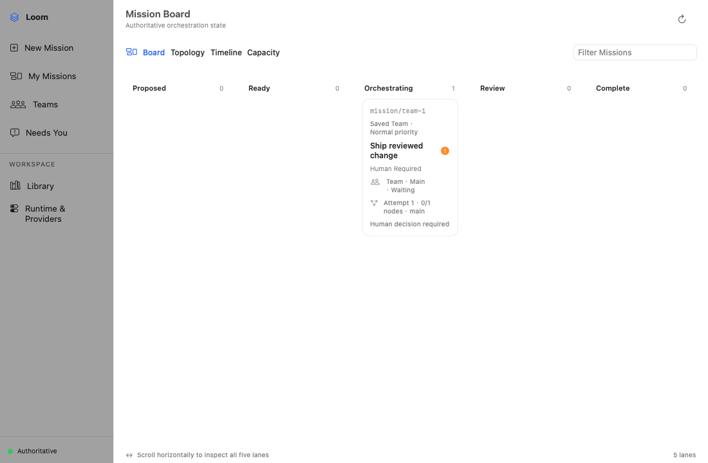
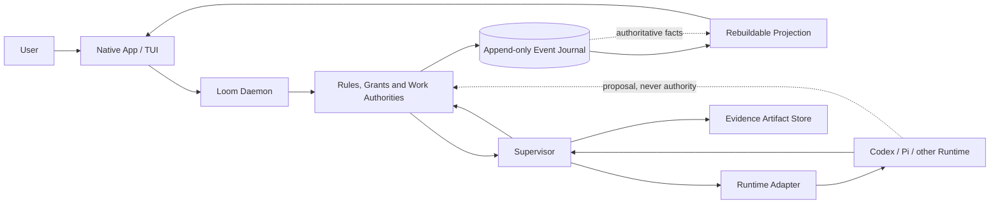

# Loom

**让 Agent 团队真正可编排，而不只是被启动。**

Loom 是一个本地优先的 Agent Team 编排与治理平台。它把一个目标组织成
Mission，绑定真实 Runtime，协调 Main Agent 与 SubAgent，并让授权、执行、
Evidence、验收和恢复始终可追溯。

[产品方案](./PRODUCT-PLAN.md) ·
[技术方案](./TECH-PLAN.md) ·
[架构](./docs/ARCHITECTURE.md) ·
[当前状态](./docs/CURRENT.md) ·
[开发流程](./docs/DEVELOPMENT.md)

> **Development Preview**
>
> Phase 1 的执行内核已经完成受控真实验证。Phase 2A 的原生 Mission
> Workbench 与 TUI 已进入开发预览，但面向普通用户的完整
> Provider → Team → Mission 执行旅程仍未完成 live acceptance。



_上图是已提交 P2A-W2 Candidate 的确定性原生窗口证据；它展示产品方向，不代表
生产激活或最终 live acceptance。_

## Loom 是什么？

Codex、Claude Code、Pi、Hermes 等 Agent Runtime 已经能够完成复杂工作。真正困难的
问题逐渐从“模型能不能做”变成：

- 谁可以启动这项工作？
- 应该由一个 Agent 完成，还是由一个 Team 协作？
- 哪些节点可以并行，哪些必须等待依赖？
- Agent 实际获得了什么权限、预算和 Runtime？
- 输出是否满足合同，谁负责独立验收？
- 失败后应该重试、降级、恢复，还是交给用户决定？
- 最终结果和 Evidence 是否能在重启后被可信重建？

Loom 位于用户和 Agent Runtime 之间，负责回答这些问题。它不重新实现模型的推理循环，
也不把一次模型调用包装成“团队”；它提供的是一层本地、可审计、可恢复的编排权威。

## 从 Issue 到 Mission

传统 Issue 主要描述“要做什么”。Loom 使用 **Mission** 表达一次完整、可治理的交付：

| 概念 | 含义 |
|---|---|
| **Mission** | 目标、Team、任务图、权限、预算、验收、Evidence 与恢复边界的统一容器 |
| **Team** | 一个 Main Agent 与实际承担工作的 SubAgent，不是单 Agent 的显示别名 |
| **Node / WorkItem** | Mission DAG 中具有负责人、依赖、合同和终态的工作节点 |
| **Attempt / Run** | 一次独立执行；每次重试都有新的 generation、Grant 与 Evidence lineage |
| **Decision** | Authorization、Review 或 Recovery 等需要可信边界的人类决定 |
| **Evidence** | 对输出、验证与终态的不可变证明，而不是 Agent 的自我报告 |

用户不需要先创建一组卡片再拼出工作流。对话是入口，Mission Board 是同一权威状态的
实时投影。

## 产品体验

### Mission Board

Board 用五个生命周期 lane 表达编排状态：

```text
Proposed → Ready → Orchestrating → Review → Complete
```

`Retrying`、`Blocked` 和 `Needs You` 是 Mission/节点状态和 Attention 过滤条件，
不会被伪装成另一套生命周期。卡片展示 Team、Attempt、节点进度、优先级、来源和当前
milestone。

### Mission Room

每个 Mission 都有三栏工作空间：

- **Mission 列表**：选择、搜索和恢复已有工作；
- **Conversation / Activity**：输入目标、查看经过授权的增量与权威 milestone；
- **Inspector**：查看 Team、Topology、Context、Changes、Evidence 和决策状态。

### Team Builder

当用户没有选择已有 Team 时，Loom 生成结构化 Team Draft，并一次只询问一个会改变
执行合同的关键问题。确认前，用户可以看到并编辑：

- Main Agent 与 SubAgent 角色；
- 实际绑定的 Runtime、Provider 与模型；
- 权限模式、预算、并发和超时；
- 首轮节点、依赖和负责人；
- 验收条件与需要用户批准的步骤。

模型生成的 Draft 只是 Proposal。只有用户确认后，Loom 才能创建 TeamInstance 或 Run。

### Decision Sheets

Authorization、Review 和 Recovery 使用原生决策窗口呈现。每个窗口都绑定确切的
Mission、Team、Node、Attempt、generation 和当前 Projection version：

- `Not now` 与 `Edit scope` 不产生执行权威；
- stale view、旧 generation 或身份漂移会 fail closed；
- Agent 不能批准自己的工作，也不能把 WorkItem 直接标记为 Done；
- 只有匹配的 prepared command 可以进入权威写入路径。

## 当前能力

### 已完成并验证的执行内核

- 普通对话与显式 Agent 入口分离，普通输入不会自动创建 Team；
- append-only SQLite Event Journal 与事务一致的 CAS 写入；
- immutable、versioned、可重建的 GlobalReadView；
- AgentDefinition、RuntimeProfile 与真实 RuntimeInstance 解耦；
- Team Draft、保存的 Team 与 Runtime compatibility 校验；
- 单 Main Agent、最多两个并行 SubAgent 的确定性 DAG 调度；
- 每个 Attempt 独立的 Run、generation、AgentGrant 和 Evidence lineage；
- Runtime capacity fencing、stale generation 拒绝与崩溃恢复；
- 授权后的 tentative Frame、权威 timeline、cursor reconnect 与 `stream_gap`；
- 客户 Rule、持久 Approval、bounded recovery 与独立 Verifier；
- executor 只能提交 `ready_for_review`，不能自我宣布完成；
- Pi 0.82.1、本地离线模型与 `loom.bridge.v1` 的受控真实执行闭环。

### Phase 2A 开发预览

- macOS 原生 Mission Board、Mission Room 与 Loom Graphite 视觉语言；
- Bubble Tea TUI 的 Mission-first Board、Detail 与 Timeline；
- Runtime、Provider、Team、Run、Evidence 和 Attention 的本地产品快照；
- Codex native-auth 状态与 MiniMax/OS Secret Store Provider setup 边界；
- Provider 管理入口、Team Builder preflight 和保存前确认；
- Authorization、Review、Recovery 的单一 `mission_decision` IPC 边界。

### 尚未作为完成产品交付

- 普通用户从 Provider 配置到启动 Mission 的完整 live-accepted 旅程；
- P2A-W3 Controlled Execution Experience；
- 可分发的稳定安装包与一键 onboarding；
- 云同步、多用户权限、外部通知和 standing orders / Autopilot；
- 自动激活第三方 Skill 或绕过 Grant、Approval、Evidence 的 session resume。

当前精确门禁和 live 状态以 [`docs/CURRENT.md`](./docs/CURRENT.md) 为准。

## 一个 Mission 如何运行


```mermaid
flowchart LR
    U["User"] --> C["Native App / TUI"]
    C --> D["Loom Daemon"]

    D --> A["Rules, Grants and Work Authorities"]
    A --> J[("Append-only Event Journal")]
    J --> P["Rebuildable Projection"]
    P --> C

    A --> S["Supervisor"]
    S --> R["Runtime Adapter"]
    R --> X["Codex / Pi / other Runtime"]

    X --> S
    S --> E["Evidence Artifact Store"]
    S --> A

    J -. "authoritative facts" .-> P
    X -. "proposal, never authority" .-> A
```

Event Journal 是状态权威。Projection、Board、Timeline、Attention、通知和客户端缓存都可以
重建，不能成为第二套写入权威。

## 安全与治理原则

1. **显式触发**：普通对话不会隐式创建 Team 或启动 Agent。
2. **Proposal 不等于 Authority**：模型、Agent、Runtime、Sidecar 输出都不能直接改变终态。
3. **最小授权**：每个 Run 只获得当前任务需要的、代次绑定的 AgentGrant。
4. **独立验收**：中高风险工作必须由独立 Verifier 检查 Evidence。
5. **有界恢复**：retry、fallback、degraded 和 human-required 由规则决定，不允许隐藏无限重试。
6. **本地优先**：状态、Evidence 和受管执行默认保留在本机。
7. **秘密不进入产品状态**：凭据只通过受控 Secret Store/Broker 边界处理，不进入源码、
   Prompt、Journal、Evidence 或 AgentDefinition。

## 产品表面

| 表面 | 定位 | 当前状态 |
|---|---|---|
| **macOS App** | 普通用户的 Mission、Team、Decision 与 Evidence 工作台 | Phase 2A preview |
| **TUI** | 终端中的 Mission Board、Team Builder、Runs、Attention 与 Timeline | Phase 2A preview |
| **CLI** | 脚本化路由、只读查询、诊断和恢复 | 可用；不是主要交互产品 |
| **loomd** | Runtime discovery、Projection、IPC 与受管执行服务 | 引擎可用；产品化启动仍受门禁约束 |

无参数运行 `loom` 会进入 TUI。CLI 当前保留以下小型运维入口：

| 命令 | 用途 |
|---|---|
| `loom app` | 连接本地 product socket 并打开 TUI |
| `loom route` | 验证普通对话与显式 Agent 入口的路由 |
| `loom status` | 从 daemon API 或只读 SQLite state 获取状态 |
| `loom timeline` | 有界读取 Team timeline，支持 cursor 恢复 |

## 本地开发

### 环境要求

- Go 1.22+
- macOS 14+ 与 Swift 6（构建原生 App 时）
- 一个兼容 Runtime（真实执行验证当前锁定为 Pi 0.82.1）

### 获取代码并运行验证

```bash
git clone https://github.com/tttboy123/loom.git
cd loom

go test ./...
go test -race ./...
go vet ./...

swift test --package-path apps/macos
swift build --package-path apps/macos -c release
```

### 验证入口路由

```bash
go run ./cmd/loom route \
  --trigger plain_input \
  --text "Explain this repository"

go run ./cmd/loom route \
  --trigger use_agent \
  --text "Prepare a reviewed local change"
```

第一条保持 `conversation`；第二条进入 `agent`。进入 Agent 模式仍不等于自动批准 Team 或
执行。

### 只读查看本地状态

```bash
go run ./cmd/loom status \
  --state /absolute/path/to/loom.sqlite

go run ./cmd/loom timeline \
  --state /absolute/path/to/loom.sqlite \
  --team <team-instance-id>
```

当前尚未发布面向普通用户的一键安装与 daemon setup 命令。不要把测试 fixture、历史
canary 或手工启动参数当作稳定安装接口。

## 代码结构

```text
cmd/loom/                 CLI 与 TUI 入口
cmd/loomd/                本地 daemon
apps/macos/               SwiftUI 原生 App
internal/app/             应用协调与 prepared decisions
internal/work/            Mission DAG、Run、Attempt 与验收
internal/rules/           Rule 与 Approval authority
internal/supervisor/      受管进程、Frame 与恢复
internal/runtime/         Runtime discovery 与 adapter
internal/authorization/   AgentGrant 与 generation fencing
internal/evidence/        内容寻址 Evidence Artifact Store
internal/journal/         append-only Event Journal
internal/projection/      GlobalReadView 与可重建 read models
internal/api/             本地产品 API、timeline 与 Mission facade
internal/localipc/        私有 versioned Unix-domain IPC
protocol/bridge/v1/       loom.bridge.v1
```

领域模块不依赖具体 Agent CLI、Provider SDK、SQLite driver 或 UI。Runtime 与 Provider
通过 adapter 接入，不改变 Loom 的状态和权限权威。

## 路线图

- **Phase 2A**：关闭 Provider → Team → Mission 的普通用户旅程，并交付 Controlled
  Execution Experience；
- **Phase 3**：Versioned Skill/Template Library、Candidate Evaluation、accepted
  Run promotion 与可回滚的能力复用；
- **Phase 4**：可替换 Provider 路由、Multica 等协作平台适配和可选 Web UI；
- **Later opt-in**：有持久授权、预算、scope 和 revoke 的 standing orders，
  默认关闭。

路线图是方向，不是当前能力承诺。详细边界见
[`PRODUCT-PLAN.md`](./PRODUCT-PLAN.md) 与 [`TECH-PLAN.md`](./TECH-PLAN.md)。

## 参与开发

Loom 使用单写入 Candidate、确定性验证和独立只读 Review。修改代码前请阅读：

1. [`AGENTS.md`](./AGENTS.md)
2. [`docs/CURRENT.md`](./docs/CURRENT.md)
3. [`docs/DEVELOPMENT.md`](./docs/DEVELOPMENT.md)
4. 与改动直接相关的 Contract 或 ADR

不要根据旧进度记录推断当前门禁，也不要把 hermetic test、确定性视觉 fixture 或一次 live
canary 描述为生产可用性。
