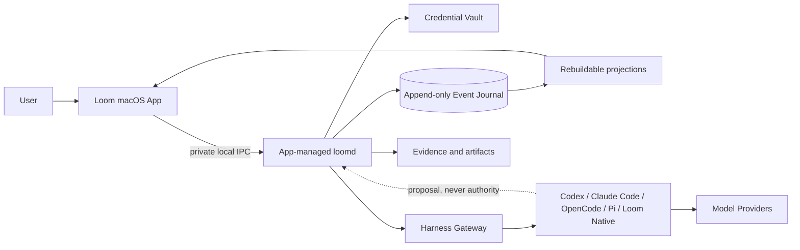

# Loom

**Conversation first. Governed Agent Teams when the work becomes a Mission.**

Loom is a local-first macOS workspace for pairing with coding Agents and for
governing multi-Agent work. You can begin with an ordinary conversation, then
turn a concrete objective into a titled Mission with an explicit Team,
independent execution bindings, live activity, evidence, accounting and human
intervention.

[Changelog](./CHANGELOG.md) ·
[Current status](./docs/CURRENT.md) ·
[Product plan](./PRODUCT-PLAN.md) ·
[Architecture](./docs/ARCHITECTURE.md) ·
[Development guide](./docs/DEVELOPMENT.md)

> **Current installed acceptance**
>
> Loom `0.5.6` Build 324 is installed and completes Phase 7 for the Runtimes
> available to this user. Source, deterministic packaging, strict bundle
> identity, managed restart and the real-model control matrix pass for Codex,
> OpenCode/DeepSeek, Pi and Loom Native/MiniMax. All 28 model-facing Loom Tools,
> Proposal decisions, expiry, replay rejection, RoundTable governance, restart
> restoration and the installed privacy scan pass across those four Runtimes.
> Claude Code is discovered but has no executable Conversation Profile; its
> installed login and paid live call are explicitly N/A by user choice, while
> source parity, admission, cancellation and failure-isolation remain enforced.
> Phase 2D, Phase 4, Phase 5 and Phase 6 are closed for their defined scopes.
> The four-real-Provider
> Team, real-account revoke/rate-limit matrix and custom-endpoint live loop are
> explicitly deferred; see [Current status](./docs/CURRENT.md).

## Start Here

Open Loom and type in **Conversation**. The App starts and manages its bundled
`loomd` service automatically; users do not need to launch a second process.
Conversation becomes usable before Loom finishes discovering every external
Harness and restoring governed Agent history. A Mission or RoundTable opened
during that preparation remains in place and restores automatically.

1. Start a conversation in the center workspace.
2. Optionally type `/` or choose **Commands** to find a Loom action without
   leaving the composer.
3. Choose a route near the composer when you need a different Harness,
   Provider Account, model or reasoning level.
4. Continue chatting for ordinary pairing work.
5. Choose **Run as Mission** when the work needs a Team, workflow, governed
   execution or durable result.
6. Review the proposed Team and execution bindings, then start the Mission.
7. Follow each Agent's activity, output and status in Mission Room. If a Mission
   is blocked, add guidance through **Continue this Mission**.

If no usable route is available, open **Runtime & Providers**. Loom separates
runtime discovery from Provider credentials, so the screen can tell you whether
the missing piece is a Harness, an account, a model or a credential.

## The Product Model

These five concepts are deliberately separate:

| Concept | What the user should expect |
|---|---|
| **Conversation** | The default pairing surface. It can remain a simple chat and does not create a Team implicitly. |
| **Mission** | One titled, navigable workflow related to a Conversation. Opening it shows that workflow's objective, Team, Agent activity, output, evidence and recovery state. |
| **Agent Team** | A reusable roster and orchestration definition. Every Agent can use a different Harness, Provider Account and model. |
| **Runtime & Providers** | The setup and health surface for Harness runtimes, Provider Accounts, models, credentials and diagnostics. |
| **RoundTable** | A governed discussion node inside a Mission. Add 2–6 Team Agents by drag and drop, watch each contribution, intervene per seat and explicitly accept the conclusion. |

The Mission Board is a projection of Missions, not a place where every internal
object is flattened into cards. A Mission title is the entry point; Mission
Room is where the single workflow and its Team execution are understood.

## Conversation

Conversation follows the interaction model users already know from Codex and
Claude Code: the center of the App is the dialogue, while navigation and
governance stay available at the sides.

- A new App session opens into Conversation.
- Multiple conversations are isolated and remain navigable in the sidebar.
- The selected reply shows its actual Harness, Provider Account, model and
  reasoning level.
- The current response can be stopped without deleting the Conversation.
- A Conversation can be copied as a readable transcript.
- A proposal can become a Mission without re-entering its objective.

### Actions from Conversation

Ordinary text remains ordinary chat. Type `/` or choose the command icon to
open the same searchable action catalog; Up/Down changes selection, Return
opens it and Escape closes it. Explicit Chinese and English requests such as
"open RoundTable" resolve through the same typed actions, while questions and
incidental mentions remain chat.

| Group | Commands |
|---|---|
| **Conversation** | `/help`, `/new`, `/copy` |
| **Work** | `/mission [objective]`, `/missions`, `/team [purpose]`, `/roundtable`, `/continue [guidance]` |
| **Governance** | `/route`, `/model`, `/reasoning`, `/status`, `/diagnostics`, `/stop`, `/needs-you`, `/library` |
| **Setup** | `/providers`, `/folder` |

Unavailable actions remain visible with a concrete reason. Unknown Slash
commands stay in the composer and never reach a Provider. Mission and Team
commands create reviewable drafts; RoundTable opens its governed Mission
context; route trust changes and stopping a response keep their confirmation
boundaries. Credentials can only be managed in **Runtime & Providers** and are
rejected as Conversation command arguments.

The selected model can also choose Loom Harness tools from ordinary language;
no exact trigger phrase is required. For example, "align s1 and s2 with this
conversation", "continue the blocked accessibility Mission" or "show the
Provider incident" can resolve to typed tools when the current Runtime supports
the frozen Registry.

| Model tool outcome | What Loom permits |
|---|---|
| **Read** | Search or inspect bounded Session, Mission, Team, RoundTable, Needs You, Runtime, Provider, Incident, Workspace, Route and Library metadata. |
| **Prepare** | Show a reviewable Proposal for Session alignment; Mission create/continue; Team create/edit; RoundTable open/pause/steer/retry/skip/replace; Route, model, reasoning or workspace changes. |
| **Never** | Confirm, cancel or execute its own Proposal; access credentials, Prompt history, Provider bodies, policy or Journal authority; invoke Stop. |

If a model prepares a change, Loom displays the exact target and action in the
Conversation. Nothing changes until you choose **Review** or **Confirm**. The
existing governed review then applies the same confirmation, binding and audit
rules as the visible commands. Session alignment starts a new immutable Segment
with the approved Context Capsule on the next message.

Every decision stores an immutable receipt for that exact Proposal and shows a
copyable Incident ID. A restored historical approval without this receipt stays
visible but cannot be applied. This prevents an old UI status from becoming new
execution authority after a restart.

Installed Build 324 exposes this model-driven surface through Codex,
OpenCode/DeepSeek, Pi and Loom Native/MiniMax in real Conversation turns. The
same Registry and authority contracts are source-green for Claude Code, but
Loom does not advertise that Route until native authentication produces an
executable Profile. Pi appears only when its source-pinned llama.cpp archive,
complete Runtime tree, exact server and GGUF all agree; changed dependencies or
model bytes fail closed.

The installed matrix never chooses the first historical Mission or RoundTable
that happens to look relevant. It binds an explicit acceptance Mission/Team,
creates isolated current RoundTable state for each intervention and concludes
that state after verification. A model cannot turn an old concluded Session
back into writable authority.

### Switching routes

A route is an executable combination, not another Provider:

```text
Harness + Provider Account + Credential Revision + Model + Limits
```

Changing route creates an immutable Conversation Segment. Loom does not mutate
the previous Segment or pass a Provider-native session identifier to another
Provider. When context or trust boundaries change, the App asks how to proceed:

- **Continue with context** sends the policy-admitted relevant context.
- **Summary only** sends goals, confirmed constraints, decisions and current
  state with explicit omissions.
- **Start clean** begins with the current request and required policy only.

Context Capsules carry provenance and disclosure metadata. Previous model
output remains untrusted input; hidden reasoning and credentials are never
transferred.

## Missions

A Mission is one execution journey, not a second kind of chat and not a dump of
all project state. It has a title, a link to its source Conversation when one
exists, a Team, a task graph and a sequence of independently audited Attempts.

Mission Room presents:

- the objective and current lifecycle state;
- each Agent's frozen Harness, Provider Account, model and status;
- visible Agent output while execution is in progress;
- node progress, dependencies and failure isolation;
- published results and workspace artifacts;
- evidence, accounting, incidents and recovery actions.

Live Agent output is marked tentative until accepted terminal Evidence exists.
Prompts, secrets, Provider response bodies and hidden reasoning are excluded
from the operational stream.

### Human intervention

Blocked, Failed and Cancelled Missions keep a **Continue this Mission** composer.
Guidance opens a prefilled review for the same Team and starts a fresh Attempt
only after explicit confirmation. The old Attempt, output, failure and Incident
remain unchanged and auditable.

## RoundTable

Use RoundTable when a Mission needs several Agents to deliberate before the
workflow continues. It stays related to the same Conversation, Mission and
Team; it is not a separate project board and it does not flatten every internal
object into one view.

1. Open RoundTable from Mission Room.
2. Drag two to six configured Team Agents into the seats. The first is the
   Lead; the others are Participants.
3. Start the discussion and follow each Agent's visible contribution and exact
   Harness, Provider Account, model and status.
4. Pause the round or Steer a running Agent when its Runtime supports live
   guidance. Loom enables Steer only after the exact running Attempt reports
   that capability; otherwise it prepares the controls or keeps guidance for
   Retry after completion. For a failed or cancelled seat, Retry, Skip or
   Replace that Agent without discarding healthy peer results. Retry keeps the
   original discussion goal and adds the new guidance as a separate confirmed
   constraint.
5. When two or more Agent results are ready, start a synthesis round. The Lead
   reconciles agreement, disagreement and the next action; Participants review
   that synthesis independently. A later round is presented as **Refine
   synthesis**, not as another unexplained first synthesis.
6. Review the Lead's latest successful contribution as the conclusion
   candidate. Loom publishes the Alignment Summary only after you explicitly
   choose **Accept Lead result** or **Accept Lead synthesis**.

Every seat Attempt freezes its own Execution Binding and Context Capsule.
Restart recovery cancels interrupted Attempts instead of silently resuming
Provider work. Export and Import are explicit local actions for a concluded,
digest-verified RoundTable record; credentials, prompts, Provider bodies and
hidden reasoning are not written to the RoundTable Journal.

## Agent Teams

Team-level defaults initialize new Agents; they do not overwrite an Agent's
independent binding. The execution chain is:

```text
Team Role
  -> Agent Definition
  -> Execution Profile
  -> Harness Adapter
  -> Provider Account / Credential Revision
  -> Model / Limits / Capabilities
```

The Dispatcher resolves and freezes this chain per Agent and per Attempt. One
Provider Account failure blocks only the affected Agent. Fallback is explicit,
versioned and auditable; Loom does not silently move a Claude or Codex Agent to
another Provider.

## Runtime, Provider And Model

The three selectors answer different questions:

| Dimension | Question | Examples |
|---|---|---|
| **Harness runtime** | How is the Agent executed? | Codex, Claude Code, OpenCode, Loom Native, Pi |
| **Provider Account** | Which model service and credential authority are used? | OpenAI, Anthropic, DeepSeek, Kimi, MiniMax |
| **Model** | Which model does that route invoke? | A model supported by the selected account and Harness |

OpenCode is a Harness runtime. It may execute a DeepSeek or MiniMax route, but
it must not appear as duplicate `opencode-deepseek` or `opencode-minimax`
Provider Accounts. Provider Directory is built from model Providers; Runtime
inventory is built from detected Harnesses; the route menu combines them only
at the point of execution.

The Provider catalog includes official, gateway, cloud, local and custom
compatible descriptors. A catalog entry means Loom understands the setup
contract; it does not claim that the current machine has a credential, a
compatible runtime or a live-verified route. The App shows those states
separately.

## Credentials And Privacy

Normal operation uses the Loom-owned Credential Vault. The macOS Keychain is a
migration source only and is not read for every Conversation turn or Agent
Attempt.

- Secrets enter through the private local IPC boundary only during import or
  replacement.
- The daemon acquires short-lived, exact credential leases by Provider Account,
  reference and revision.
- Credentials do not enter Conversation transcripts, Prompts, Teams, Journal,
  Evidence, diagnostics, process arguments or global environment variables.
- Operational diagnostics contain safe stage, timing, result and Incident IDs,
  not user content or Provider bodies.
- Vault, Conversation and export encryption use separate key domains and fail
  closed on identity, revision or integrity drift.

The default local key-file mode protects against disclosure of the Vault
database by itself. It does not claim protection from an attacker who already
controls the same macOS account, root or daemon memory; use FileVault and normal
device security as part of the threat model.

## Failure And Diagnostics

The UI does not reduce every failure to `Unavailable`. Provider import,
verification, Conversation dispatch and Agent Attempts expose a privacy-safe
stage, retryability, recovery action and Incident ID.

Users can retry, inspect diagnostics or copy the Incident ID without opening a
terminal. Journal facts remain separate from operational diagnostics: the
Journal is execution authority; diagnostics help explain what happened.

## Current Release Boundary

`v0.5.6` includes the Phase 2D and Phase 4 product boundaries, the accepted
Phase 5 Conversation-first experience, the Phase 6 unified action entry and
the completed Phase 7 model-driven Harness surface through installed Build
324:

- a searchable 18-action Conversation command catalog with stable keyboard,
  compact-layout and accessibility behavior;
- conservative natural-language action routing through the same typed catalog;
- contextual unavailable reasons, visible local feedback and privacy-safe
  diagnostics directly from the composer;
- governed Mission and Team drafts, Mission-linked RoundTable navigation and
  reviewed Route transitions without direct execution authority from text;
- App-managed bundled daemon startup;
- Conversation Profiles, Route Segments and Context Capsules;
- Loom Credential Vault and short-lived credential leases;
- independent per-Agent execution bindings;
- Mission creation from Conversation, live Agent activity and result opening;
- actionable blocked-Mission intervention;
- Provider / Runtime / route separation, including OpenCode;
- Incident diagnostics, controlled failure isolation, fallback and accounting;
- governed RoundTable sessions, drag-and-drop seating, visible failure recovery,
  restart-safe Agent output, prompt-preserving Retry and provenance-bound
  multi-round synthesis;
- Conversation-ready startup with external Harness discovery deferred behind
  the local service boundary, plus automatic RoundTable restoration while the
  governed Agent Runtime is still preparing;
- bounded restart recovery that validates terminal Attempt bindings without
  replaying each historical Run, and validates one frozen payload authority
  only once per reconciliation pass;
- compact RoundTable Agent result previews that preserve each conclusion's
  beginning and latest action at complete rendered-word boundaries, with
  explicit accessible full-result expansion;
- structured RoundTable operation recovery in both the Conversation inspector
  and full workbench, including stage, retryability, recovery action,
  diagnostics and copyable Incident ID;
- visible retry alerts when diagnostic preparation or folder selection fails,
  instead of silent navigation or dismissal.
- structured Mission preflight recovery with one correlation identity, safe
  stage, retryability, diagnostics and copyable Incident ID;
- complete installed keyboard traversal across Conversation, Mission and
  RoundTable controls without focus traps;
- automatic recovery when a rapid App restart briefly adopts the previous
  managed daemon's Socket and that daemon then exits.
- a versioned, Segment-scoped Codex tool registry with metadata-only
  Conversation search and digest-bound alignment proposals;
- user-only Confirm/Cancel review, followed by a new immutable Segment whose
  binding freezes the alignment receipt and Context Capsule provenance;
- one 28-tool Registry across Codex, OpenCode, Claude Code, Pi and Loom Native,
  with 13 bounded metadata reads and 15 governed mutation previews;
- installed ordinary-language Tool selection, Proposal governance, expiry,
  replay rejection, managed restart and privacy acceptance for Codex,
  OpenCode/DeepSeek, Pi and Loom Native/MiniMax;
- distinct Loom Native Runtime labels for DeepSeek, Kimi and MiniMax instead of
  three indistinguishable rows.

Not claimed by this release candidate:

- one installed Team using four independently credentialed real Providers at
  the same time;
- a live revoke/rate-limit test against a user's real Provider Account;
- a complete real Conversation through a newly imported custom endpoint;
- a Claude Code installed login or paid live call on this machine; the user has
  marked that Runtime N/A, while its source and fail-closed admission contracts
  remain supported;
- cloud sync, multi-user collaboration or unattended standing orders.

## Build And Install On macOS

Requirements:

- macOS 14 or newer on Apple silicon;
- Go 1.22 or newer;
- Swift 6;
- one or more supported Harness CLIs for native-runtime routes.

Build a signed local bundle into a new private directory:

```bash
release_root="$(mktemp -d)"
scripts/build-loom-local-app.sh --output "$release_root/Loom.app"
```

Install it transactionally for the current user:

```bash
mkdir -p "$HOME/Applications"
scripts/install-loom-local-app.sh \
  --app "$release_root/Loom.app" \
  --destination "$HOME/Applications/Loom.app"
open "$HOME/Applications/Loom.app"
```

The installer validates ownership, file modes, bundle identity, architecture
and code signature. It keeps one rollback bundle at `Loom.app.previous`.

## Verify A Source Checkout

```bash
go test -p 4 ./... -count=1 -timeout=15m
go test -race ./internal/api ./internal/app ./internal/execution \
  ./internal/localipc ./internal/runtime/...
go vet ./...

swift test --package-path apps/macos
scripts/test-build-loom-local-app.sh
scripts/test-install-loom-local-app.sh
git diff --check
```

External Provider tests may spend quota or use real credentials and are not
part of the default source gate. Run only the explicitly scoped live acceptance
scripts with user authorization.

## Architecture In One View


```mermaid
flowchart LR
    U["User"] --> A["Loom macOS App"]
    A -->|"private local IPC"| D["App-managed loomd"]

    D --> V["Credential Vault"]
    D --> J[("Append-only Event Journal")]
    J --> P["Rebuildable projections"]
    P --> A

    D --> G["Harness Gateway"]
    G --> H["Codex / Claude Code / OpenCode / Pi / Loom Native"]
    H --> M["Model Providers"]

    D --> E["Evidence and artifacts"]
    H -. "proposal, never authority" .-> D
```

The daemon is the local authority for policy, credentials, execution and state
transitions. Clients render projections and submit versioned commands; Agent
output cannot approve itself or directly write terminal authority.

## Repository Map

```text
apps/macos/                 Native SwiftUI App
cmd/loomd/                  App-managed local daemon
internal/api/               Local product API
internal/app/               Mission and setup coordination
internal/contextcapsule/    Context admission, packing and disclosure
internal/credentials/       Credential contracts and Loom Vault
internal/harnessgateway/    Segment Sessions and Harness lifecycle
internal/mcp/tencent/       Decoupled Tencent Cloud MCP demo component
internal/provider/          Provider and model catalogs/adapters
internal/runtime/           Harness adapters and runtime discovery
internal/work/              Mission, Run, Attempt and authority
internal/journal/           Append-only Event Journal
internal/projection/        Rebuildable read models
.loom-evidence/             Contracts and acceptance evidence
```

## Development Rules

Read [AGENTS.md](./AGENTS.md), [Current status](./docs/CURRENT.md) and the
relevant ADR or contract before changing behavior. Preserve these invariants:

1. Ordinary Conversation never creates a Team implicitly.
2. Team drafts and execution require explicit user confirmation.
3. Agent and model output is a proposal, never execution authority.
4. Secrets never enter source control, Prompt, Journal, Evidence or diagnostics.
5. An executor cannot mark its own work done.
6. Historical failed evidence remains historical failure evidence.

Current, source-only, experimental and deferred capabilities must remain clearly
labelled. Tests and installed acceptance outrank roadmap prose.
