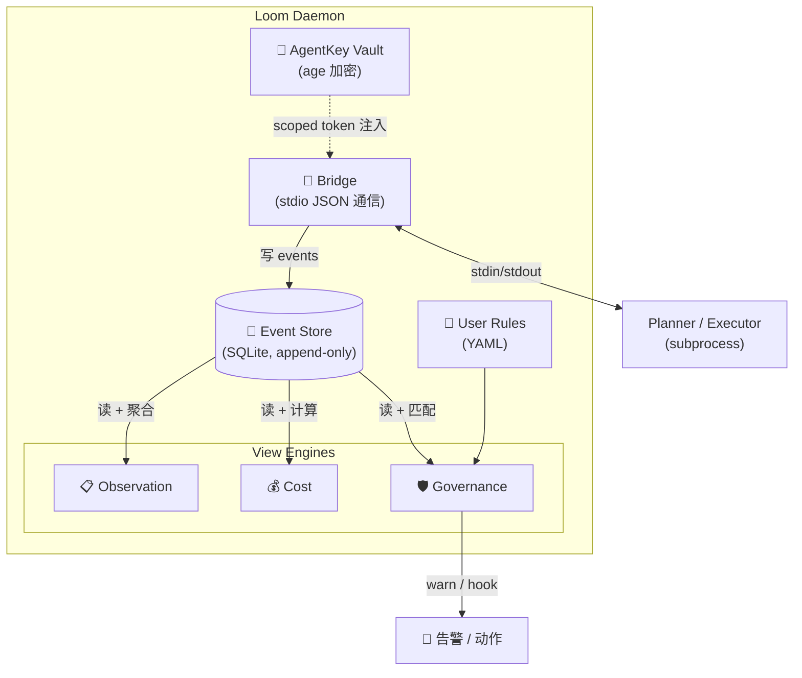

# Loom 技术方案

> 草稿 v0.1 · 2026-07-24
> 对应: [PRODUCT-PLAN.md](./PRODUCT-PLAN.md)
> 状态: 等待 review。确认后开始落地方案。

## 1. 架构总览



完整架构图、流程图、时序图见 [docs/ARCHITECTURE.md](./docs/ARCHITECTURE.md)。

**数据流**：
1. 用户在 CLI 描述问题
2. Loom 启动 planner，给 planner 看到任务描述 + executor pool + AgentKey 中可用 provider
3. Planner 规划步骤，dispatch 给 executor
4. Executor 跑 tool calls，emit events
5. Loom 抓 events 写进 SQLite
6. View engines 从 SQLite 读，渲染 3 个 view
7. Governance engine 匹配 user rules，触发告警
8. 用户在 CLI 看到实时 view，最后 approve delivery

## 2. 组件详解

### 2.1 Loom Daemon

**职责**：中心进程，桥接 planner / executor / 视图 / 规则引擎。

**实现**：
- **Language**: Go 1.22+（单二进制、快、daemon-style 友好、Multica 验证过、部署简单）
- **HTTP server** on localhost（web UI / TUI 后端）
- 启动时加载配置、初始化 SQLite、解锁 AgentKey

### 2.2 Bridge

**职责**：连接 planner 和 executor，抓 events。

**实现**：
- **Phase 1**: stdio JSON（每个 agent 是 subprocess，Loom 通过 stdin/stdout 通信）
- **Phase 2**: MCP 兼容（Anthropic 的 Model Context Protocol，生态收敛方向）
- 消息类型：`task` / `dispatch` / `result` / `event` / `cancel` / `heartbeat`

### 2.3 Event Store

**职责**：append-only event log，3 个 view + governance 的数据源。

**实现**：
- **SQLite**（modernc.org/sqlite 纯 Go，零 CGO）
- 表：`events(id, task_id, ts, type, payload_json)` 灵活 schema
- 提供 query API：按 task_id / type / ts 范围

### 2.4 View Engines

**职责**：从 event stream 切出 3 个 view。

| View | 数据源 | 渲染 |
|---|---|---|
| **Observation** | tool_call / file_change / decision / timing events | 时间线 + 决策点高亮 |
| **Cost** | cost events（provider / model / tokens / $ / fallback 链） | 聚合 + 跟 baseline 对比 |
| **Governance** | event stream + user rules | 告警 + 合规状态 |

**Phase 1**：CLI text output（人类可读）
**Phase 2**：TUI（bubbletea 实时刷新）
**Phase 3**：Web（如果 TUI 不够用）

### 2.5 Governance Engine

**职责**：匹配 user-defined rules，触发告警 / hook。

**实现**：
- 用户写 rules（YAML）
- Rule schema（v0.1）：
  ```yaml
  - name: auth-needs-2-reviewers
    when:
      event_type: file_change
      path_glob: "src/auth/**"
    then:
      action: warn
      message: "auth changes need 2 reviewers"
  ```
- Engine 订阅 event stream，匹配 rule，触发 action（warn / log / hook）
- **不强制执行**（Loom 不 block 任务，只是告警）

### 2.6 AgentKey Vault

**职责**：加密存储 provider API key，生成 scoped token。

**实现**：
- **Phase 1**: 文件级加密（`age` encryption，X25519 + ChaCha20-Poly1305）
- **Phase 2**: 接入 OS keychain（macOS Keychain / Linux Secret Service）
- **Scoped token 流程**：
  1. Executor 启动时向 Loom 请求："我需要调 minimax/M2.7，task X"
  2. Loom 校验 task 范围（path / provider / 时间）
  3. Loom 用 AgentKey 中的真 key 生成一个短时效 token
  4. Token 注入到 executor 的 env
  5. Executor 用 token 调 API，token 过期自动失效
- **关键点**：executor 永远不直接拿 key，只拿 scoped token

## 3. Tech Stack

| 组件 | 技术 | 理由 |
|---|---|---|
| Daemon 主程序 | **Go 1.22+** | 单二进制、快、daemon 友好、Multica 验证、部署简单 |
| Event Store | **SQLite (modernc.org/sqlite)** | 嵌入式、零 CGO、append-only 友好 |
| Bridge (Phase 1) | **stdio JSON** | 最简、调试容易 |
| Bridge (Phase 2) | **MCP** | 生态收敛方向 |
| AgentKey 加密 | **`age` (filippo.io/age)** | 现代、简洁、可审计 |
| TUI (Phase 2) | **bubbletea / lipgloss** | Go 生态成熟、好看 |
| Web UI (Phase 3) | TBD（next.js 或 htmx） | 看需求 |
| 配置 | **YAML** | 跟 ecosystem 习惯一致 |

## 4. 数据模型

```sql
-- 任务
CREATE TABLE tasks (
  id TEXT PRIMARY KEY,
  description TEXT NOT NULL,
  planner TEXT,           -- user-defined model name (e.g. "claude-opus-4.7")
  executor TEXT,          -- user-defined model name (e.g. "minimax-m2.7")
  status TEXT,            -- running | done | failed | approved | rejected
  created_at INTEGER,
  finished_at INTEGER,
  total_cost_usd REAL,
  total_tokens INTEGER
);

-- Event（append-only）
CREATE TABLE events (
  id INTEGER PRIMARY KEY AUTOINCREMENT,
  task_id TEXT NOT NULL,
  ts INTEGER NOT NULL,
  type TEXT NOT NULL,      -- tool_call | file_change | decision | cost | ...
  payload_json TEXT NOT NULL,
  FOREIGN KEY (task_id) REFERENCES tasks(id)
);
CREATE INDEX idx_events_task_ts ON events(task_id, ts);

-- Provider 配置
CREATE TABLE providers (
  id TEXT PRIMARY KEY,
  type TEXT,               -- openai-compat | anthropic | ...
  base_url TEXT,
  models_json TEXT
);

-- Governance rules
CREATE TABLE rules (
  id TEXT PRIMARY KEY,
  name TEXT,
  enabled BOOLEAN,
  rule_yaml TEXT,
  created_at INTEGER
);
```

## 5. Bridge 协议（Phase 1, stdio JSON）

**消息格式**：JSON Lines（每行一个 JSON 对象）。

**消息类型**：
- `task` (Loom → Planner): 启动新任务
- `dispatch` (Loom → Executor): 分派步骤
- `result` (Executor → Loom): 步骤完成
- `event` (Executor → Loom): 工具调用 / 文件变更 / 决策点
- `cancel` (Loom → Planner/Executor): 取消
- `heartbeat` (双向): 健康检查

每个消息带 `task_id`、`step_id`、`ts`、`payload`。

**示例**：

```json
// Loom → Planner
{
  "type": "task",
  "id": "task-42",
  "description": "Fix auth bug in PR #42",
  "executors": ["minimax-m2.7", "glm-4.7"],
  "providers": ["minimax", "zhipu"],
  "scope": { "paths": ["/repo/src/auth/"], "tools": ["read","edit","bash"] }
}

// Planner → Executor (via Loom)
{
  "type": "dispatch",
  "task_id": "task-42",
  "step": 1,
  "instruction": "Read src/auth/login.ts and identify the bug"
}

// Executor → Loom (event)
{
  "type": "event",
  "task_id": "task-42",
  "event": "tool_call",
  "tool": "read",
  "args": { "path": "src/auth/login.ts" },
  "result": "...",
  "cost": { "provider": "minimax", "model": "M2.7", "tokens": 1234, "usd": 0.001 }
}
```

## 6. 安全边界

- **AgentKey vault**：key 加密存储（age），daemon 启动时要求 user 输入 master password（或用 OS keychain）
- **Scoped token**：executor 拿到的是短时效、有限范围的 token
- **事件存储**：v1.0 不加密 event stream（本地）
- **网络隔离**：daemon 只 listen localhost，不开外部端口
- **审计**：governance engine 可以记录所有敏感操作

## 7. 不确定 / 风险

- **Bridge 协议稳定性**：MCP 在快速演化，Phase 2 切换有迁移成本
- **TUI 性能**：高频 event 流下 bubbletea 是否扛得住
- **AgentKey 跨平台**：macOS / Linux / Windows 的 keychain 行为差异
- **多任务并发**：单 daemon 跑多 task 是否够用
- **云端 vs 本地**：v1.0 锁定本地，社区反馈后再考虑云
- **scoped token 安全模型**：怎么防止 token 被 executor 滥用 / 转授
- **event 体积**：高频 tool_call 事件可能让 SQLite 很快变大，需要 rotation 策略

## 8. Phase 1 落地方案（1 周 demo）

**目标**：跑通一个真实任务，3 view 都出图。

**最小技术栈**：
- 单个 Go binary
- stdio JSON bridge
- Mock planner（一个简单 LLM 调用脚本）
- Mock executor（另一个简单 LLM 调用脚本）
- SQLite event store
- 3 view 渲染到 stdout（text format）

**实现顺序**：
1. Day 1-2: Event store + 数据模型 + SQLite schema
2. Day 3: stdio JSON bridge + mock planner/executor
3. Day 4: 3 view 渲染（CLI text）
4. Day 5: 端到端跑通 "修 PR #42" demo
5. Day 6-7: 修 bug + 整理 demo

**不实现**：
- AgentKey（Phase 2 才有）
- TUI（Phase 2）
- 真实 Provider 集成（用 mock）
- Governance engine（Phase 3）
- 任何 web UI

## 9. 后续可能扩展

- Web UI（独立 React app 或 htmx）
- Multica 集成（作为 Loom 的 UX 前端）
- 9Router 集成（cost 数据互通）
- Provider canary（基于历史 cost/quality 自动切）
- Skill 系统（planner 沉淀经验）
- 多用户（v2.0+）
- 远程 / 云端 daemon（v2.0+）
