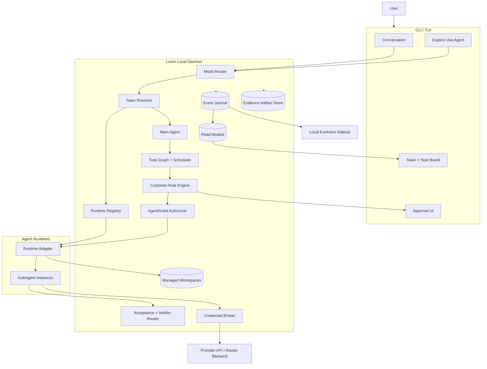

# Loom 技术方案

> 草稿 v0.3 · 2026-07-24
> 对应：[PRODUCT-PLAN.md](./PRODUCT-PLAN.md)
> 状态：Phase 1 合同已定义，可进入实现

## 1. 设计目标

Phase 1 必须证明一条真实纵向链，而不是只证明消息可以传输：

```text
普通对话不组队
→ 用户显式使用 Agent
→ 解析已有团队或生成 Team Draft
→ 用户确认
→ 创建 Main Agent 与 SubAgent
→ 绑定真实在线 RuntimeInstance
→ 认领 Run 并签发任务级 AgentGrant
→ 执行真实工作项
→ 提交 Evidence
→ 确定性验收或独立验证
→ 更新看板终态
```

### 1.1 不变量

1. 普通输入不会自动创建 Agent 团队。
2. 每个团队有且只有一个 Main Agent。
3. Main Agent 不直接承担交付物修改和自我验收。
4. 模型生成的团队必须由用户确认后实例化。
5. AgentDefinition、RuntimeProfile 与 RuntimeInstance 分离。
6. 执行 Agent 只能提交 `ready_for_review`，不能直接写入 `done`。
7. 客户规则匹配 `require_approval` 时，关联工作项必须暂停。
8. Loom 自签临时凭证只由 Loom 本地服务验证，不能冒充 Provider 凭证。
9. Event 是追加写事实；看板、成本和治理状态是可重建投影。
10. Sidecar 不修改运行中的团队，只生成版本化候选。
11. Team Draft 只能引用目录快照中真实可用的 Agent、Runtime、模型、Skill、成员和权限。
12. Agent 进程只能使用任务级 AgentGrant 调用 Loom，不能继承 Client 或 Daemon 的用户身份。
13. 所有 Run 消息必须匹配当前 `claim_generation`；旧认领的晚到消息 fail closed。
14. terminal 与 Evidence 先提交到本地状态权威，不以远端回调成功作为完成条件。

## 2. 系统架构

完整的 C4 Context、Container、Daemon Component、Deployment 和 Dynamic 图见
[docs/architecture/](./docs/architecture/README.md)。Phase 1 使用本地模块化单体 daemon，
不会把内部 Component 提前拆成微服务。



## 3. 入口与团队解析

### 3.1 模式路由

Mode Router 接收结构化用户意图：

```json
{
  "mode": "conversation | agent",
  "trigger": "plain_input | use_agent | select_agent | select_team | assign",
  "target_id": "optional agent or team id",
  "text": "user input"
}
```

规则：

- `plain_input` 默认进入 `conversation`；
- 只有显式 Agent trigger 才进入 `agent`；
- 普通对话可以展示“使用 Agent”建议，但不能自动切换；
- 模式切换写入 Event Journal。

### 3.2 团队解析顺序

```text
显式选择 Team
→ 加载该 Team

显式选择单个 Agent
→ 将其作为团队入口
→ 若它不是 Main Agent，创建默认 Main Agent 并把所选 Agent 加入 Team Draft

显式使用 Agent，但未选择 Team
→ 查找项目默认 Team
→ 查找匹配的个人复用 Team
→ 均不存在时，由默认 Main Agent 生成 Team Draft
```

用户显式定义且选择的完整团队直接实例化，不再次询问团队结构。模型生成或补全的团队必须进入 Team Draft。

### 3.3 Team Draft

Team Draft 是版本化对象，包含：

- `main_agent_definition_id`；
- SubAgent 定义与来源；
- RuntimeProfile 与兼容 RuntimeInstance 建议；
- 首轮任务图；
- 权限、预算和并发；
- 验收条件；
- 客户规则摘要；
- 尚未确认的问题。
- 生成时使用的可用目录快照 digest。

每次回答只产生一个新 revision。只有最新 revision 可以被接受。

状态：

```text
draft
→ awaiting_answer
→ proposed
→ accepted | rejected | expired
```

`accepted` 后创建 TeamInstance 和 WorkItem；`rejected` 不创建运行实例。

生成 Draft 前，Team Resolver 构造有界 `TeamDraftCatalogSnapshot`：

```text
AgentDefinition IDs
+ online RuntimeInstance IDs and capabilities
+ Runtime-discovered model IDs
+ workspace Skill and member IDs
+ customer permission, budget and concurrency ceilings
```

Main Agent 只能返回快照中的 ID，或返回显式 `capability_gap`。每轮回复必须携带结构化 Draft revision；
面向用户的文字解释和可执行草案分离。模型输出不能绕过 Schema 校验。

### 3.4 运行期变更

已有 Agent 之间的任务重排可以自动发生。

以下操作必须创建 TeamChange：

- 新增 Agent；
- 替换 AgentDefinition 或 RuntimeProfile；
- 扩大工具、数据或外部动作权限；
- 提高预算或并发上限。

停止、取消和降权不需要 TeamChange 批准，但必须写入事件和原因。

## 4. 核心领域模型

| 实体 | 用途 |
|---|---|
| `AgentDefinition` | 与模型无关的职责、输入输出、工具边界和质量要求 |
| `RuntimeProfile` | Agent CLI、Provider、模型、认证模式、预算、超时和 fallback |
| `RuntimeInstance` | 某台设备上实际发现的 Runtime、版本、在线状态、能力和容量 |
| `TeamDefinition` | 用户显式保存的团队结构 |
| `TeamDraft` | 模型生成或补全、等待确认的团队和首轮任务草案 |
| `TeamInstance` | 一次 Agent 模式执行中的实际团队 |
| `AgentInstance` | AgentDefinition、RuntimeProfile 与 RuntimeInstance 在某次 TeamInstance 中的绑定 |
| `WorkPackage` | Coding、研究、写作等领域模板 |
| `WorkItem` | 可分派、可验收的工作单元 |
| `Run` | AgentInstance 对 WorkItem 的一次执行尝试 |
| `AgentGrant` | 绑定 Run、AgentInstance 和认领代次的 Loom 本地 API 权限 |
| `Evidence` | 验收所需的结构化或文件型证据 |
| `Rule` | 客户定义的匹配条件和执行效果 |
| `ApprovalRequest` | `require_approval` 产生的暂停与客户决定 |
| `CredentialGrant` | Broker 模式下的任务级本地临时访问许可 |
| `Event` | 追加写事实 |
| `EvolutionCandidate` | Sidecar 生成的 Memory、Skill、Agent 或策略候选 |

### 4.1 AgentDefinition scope

```text
project
→ reusable
→ transient
```

解析优先级为 `project > reusable > transient generation`。临时定义不会自动升级作用域。

### 4.2 WorkPackage

WorkPackage 只封装领域差异：

- 推荐 AgentDefinition；
- 工具类别；
- 默认验收器；
- Evidence 类型；
- 默认客户规则模板。

编排、状态机、批准和 Sidecar 对所有 WorkPackage 相同。

## 5. SQLite 最小 Schema

以下是 Phase 1 的逻辑 Schema；迁移文件实现时必须使用外键、事务和唯一约束。

```sql
CREATE TABLE agent_definitions (
  id TEXT NOT NULL,
  version INTEGER NOT NULL,
  scope TEXT NOT NULL CHECK (scope IN ('project', 'reusable', 'transient')),
  project_id TEXT,
  name TEXT NOT NULL,
  role_spec_json TEXT NOT NULL,
  status TEXT NOT NULL CHECK (status IN ('active', 'archived')),
  created_at INTEGER NOT NULL,
  PRIMARY KEY (id, version)
);

CREATE TABLE runtime_profiles (
  id TEXT PRIMARY KEY,
  adapter_type TEXT NOT NULL,
  provider TEXT,
  model TEXT,
  auth_mode TEXT NOT NULL CHECK (
    auth_mode IN ('brokered', 'provider_ephemeral', 'native_auth')
  ),
  config_json TEXT NOT NULL,
  created_at INTEGER NOT NULL
);

CREATE TABLE runtime_instances (
  id TEXT PRIMARY KEY,
  device_id TEXT NOT NULL,
  adapter_type TEXT NOT NULL,
  display_name TEXT NOT NULL,
  executable_version TEXT,
  status TEXT NOT NULL CHECK (
    status IN ('online', 'offline', 'incompatible', 'disabled')
  ),
  capabilities_json TEXT NOT NULL,
  capacity INTEGER NOT NULL CHECK (capacity > 0),
  last_seen_at INTEGER,
  created_at INTEGER NOT NULL
);

CREATE TABLE team_drafts (
  id TEXT NOT NULL,
  revision INTEGER NOT NULL,
  work_request_id TEXT NOT NULL,
  status TEXT NOT NULL,
  proposal_json TEXT NOT NULL,
  created_at INTEGER NOT NULL,
  PRIMARY KEY (id, revision)
);

CREATE TABLE team_instances (
  id TEXT PRIMARY KEY,
  work_request_id TEXT NOT NULL,
  source_draft_id TEXT,
  source_draft_revision INTEGER,
  state TEXT NOT NULL,
  created_at INTEGER NOT NULL
);

CREATE TABLE agent_instances (
  id TEXT PRIMARY KEY,
  team_instance_id TEXT NOT NULL,
  definition_id TEXT NOT NULL,
  definition_version INTEGER NOT NULL,
  runtime_profile_id TEXT NOT NULL,
  runtime_instance_id TEXT NOT NULL,
  is_main INTEGER NOT NULL CHECK (is_main IN (0, 1)),
  state TEXT NOT NULL,
  FOREIGN KEY (team_instance_id) REFERENCES team_instances(id),
  FOREIGN KEY (definition_id, definition_version)
    REFERENCES agent_definitions(id, version),
  FOREIGN KEY (runtime_profile_id) REFERENCES runtime_profiles(id),
  FOREIGN KEY (runtime_instance_id) REFERENCES runtime_instances(id)
);

CREATE UNIQUE INDEX one_main_agent_per_team
  ON agent_instances(team_instance_id)
  WHERE is_main = 1;

CREATE TABLE work_items (
  id TEXT PRIMARY KEY,
  team_instance_id TEXT NOT NULL,
  parent_id TEXT,
  title TEXT NOT NULL,
  contract_json TEXT NOT NULL,
  risk TEXT NOT NULL CHECK (risk IN ('low', 'medium', 'high')),
  status TEXT NOT NULL,
  assignee_agent_instance_id TEXT,
  created_at INTEGER NOT NULL,
  updated_at INTEGER NOT NULL,
  FOREIGN KEY (team_instance_id) REFERENCES team_instances(id),
  FOREIGN KEY (parent_id) REFERENCES work_items(id),
  FOREIGN KEY (assignee_agent_instance_id) REFERENCES agent_instances(id)
);

CREATE TABLE work_dependencies (
  work_item_id TEXT NOT NULL,
  depends_on_work_item_id TEXT NOT NULL,
  PRIMARY KEY (work_item_id, depends_on_work_item_id),
  FOREIGN KEY (work_item_id) REFERENCES work_items(id),
  FOREIGN KEY (depends_on_work_item_id) REFERENCES work_items(id)
);

CREATE TABLE runs (
  id TEXT PRIMARY KEY,
  work_item_id TEXT NOT NULL,
  agent_instance_id TEXT NOT NULL,
  runtime_instance_id TEXT NOT NULL,
  attempt INTEGER NOT NULL,
  claim_id TEXT UNIQUE,
  claim_generation INTEGER NOT NULL DEFAULT 0,
  status TEXT NOT NULL CHECK (
    status IN (
      'queued', 'claimed', 'preparing', 'running',
      'waiting_approval', 'ready_for_review', 'verifying',
      'completed', 'failed', 'cancelled'
    )
  ),
  claimed_at INTEGER,
  prepare_lease_expires_at INTEGER,
  started_at INTEGER,
  last_heartbeat_at INTEGER,
  finished_at INTEGER,
  terminal_reason TEXT,
  UNIQUE (work_item_id, attempt),
  FOREIGN KEY (work_item_id) REFERENCES work_items(id),
  FOREIGN KEY (agent_instance_id) REFERENCES agent_instances(id),
  FOREIGN KEY (runtime_instance_id) REFERENCES runtime_instances(id)
);

CREATE TABLE events (
  id TEXT PRIMARY KEY,
  stream_id TEXT NOT NULL,
  seq INTEGER NOT NULL,
  event_type TEXT NOT NULL,
  payload_json TEXT NOT NULL,
  emitted_at INTEGER NOT NULL,
  UNIQUE (stream_id, seq)
);

CREATE TABLE evidence (
  id TEXT PRIMARY KEY,
  work_item_id TEXT NOT NULL,
  run_id TEXT,
  kind TEXT NOT NULL,
  digest TEXT NOT NULL,
  location TEXT,
  metadata_json TEXT NOT NULL,
  created_at INTEGER NOT NULL,
  FOREIGN KEY (work_item_id) REFERENCES work_items(id),
  FOREIGN KEY (run_id) REFERENCES runs(id)
);

CREATE TABLE rules (
  id TEXT NOT NULL,
  version INTEGER NOT NULL,
  scope_json TEXT NOT NULL,
  condition_json TEXT NOT NULL,
  effect_json TEXT NOT NULL,
  enabled INTEGER NOT NULL,
  PRIMARY KEY (id, version)
);

CREATE TABLE approval_requests (
  id TEXT PRIMARY KEY,
  work_item_id TEXT NOT NULL,
  rule_id TEXT NOT NULL,
  rule_version INTEGER NOT NULL,
  status TEXT NOT NULL CHECK (
    status IN ('pending', 'approved', 'rejected', 'cancelled', 'expired')
  ),
  request_json TEXT NOT NULL,
  decision_json TEXT,
  created_at INTEGER NOT NULL,
  decided_at INTEGER,
  FOREIGN KEY (work_item_id) REFERENCES work_items(id),
  FOREIGN KEY (rule_id, rule_version) REFERENCES rules(id, version)
);

CREATE TABLE agent_grants (
  id TEXT PRIMARY KEY,
  token_hash TEXT NOT NULL UNIQUE,
  run_id TEXT NOT NULL,
  agent_instance_id TEXT NOT NULL,
  claim_generation INTEGER NOT NULL,
  allowed_operations_json TEXT NOT NULL,
  expires_at INTEGER NOT NULL,
  revoked_at INTEGER,
  FOREIGN KEY (run_id) REFERENCES runs(id),
  FOREIGN KEY (agent_instance_id) REFERENCES agent_instances(id)
);

CREATE TABLE credential_grants (
  id TEXT PRIMARY KEY,
  token_hash TEXT NOT NULL UNIQUE,
  run_id TEXT NOT NULL,
  provider TEXT NOT NULL,
  model TEXT,
  max_cost_usd REAL,
  expires_at INTEGER NOT NULL,
  revoked_at INTEGER,
  FOREIGN KEY (run_id) REFERENCES runs(id)
);

CREATE TABLE evolution_candidates (
  id TEXT PRIMARY KEY,
  candidate_type TEXT NOT NULL,
  source_scope_json TEXT NOT NULL,
  artifact_json TEXT NOT NULL,
  evaluation_json TEXT,
  status TEXT NOT NULL CHECK (
    status IN ('draft', 'evaluating', 'proposed', 'activated', 'rejected')
  ),
  created_at INTEGER NOT NULL,
  activated_at INTEGER
);
```

Raw Provider Key、OAuth refresh token、CLI 凭证和 AgentGrant/CredentialGrant 明文不进入这些表。
数据库只保存凭证引用、Grant 哈希和授权边界。

### 5.1 Evidence Artifact Store

大型日志、报告、Receipt 和导出物不内联到 Event 或 SQLite。Daemon 独占一个本地内容寻址目录：

```text
artifacts/
└── sha256/
    └── ab/
        └── abcdef...      immutable artifact bytes
```

写入顺序：

```text
写入 daemon-owned staging file
→ fsync
→ 计算并校验 sha256
→ 原子重命名到内容寻址路径
→ SQLite 事务追加 Evidence metadata 和引用 Event
```

数据库事务失败时可能留下未引用 artifact，但不能留下引用不存在文件的已提交 Evidence。后台 GC
只处理超过保留期且没有任何 Event/Evidence 引用的 orphan；不能删除已引用失败证据。

Phase 1 使用用户私有目录权限（目录 `0700`、文件 `0600`）并依赖操作系统磁盘保护；这不是
应用层静态加密。Provider 凭证仍必须进入 OS Secret Store。Sidecar 的个人记忆和轨迹在 Phase 3
引入应用层静态加密，UI 必须如实显示当前存储保护等级。

### 5.2 Managed Workspace 与 Source

一个 Daemon 可以管理多个项目，但每个 Run 只能访问它被分派的 workspace：

```text
Source repository or approved local directory
→ resolve immutable source digest / Git commit
→ create per-Run managed worktree or copy
→ mount only allowed paths into Agent process
→ collect changed files and output
→ verify original Source digest is unchanged
→ retain or GC workspace according to terminal and retention policy
```

Git 项目优先使用 daemon-owned repo cache 和独立 worktree，避免每次完整 clone。非 Git 本地目录默认
复制到受管 workspace；若客户显式选择原地执行，则同一路径同时只能有一个 writer，并在 UI 中显示
更低的隔离等级。State Store、Artifact Store、其他项目 workspace、`.git` 凭证和用户主目录不能
因方便而整体暴露给 Agent。

Workspace GC 只删除可重建的构建缓存或超过保留期且已经 terminal 的受管目录。失败 Evidence、
Source digest、terminal Receipt 和用户选择保留的工作区不受普通缓存 GC 影响。

## 6. Event Journal 与状态投影

所有执行事实先写入 `events`，再更新可查询投影。单个事务必须满足：

```text
验证事件序号与幂等键
→ 追加 Event
→ 更新 WorkItem / Run / Approval 投影
→ commit
```

崩溃恢复时按 Event 重建投影。重复 `message_id` 或 `(stream_id, seq)` 不得产生第二次副作用。

核心 Event：

- `ModeSelected`
- `RuntimeInstanceDiscovered`
- `RuntimeInstanceStatusChanged`
- `TeamDraftProposed`
- `TeamDraftAnswered`
- `TeamDraftAccepted`
- `TeamInstantiated`
- `WorkItemCreated`
- `WorkItemAssigned`
- `RunClaimed`
- `RunPrepareLeaseExtended`
- `AgentGrantIssued`
- `RunStarted`
- `RunEventRecorded`
- `EvidenceSubmitted`
- `ApprovalRequested`
- `ApprovalDecided`
- `VerificationCompleted`
- `RunTerminalCommitted`
- `AgentGrantRevoked`
- `WorkItemTerminal`
- `TeamChangeProposed`
- `EvolutionCandidateProposed`
- `EvolutionCandidateActivated`

## 7. Bridge 协议

Phase 1 使用 JSON Lines over stdio。每条消息必须包含：

```json
{
  "protocol_version": "loom.bridge.v1",
  "message_id": "uuid",
  "correlation_id": "uuid",
  "work_item_id": "work-123",
  "run_id": "run-456",
  "claim_generation": 2,
  "runtime_instance_id": "runtime-local-codex",
  "sender_agent_instance_id": "agent-789",
  "seq": 7,
  "type": "dispatch | event | evidence | result | cancel | ack | heartbeat",
  "emitted_at": "2026-07-24T00:00:00Z",
  "payload": {}
}
```

协议约束：

- `message_id` 全局唯一；
- 单个 Run 的 `seq` 严格递增；
- 每条 Run 消息必须匹配当前 `claim_generation` 和 `runtime_instance_id`；
- `dispatch`、`cancel` 和 terminal `result` 必须收到 `ack`；
- terminal `result` 只能接受一次；
- 未知 `protocol_version` fail closed；
- 单条消息和缓冲区有硬上限；
- stdout 只用于协议帧，诊断写 stderr；
- Agent 退出、超时或取消必须产生 Run terminal；
- Adapter 负责清理子进程组；
- 大文件和 Evidence 使用 digest + location，不内联进 JSONL。

AgentGrant 明文通过受限环境或 IPC 交给当前 Agent 进程，但不出现在 Bridge payload、Event 或 Evidence。

## 8. Run 认领与工作项生命周期

### 8.1 Run 认领

```text
queued
→ claimed(claim_id, generation, RuntimeInstance, prepare lease)
→ preparing(workspace, skills, config, process environment)
→ running
→ terminal
```

认领必须在一个 SQLite 事务中完成：验证 RuntimeInstance 在线与容量、递增
`claim_generation`、写入 `claim_id` 和准备租约、追加 `RunClaimed` Event。准备阶段定期续租；
Daemon 崩溃或租约过期后，恢复器只能用新的 generation 重新认领。

旧 generation 的 `start`、heartbeat、Evidence 和 terminal 全部拒绝。AgentGrant 与 generation
绑定；重新认领签发新 Grant 并撤销旧 Grant。Run 开始后使用 heartbeat 和进程归属判断存活，
不能用准备租约替代运行期监督。

terminal 提交顺序：

```text
停止接收该 generation 的新输出
→ 原子发布 Evidence artifacts
→ SQLite 事务追加 Evidence metadata + RunTerminalCommitted
→ 更新 Run / WorkItem 投影
→ 撤销 AgentGrant
→ 向 Client 投影结果
```

Client 是否在线、UI 是否收到通知、未来远程协作 Adapter 是否回调成功，都不影响本地 terminal
事实。若 Agent 退出但没有合法 terminal result，Supervisor 生成明确的失败 terminal。

### 8.2 工作项生命周期

```text
draft
→ ready
→ assigned
→ running
→ waiting_approval
→ running
→ ready_for_review
→ verifying
→ done
```

任何执行态都可以进入：

- `blocked`
- `failed`
- `cancelled`

规则：

- Executor 只能请求 `ready_for_review`；
- 验收失败返回 `ready` 或 `failed`，并保留失败 Evidence；
- `require_approval` 创建 ApprovalRequest，并将工作项置为 `waiting_approval`；
- 批准后恢复原执行点；
- 拒绝、超时和取消行为由对应客户规则定义；
- 只有 Loom 的状态投影器可以写入 terminal 状态。

## 9. 客户规则与批准

规则由客户定义，Rule Engine 不在模型 Prompt 中解释执行。

示例：

```yaml
id: publish-needs-owner
scope:
  project: example
when:
  action: publish
then:
  effect: require_approval
  approver: project_owner
  timeout: 24h
  on_timeout: reject
```

匹配流程：

```text
Agent 提议动作
→ Rule Engine 计算全部匹配规则
→ 合并客户定义效果
→ 继续、告警、请求批准、拒绝或执行客户动作
```

`require_approval` 必须持久化 ApprovalRequest。UI 关闭、daemon 重启或 Agent 退出都不能让工作项绕过批准。

## 10. 验收与 Verifier

每个 WorkItem contract 必须定义：

- 交付物；
- 验收条件；
- Evidence 类型；
- 确定性命令或验证器；
- 是否强制独立 Verifier。

默认路由：

| 风险 | 验收 |
|---|---|
| low | 确定性检查；Main Agent 基于 Evidence 验收 |
| medium | 确定性检查；客户规则决定是否创建 Verifier |
| high | 确定性检查 + 独立 Verifier |

Verifier 使用独立 AgentInstance，不继承 Executor 的写权限，不能修改交付物。

## 11. AgentGrant、AgentKey 与 Credential Broker

### 11.1 AgentGrant

AgentGrant 只允许当前 Run 调用 Loom 本地能力，例如发送 Bridge 消息、读取已分派的最小上下文、
上传 Evidence staging 和请求已批准的 Broker 能力。验证条件至少包含：

```text
token hash + Run + AgentInstance + claim_generation
+ allowed operation + expiry + not revoked
```

Agent 进程不得获得 Client session、Daemon 管理 Token 或其他 Run 的 Grant。AgentGrant 不能用于
调用 Provider，也不能扩大客户规则、WorkItem Contract 或 RuntimeProfile 已冻结的权限。

### 11.2 为什么不能把 Loom token 直接发给 Provider

Provider 只接受它官方支持的认证材料。例如：

- OpenAI API 使用 `Authorization: Bearer OPENAI_API_KEY`；
- Claude API 使用 Console API Key，或通过官方身份联邦流程取得的短期 Bearer token。

Loom 本地生成的字符串没有被 Provider 信任，因此不能直接调用 Provider。

参考：

- [OpenAI API Authentication](https://platform.openai.com/docs/api-reference/backward-compatibility)
- [Claude API Authentication](https://platform.claude.com/docs/en/manage-claude/authentication)

### 11.3 三种认证模式

| 模式 | 请求路径 | 隔离保证 |
|---|---|---|
| `brokered` | Agent → Loom Broker → Provider | Agent 不接触真实 Provider Key |
| `provider_ephemeral` | Agent → Provider | 使用 Provider 官方短期凭证；能力取决于 Provider |
| `native_auth` | Agent CLI → Provider/订阅服务 | Loom 不持有 Key，也不能保证 CLI 内部不接触凭证 |

UI 和 Evidence 必须记录实际 `auth_mode`，不能把 `native_auth` 宣称为 AgentKey 隔离。

### 11.4 Brokered 流程

```text
Run 获准访问 Provider
→ Broker 生成随机一次性明文 token
→ 数据库只保存 token hash、Run、Provider、模型、额度和过期时间
→ token 通过受限 IPC 或进程环境交给 Agent
→ Agent 把请求发到 localhost Broker
→ Broker 校验 hash、Run 状态、Provider、模型、额度和有效期
→ Broker 从 OS Keychain / Secret Store 解析真实凭证
→ Broker 代发并记录成本
→ Run terminal 后立即撤销 Grant
```

Broker 只监听 loopback 或 Unix domain socket。日志不得记录请求认证头、真实 Key 或 Grant 明文。

## 12. 共进化 Sidecar

Sidecar 订阅经过许可的 terminal Run 和 Evidence，不阻塞执行主路径。

流程：

```text
收集脱敏轨迹
→ 提取个人偏好、项目事实和可复用程序
→ 生成 Memory / Skill / Agent / Strategy Candidate
→ 在历史任务或合成 Eval 上评测
→ 生成改进摘要
→ 用户激活、拒绝或保留
```

存储边界：

- 默认本地；
- 按用户和项目分区；
- 文件与数据库静态加密；
- Agent 只获得当前工作所需的检索结果；
- 不把完整历史自动注入 Prompt；
- 同步、发布和团队共享默认关闭。

## 13. 技术栈

| 组件 | Phase 1 选择 |
|---|---|
| Daemon | Go 1.22+ |
| Event 与投影 | SQLite，WAL，事务写入 |
| Evidence artifact | 本地内容寻址文件目录，原子写入 |
| Bridge | JSON Lines over stdio |
| CLI | Cobra |
| 配置 | YAML；启动时转为已验证结构 |
| 凭证 | Phase 1 使用 Runtime 原生认证并准确标注；Phase 2 实现 Broker |
| TUI | Phase 2 再引入 Bubble Tea |
| Sidecar | Phase 3 独立进程 |

Go 与 SQLite 是默认实现选择，不属于对外协议；若原型证明不适合，可以在不改变领域合同的前提下替换。

### 13.1 Go 模块边界

Phase 1 建议使用以下内部边界。目录名可以在初始化仓库时微调，但依赖方向必须保持：

```text
cmd/loom/                   CLI 入口
cmd/loomd/                  daemon 入口
internal/app/               command/query application services
internal/mode/              conversation 与 explicit Agent 路由
internal/agents/            AgentDefinition 与 AgentInstance
internal/teams/             TeamDefinition、TeamDraft、TeamInstance
internal/work/              WorkPackage、WorkItem、依赖和状态机
internal/rules/             客户规则与 ApprovalRequest
internal/verification/      Evidence、acceptance 和 Verifier 路由
internal/evidence/          Artifact staging、digest、原子发布和读取
internal/supervisor/        Run、进程组、timeout、cancel 和 cleanup
internal/runtime/           RuntimeProfile、RuntimeInstance、发现、能力与 adapter ports
internal/authorization/     AgentGrant 签发、验证、撤销与认领代次
internal/credentials/       CredentialGrant、Provider 引用与 Broker
internal/journal/           Event append 与幂等
internal/projection/        Team、Task、Cost、Governance read models
internal/api/               versioned local API 与 event stream
internal/config/            YAML 加载与结构化校验
protocol/bridge/v1/         JSONL message schema
migrations/                 SQLite migrations
artifacts/                  daemon-owned content-addressed evidence
```

依赖方向：

```text
cmd
→ app
→ domain modules
→ ports
→ runtime / credentials / journal / projection adapters
```

Domain module 不导入具体 Agent CLI、Provider SDK、SQLite driver 或 UI package。

## 14. Phase 1 实施切片

### Slice 1：入口与持久化

- Mode Router；
- 普通对话不创建 TeamDraft/TeamInstance；
- Event Journal、幂等追加和状态投影；
- Evidence Artifact Store 的原子发布；
- CLI 查询模式与工作状态。

### Slice 2：Agent 定义与团队草案

- AgentDefinition / RuntimeProfile / RuntimeInstance；
- 单 Daemon 自动发现本机 Runtime、版本、模型和能力；
- 项目、复用、临时作用域；
- 默认 Main Agent；
- 已定义团队直接加载；
- 有界目录快照、实时 Team Draft revision、逐项回答和接受。

### Slice 3：真实执行

- 一个真实 Runtime Adapter；
- Main Agent + 最多两个 SubAgent；
- JSONL Bridge；
- AgentGrant、claim generation 和 prepare lease；
- 每任务受管 workspace 与 source 不变检查；
- WorkItem DAG；
- cancel、timeout 和 terminal。

### Slice 4：规则与验收

- 客户 Rule；
- `require_approval` 持久暂停和恢复；
- Evidence；
- 确定性验收；
- 风险级 Verifier 路由。

### Slice 5：看板与 Demo

- Team、Task、Observation、Cost、Governance CLI 视图；
- 对话 + 实时 Draft，以及执行期 timeline/Attention 投影；
- 一个 Coding WorkPackage；
- 一个知识工作 WorkPackage；
- 真实任务 Demo；
- crash/restart 后状态恢复。

## 15. Phase 1 验收

实现只有在以下条件全部满足时才可称为 Phase 1 完成：

1. 普通对话输入后，数据库中没有新增 TeamDraft、TeamInstance 或 AgentInstance。
2. 用户显式选择完整团队时，直接创建 TeamInstance，不生成模型 Team Draft。
3. 用户显式使用 Agent 且无团队时，生成 Team Draft；未接受前没有 Agent 进程。
4. Team Draft 每次只存在一个未解决问题，回答后 revision 增加。
5. 每个 TeamInstance 恰好一个 Main Agent。
6. Main Agent 不能获得交付物写工具。
7. AgentDefinition 切换 RuntimeProfile 不需要复制角色定义。
8. RuntimeProfile 必须绑定兼容且在线的 RuntimeInstance；离线或不兼容实例不能启动 Run。
9. Team Draft 中的模型、Skill、成员和 Runtime ID 都能在其目录快照中解析；编造 ID 被拒绝。
10. 每个激活 SubAgent 至少有一个明确 WorkItem，且具有独立 Run、AgentGrant 和 Evidence。
11. Agent 进程不能使用 Client/Daemon 用户身份；AgentGrant 只能访问当前 Run 允许的 Loom 操作。
12. 旧 `claim_generation` 的 start、heartbeat、Evidence 和 terminal 全部被拒绝。
13. prepare lease 过期后只产生一个新 generation；旧 Agent 的晚到结果不能覆盖新 Run 状态。
14. Executor 请求 `done` 被拒绝；只能提交 `ready_for_review`。
15. `require_approval` 在 daemon 重启后仍保持暂停，批准后恢复。
16. 重复消息不会产生重复 Event、Run 或外部动作。
17. cancel/timeout 清理 Agent 子进程，原子提交 terminal，并撤销 AgentGrant。
18. Client 在 terminal 提交前退出时，Run 继续；重连后从投影恢复同一结果。
19. 高风险 WorkItem 必须有独立 Verifier Evidence。
20. `native_auth` 在 UI 中不会显示为 Broker 隔离。
21. Event Journal 可以重建任务和看板投影；每个已提交 Evidence digest 都能解析到不可变 artifact，状态目录和文件分别保持 `0700`/`0600`。
22. Coding 与知识工作使用相同状态机，只更换 WorkPackage。

## 16. Phase 1 不实现

- Credential Broker 的真实 Provider 代发；
- Provider 自动 fallback；
- TUI / Web UI；
- Sidecar 自动评测和激活；
- 云端同步；
- 团队共享市场；
- 多用户权限系统；
- 自动持久化临时 Agent。

这些能力不影响 Phase 1 合同，但文档和 UI 不得把它们描述为已经存在。
