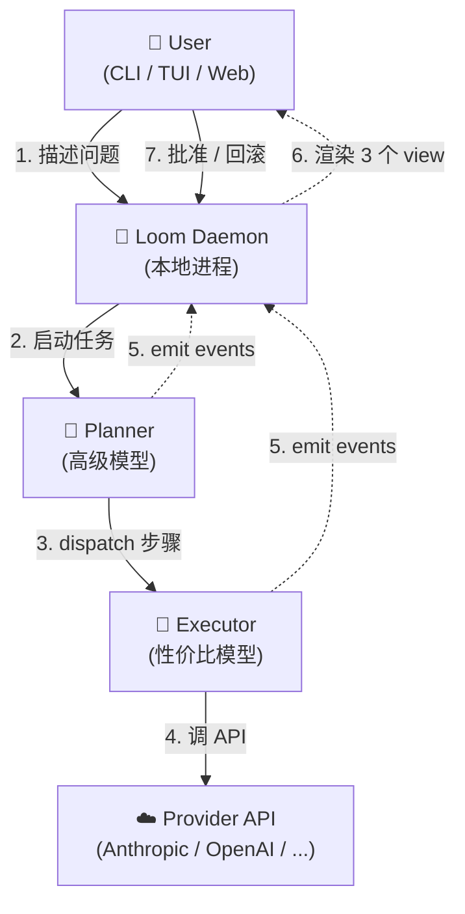
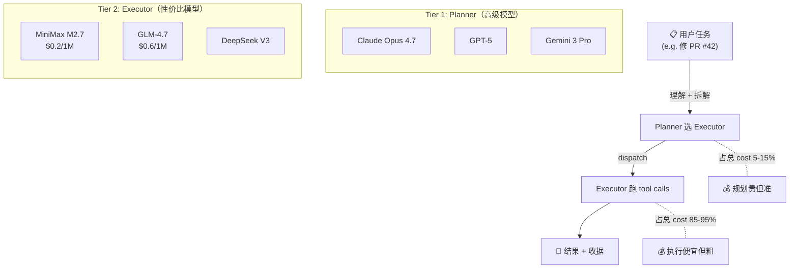
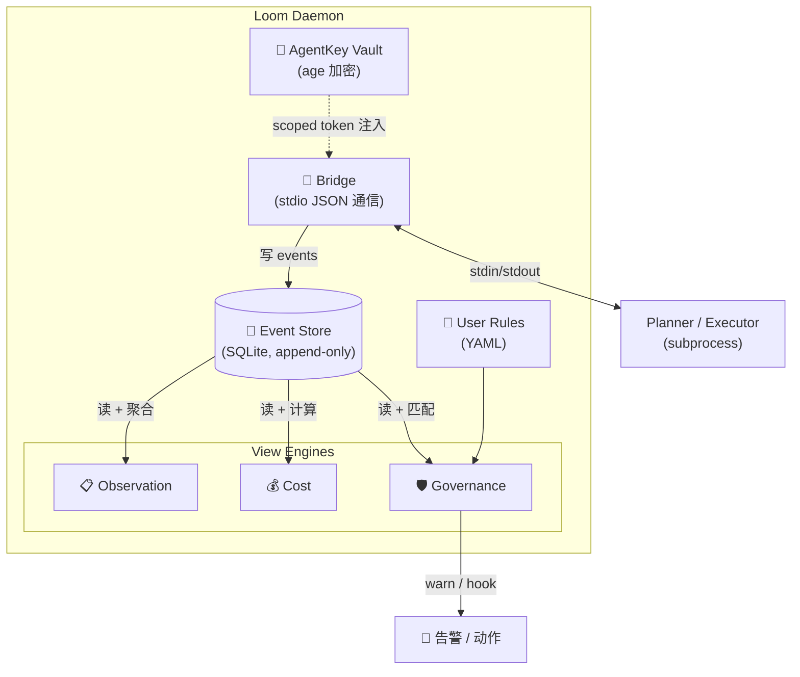
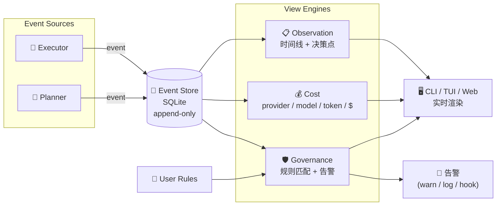
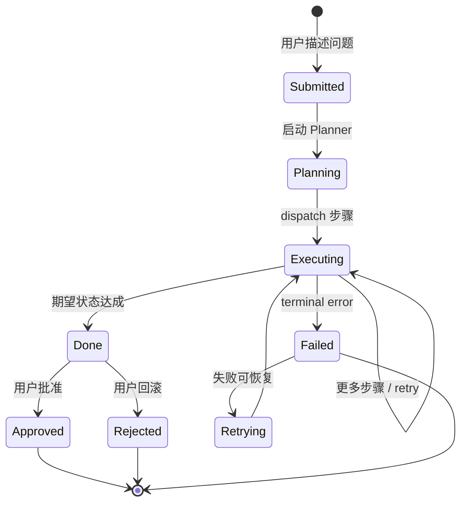
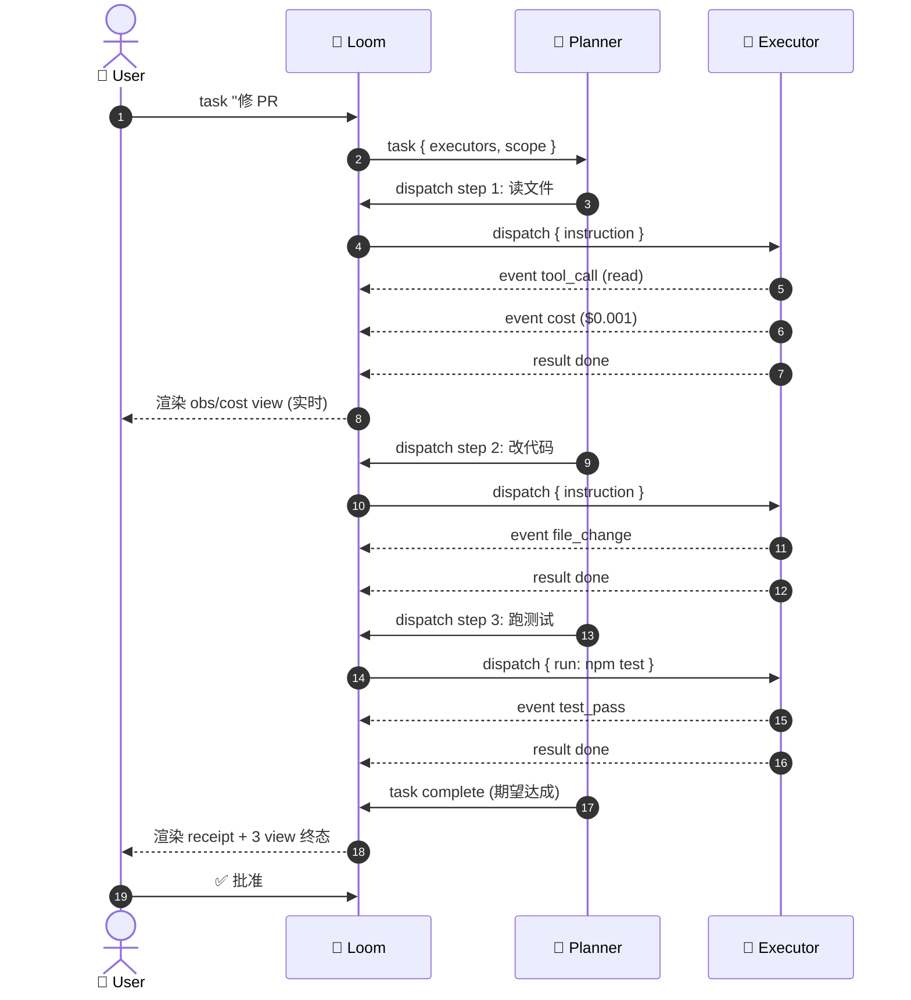
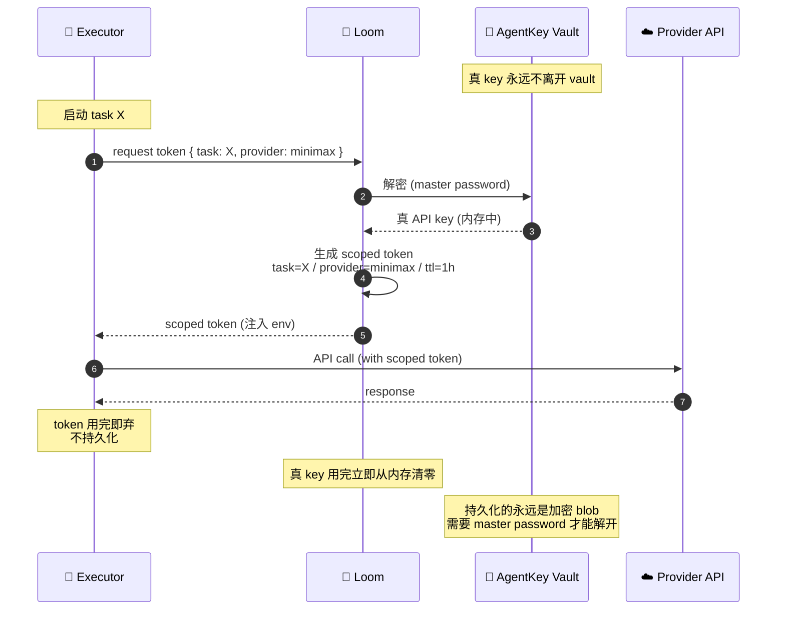

# Loom 架构图 & 流程图

> 草稿 v0.1 · 2026-07-24
> 对应: [PRODUCT-PLAN.md](../PRODUCT-PLAN.md) / [TECH-PLAN.md](../TECH-PLAN.md)
>
> 全部 Mermaid。GitHub 原生渲染。也可以贴 [mermaid.live](https://mermaid.live) 看。
>
> 图序：先 4 张架构图（系统 / 2-tier / 内部 / 数据），再 3 张流程图（任务生命周期 / bridge 消息 / AgentKey token）。

---

## 1. 系统总览（系统架构）

**这张说什么**：Loom 在整个系统里的位置。Loom 是个本地 daemon，坐在用户和 agent 之间。不指挥 agent，只观察 + 桥接 + 透明。



**关键点**：
- Loom **不直接调 Provider**。Planner 调 Provider，Loom 只在中间传递 + 抓 events。
- Planner 和 Executor 都是 subprocess，跟 Loom 通过 stdio JSON 通信。
- 用户看到的是 Loom 渲染的 3 个 view，不是 agent 自己的输出。

---

## 2. 2-tier 模型分层（核心差异化）

**这张说什么**：高级模型当大脑、便宜模型当手脚。成本结构上规划 5-15%、执行 85-95%。



**关键点**：
- Planner / Executor 全部由**用户定义**。可以是 Opus+MiniMax，也可以是 GPT-5+DeepSeek。
- 同一个 task 里 planner 不变，executor 可以动态换（failover 到更便宜的）。
- 真正的成本节省来自：高级模型只跑规划（少），便宜模型跑执行（多）。

---

## 3. Loom Daemon 内部结构（组件图）

**这张说什么**：Loom daemon 内部有哪些组件，各自干什么。



**关键点**：
- **Bridge 是唯一对外接口**，所有跟 planner/executor 的通信都从这里过。
- **Event Store 是单一数据源**，3 个 view 都从它读（避免 view 之间数据不一致）。
- **AgentKey 跟 Bridge 之间是单向的**：key → token → 注入，从不反过来。

---

## 4. 事件驱动的 3 个 view（数据流）

**这张说什么**：events 从 agent 流到 store，3 个 view 引擎各取所需，governance 还会触发外部动作。



**关键点**：
- 3 个 view 是**只读消费者**，互不干扰，可以独立扩展。
- Governance 引擎是**唯一有副作用**的（触发 alert / hook），其他都是只读。
- Event Store 是 append-only，不能改不能删（审计性）。

---

## 5. 任务生命周期（状态机）

**这张说什么**：一个 task 从创建到结束的所有状态。



**关键点**：
- `Submitted / Planning / Executing` 都是中间态，对用户透明。
- `Done` 是**期望状态自动判定**（不是用户标），用户只需要 approve 或 reject。
- `Failed → Retrying` 是 planner 内部决策，Loom 不管。

---

## 6. Bridge 消息流（时序图）

**这张说什么**：一次 task 跑下来，Loom / Planner / Executor 之间的消息流长什么样。



**关键点**：
- Loom 永远在中间（不会让 Planner 直接跟 Executor 通）。
- 每个 step 都是 dispatch → events → result 的闭环。
- User 实时看到 view（不是 task 跑完才看到）。

---

## 7. AgentKey Scoped Token（安全流程）

**这张说什么**：provider API key 怎么从 vault 流到 executor，executor 怎么用，边界在哪。



**关键点**：
- **真 key 只在内存中存在**，从 vault 解密到用完，路径就是「解密 → 签 token → 清零」。
- Scoped token 是**短时效 + 任务绑定**，即使泄漏，影响范围有限。
- Executor 永远拿不到真 key，只能用 token 调 API。
- 如果 executor 想要调范围外的 provider，会被 Loom 拒绝（task scope check）。

---

## 8. Phase 1 实施顺序（参考）

这张给 Phase 1 动手用，不算正式架构图：

| Day | 内容 | 对应组件 |
|---|---|---|
| 1-2 | Event Store + SQLite schema | §3 Store, §4 数据流 |
| 3 | stdio JSON bridge + mock planner/executor | §3 Bridge, §6 消息流 |
| 4 | 3 view 渲染（CLI text） | §3 View Engines |
| 5 | 端到端跑 "修 PR #42" demo | §1 系统总览, §5 生命周期 |
| 6-7 | 修 bug + 整理 demo | — |

---

## 9. 怎么查看这些图

**选项 A: GitHub**
把代码 push 上去后，GitHub 原生渲染 Mermaid（在 markdown 文件里直接显示）。

**选项 B: mermaid.live**
打开 https://mermaid.live ，把每段 ` ```mermaid ... ``` ` 里的代码贴进去，实时看图 + 导出 PNG/SVG。

**选项 C: VS Code**
装 `Markdown Preview Mermaid Support` 扩展，markdown 文件实时预览。
