# Loom 架构与流程

> 草稿 v0.3 · 2026-07-24
> 对应：[产品方案](../PRODUCT-PLAN.md) / [技术方案](../TECH-PLAN.md)
> 本文中的 Mermaid 是架构图权威源；PNG 快照不作为当前事实。

## 0. 整体技术架构

本文件保留产品流程和领域状态图。按抽象层拆分的整体技术架构见：

- [System Context](architecture/c4-context.md)
- [Containers](architecture/c4-containers.md)
- [Loom Daemon Components](architecture/c4-components-daemon.md)
- [Local Deployment](architecture/c4-deployment.md)
- [Explicit Agent Dynamic Flow](architecture/c4-dynamic-agent-mode.md)
- [Run Dispatch Dynamic Flow](architecture/c4-dynamic-run-dispatch.md)
- [Trust Boundaries](architecture/trust-boundaries.md)

Phase 1 的总体形态是本地模块化单体 daemon。它自动发现本机 RuntimeInstance，为每个 Run 创建
受管 workspace、认领代次和 AgentGrant。CLI/TUI、Agent Runtime 和 Evolution Sidecar 都是独立
进程；只有 daemon 可以提交权威状态转移，只有 Credential Broker 可以解析真实 Provider 凭证。

## 1. 使用入口

普通对话与 Agent 模式是两个明确入口。普通任务不会因为内容复杂而自动创建团队。

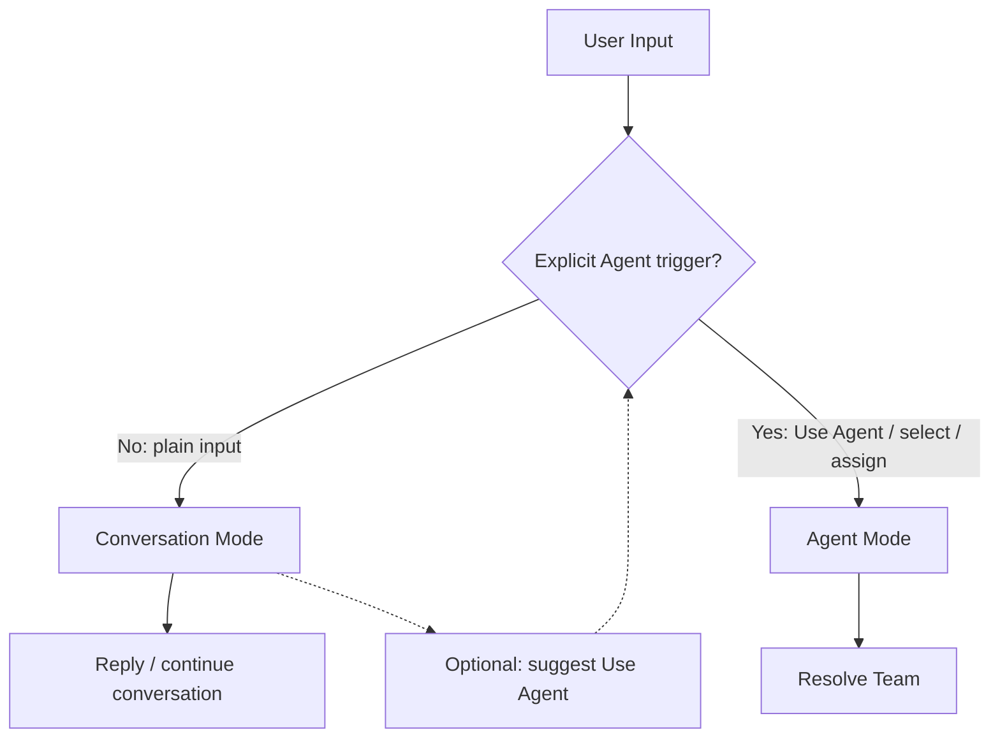

显式 Agent trigger 包括：

- 点击或调用 Use Agent；
- 选择一个 Agent；
- 选择一个 Team；
- 把工作分派给 Agent/Team；
- 在对话中明确要求使用 Agent 团队执行。

普通对话可以建议切换，但不能替用户切换。

## 2. 团队解析与 Team Draft

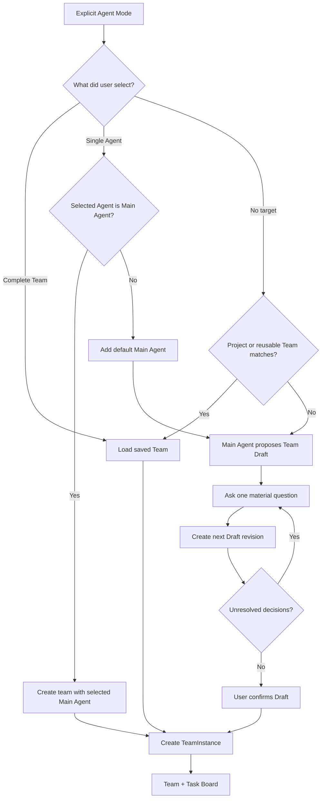

用户保存并显式选择的完整 Team 直接加载。任何由模型生成、补全或扩权的团队都必须经过用户确认。

生成 Team Draft 前，Loom 冻结一个有界目录快照：AgentDefinition、在线 RuntimeInstance、真实模型、
Skill、成员、权限上限、预算与并发。Main Agent 只能引用快照中的 ID，或者返回能力缺口，不能编造
不存在的 Runtime、模型或权限。

Team Draft 使用“对话 + 实时草案”表达：每轮只问一个关键问题，同时产生结构化 revision。用户点击
确认前不创建 AgentInstance。Team 也不能退化为 Main Agent 的显示别名；每个激活 SubAgent 都必须
拥有明确 WorkItem、独立 Run、AgentGrant 和 Evidence。

## 3. Agent 定义与实例

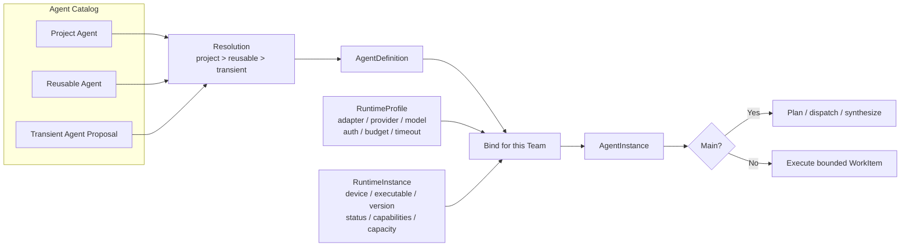

AgentDefinition、RuntimeProfile 与 RuntimeInstance 分离。同一个角色可以换模型和 Provider，而不复制
职责定义；运行时策略也不会把机器、可执行文件和在线状态写进可复用角色。

每个 TeamInstance 恰好一个 Main Agent。Main Agent 可以重排现有成员，但不能退化为直接执行和自我验收。

## 4. 系统组件

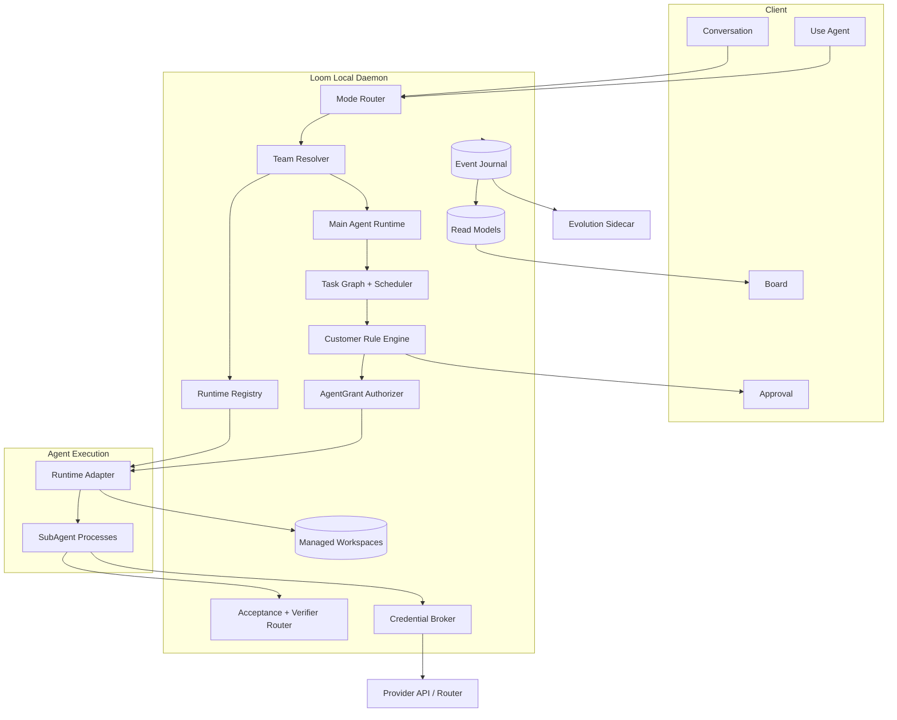

Loom 是轻量本地编排器，不实现底层 Agent 推理循环。它拥有团队、任务图、进程、规则、批准、验收和投影；Agent Runtime 负责实际推理与工具调用。

## 5. 领域关系

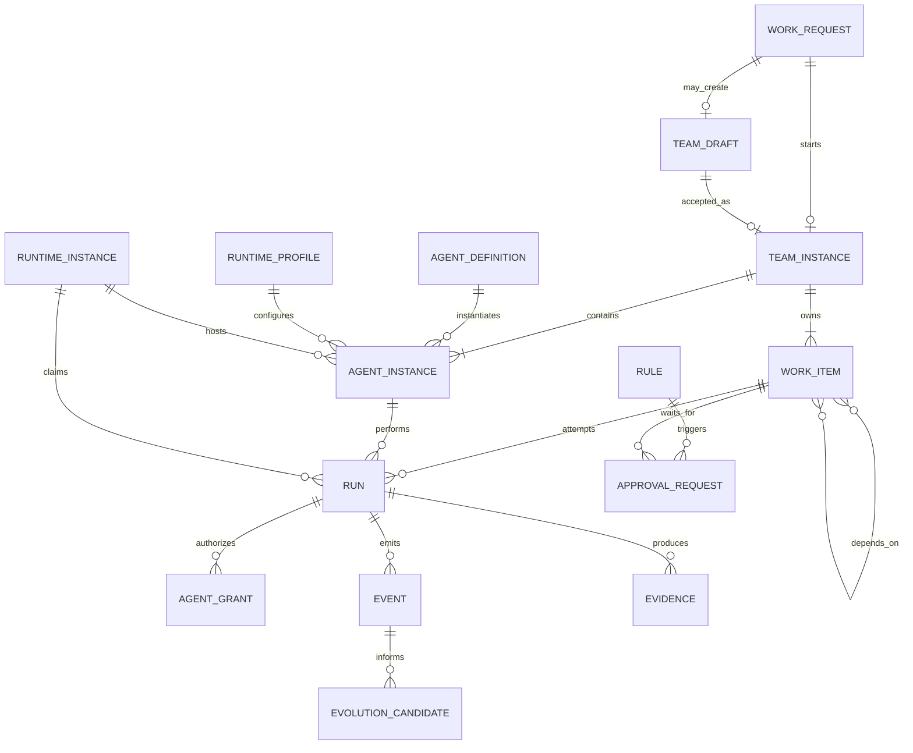

关键区分：

- Definition 是可版本化配置；
- Instance 是一次团队运行中的实体；
- Run 是一次具体执行尝试；
- Event 是事实；
- 看板状态是 Event 的投影；
- Sidecar 产出 Candidate，不直接改变运行对象。

## 6. WorkItem 与 Run 生命周期

### 6.1 WorkItem

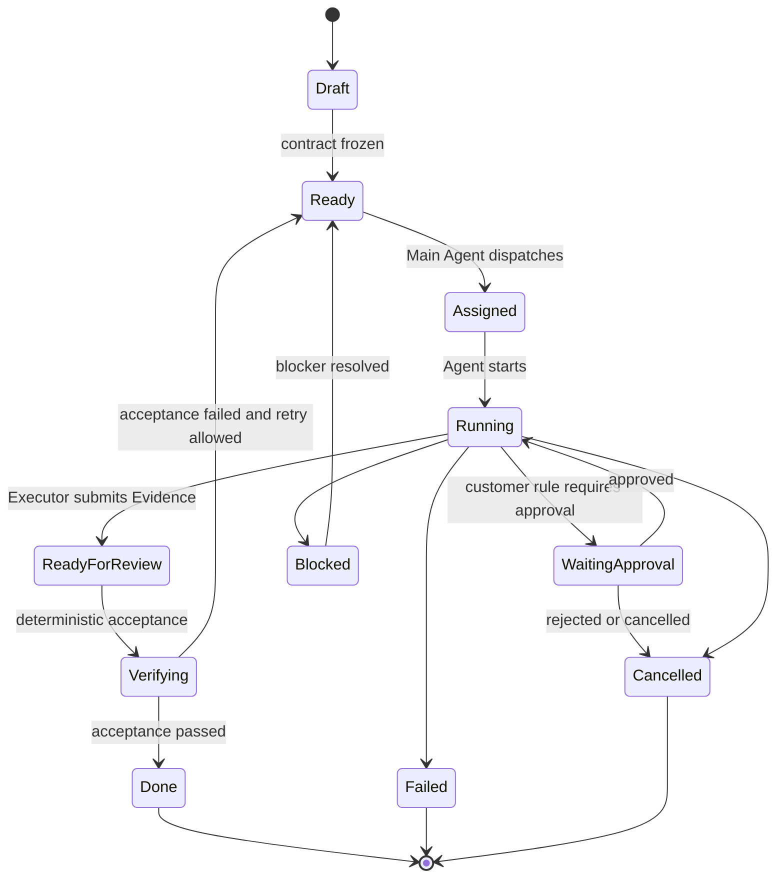

Executor 不能直接产生 Done。只有验收路径可以把 WorkItem 投影为 Done。

### 6.2 Run 认领

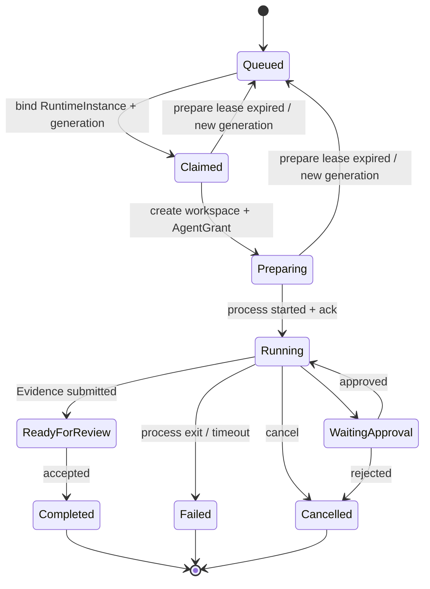

每次重新认领都递增 `claim_generation`。旧代次的 start、heartbeat、Evidence 和 terminal 被拒绝；
对应 AgentGrant 同步撤销。Agent 返回结果只是一条提议，Evidence 引用和 `RunTerminalCommitted`
在本地 SQLite 事务落盘后才成为终态。

## 7. 客户规则与批准

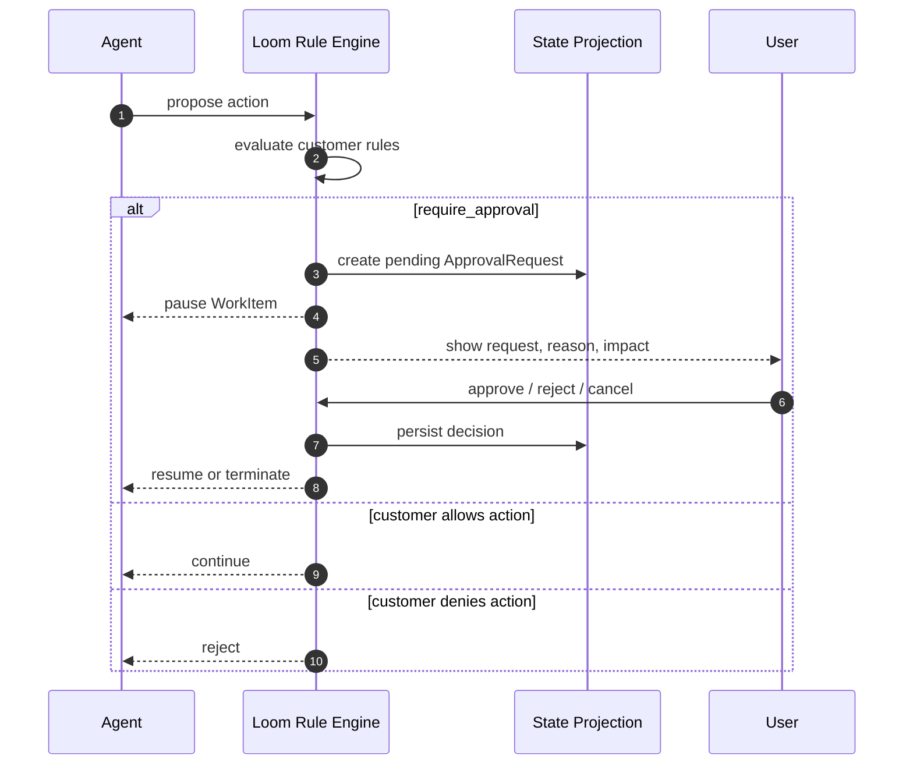

客户决定规则条件和执行效果。Loom 保证已匹配的 `require_approval` 不会因 UI 关闭、daemon 重启或 Agent 退出而被绕过。

## 8. Bridge 消息流

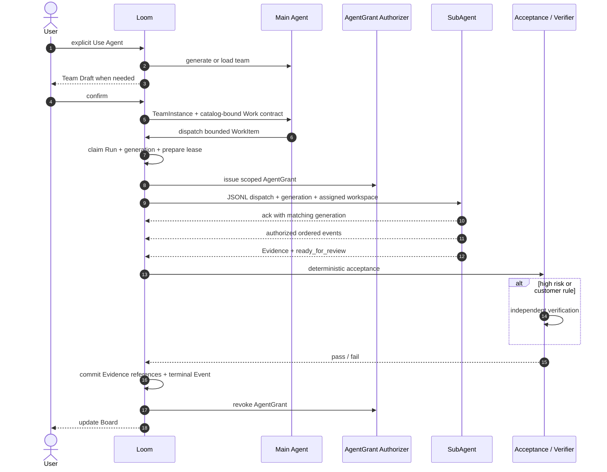

每条 Bridge 消息都有版本、唯一消息 ID、Run、认领代次、RuntimeInstance、序号和相关 ID。
重复消息或旧代次消息不能产生重复执行或覆盖新终态。

## 9. AgentGrant 与 Credential Broker

`AgentGrant` 允许一个 Agent 在当前 Run、AgentInstance 和 claim generation 中调用指定 Loom
本地操作。它不能访问 Provider。`CredentialGrant` 只在 Broker 模式下允许 Broker 访问冻结的
Provider、模型与额度。两者明文都不持久化，Provider 也不验证 Loom 自签凭证。

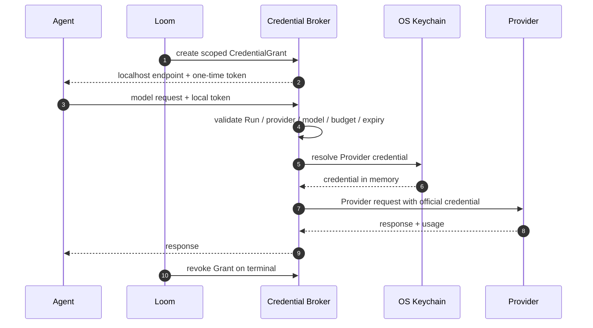

认证能力分为：

```text
brokered
→ provider_ephemeral
→ native_auth
```

只有 `brokered` 能统一保证 Agent 不接触真实 Provider Key。`native_auth` 使用 Agent CLI 自己的登录状态，必须在 UI 中如实标记。

## 10. Event、投影和三个视图

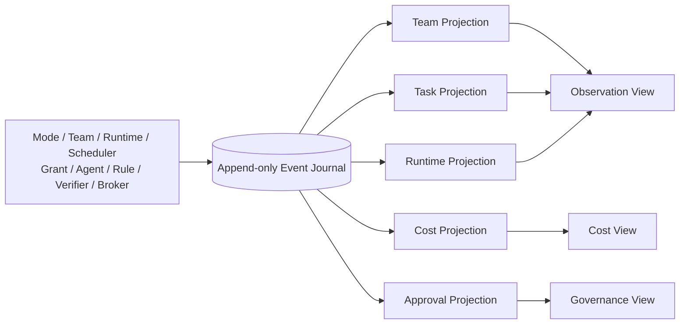

Event Journal 是事实源；Projection 可以重建。对话中的实时 Draft、执行 timeline 和高级看板读取
同一投影，不能直接修改任务或成为第二套 Issue 权威。

## 11. 共进化 Sidecar

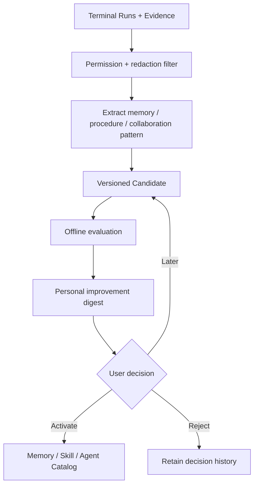

Sidecar 默认本地、按用户与项目隔离并加密。它不阻塞任务，也不在线修改运行中的 Agent。

## 12. Phase 1 纵向切片

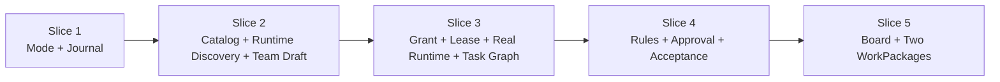

Phase 1 必须使用一个真实 Agent Runtime。Mock 只用于单元测试，不作为真实纵向 Demo。

完整 Schema、协议约束和 22 项验收见 [TECH-PLAN.md](../TECH-PLAN.md)。
