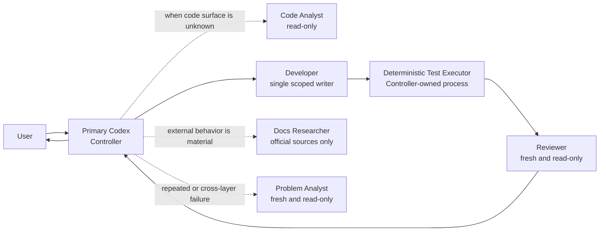

# Loom Development Workflow

This document is loaded when development process details are relevant. It is not
part of the always-loaded root instruction budget.

## 1. Development team

The primary Codex session acts as Controller. It owns acceptance boundaries,
task decomposition, dispatch, conflict prevention, and the final user report.

Until Loom's own governed CLI and Scheduler exist, this is a bootstrap
development team operated by Codex. It must not claim that Loom already created
or governed these Agents. After Slice 3 proves real Run dispatch, the same role
and evidence contracts move behind Loom's Controller without creating a second
task, evidence, or state authority.

Project-local reusable roles are defined under `.codex/agents/`:

| Role | Default use | Writes |
|---|---|---|
| `explorer` | Trace current code, contracts, and dependencies | No |
| `code_analyst` | Localize relevant code and return compact line citations | No |
| `developer` | Implement one bounded WorkItem and its tests | Scoped workspace |
| `reviewer` | Review correctness, security, regressions, and missing tests | No |
| `docs_researcher` | Verify current external API or protocol behavior | No |
| `problem_analyst` | Diagnose repeated or cross-layer failures independently | No |

Do not start every role by default. Use only roles that shorten the critical
path or provide required independence. `docs_researcher` uses the user's
available read-only primary-source tools; if none are configured, it reports the
gap instead of changing MCP or credential configuration.

Use `code_analyst` on unfamiliar repositories, cross-module behavior, bug
localization, dependency tracing, or any task where broad search would pollute
the Controller context. It returns relevant file and line ranges, not a patch or
final technical judgment. Dispatch it only with bounded include/exclude paths,
`max_files`, and `max_total_lines`. The integration contract and upstream
activation status are documented in
[`integrations/fastcontext.md`](integrations/fastcontext.md).

Deterministic test execution is a Controller action, not an Agent role. The
Controller runs formatters, tests, race checks, linters, Schema validation, and
other deterministic commands and records their terminal result. A model may
interpret that evidence, but cannot replace it.

### 1.1 Default team for a development WorkItem



The minimum normal team is Controller + Developer + Reviewer. Add the Code
Analyst when repository localization is non-trivial. Add Docs Researcher or
Problem Analyst only when their trigger is present. No more than one Developer
writes a Candidate lineage at a time.

### 1.2 Responsibility split

- **Controller** freezes the WorkItem contract, risk level, owned files,
  dependencies, test commands, and completion conditions; it dispatches work
  and synthesizes the final result, but does not self-approve product behavior.
- **Code Analyst** produces bounded repository evidence. A future local
  FastContext backend remains an interchangeable implementation of this role,
  never its authority.
- **Developer** owns the exact Candidate files and tests for one WorkItem. It
  submits changed files, checks, blockers, and residual risk.
- **Test Executor** runs deterministic commands under the Controller and
  preserves terminal evidence; it is not an LLM Agent.
- **Reviewer** independently checks the complete diff and existing test
  evidence against the frozen contract.
- **Docs Researcher** verifies current external APIs, SDKs, protocols, or
  Provider behavior using primary sources.
- **Problem Analyst** reconstructs repeated or cross-layer failures and returns
  one complete root-cause and recovery proposal without editing.

## 2. Concurrency

- At most three child Agent threads run alongside the primary Controller.
- Each branch, worktree, or Candidate lineage has one writer at a time.
- Read-only exploration and review may run alongside work on non-conflicting
  paths.
- Separate WorkItems must declare owned files before parallel implementation.
- A Reviewer or Problem Analyst must not be the Agent that produced the change
  it reviews.
- Keep child depth at one until a real development task proves nested delegation
  is necessary.

## 3. Execution intensity

### Lightweight

Use for documentation, fixtures, pure logic, and read-only diagnosis.

Required: scoped files, a concrete acceptance statement, relevant checks, and a
diff review.

### Standard

Use for components, public interfaces, persistence behavior, or ordinary
runtime changes.

Required: acceptance contract, failing test when behavior changes, small
implementation, focused green tests, impact tests, and independent review.

### Strict

Use for credentials, grants, policy, event ordering, state authority, leases,
process ownership, migrations, or release behavior.

Required: all Standard evidence plus explicit trust-boundary analysis,
fail-closed tests, restart/replay or cleanup proof where applicable, and human
approval for activation or irreversible external action.

Security-sensitive work cannot automatically move to a lower intensity.

## 4. Standard and strict workflow

Lightweight work uses the checklist in its own section and does not require a
failing test, repository-wide impact run, or independent review unless its
actual risk requires one.

```text
Inspect current code and docs/CURRENT.md
→ freeze acceptance and owned files
→ add the smallest meaningful failing test
→ implement one bounded change
→ run focused tests
→ run impact tests once
→ independent review
→ update current/target documentation
→ human decision for activation, release, push, or merge
```

Do not repeat an unchanged command against an unchanged digest merely to create
fresh-looking evidence.

## 4.1 Codex bootstrap development flow

Each product slice is decomposed into independently verifiable WorkItems. Start
with the smallest end-to-end behavior that advances the active slice; do not
initialize all packages or start all roles at once.

```text
1. Controller reads docs/CURRENT.md and the active TECH-PLAN slice.
2. When the code surface is unknown, Code Analyst returns bounded file:line evidence.
3. Controller freezes one WorkItem contract, risk, owned files and exact checks.
4. Developer adds the smallest meaningful failing test, then implements the change.
5. Controller runs focused deterministic checks and one impact union for that digest.
6. Fresh Reviewer checks the whole diff, contract, test evidence and trust boundaries.
7. Developer repairs within the same lineage when required; repeated failures follow §5.
8. Controller updates CURRENT/TARGET documentation and reports the real evidence.
9. Commit, push, merge, release and activation follow their separate authority boundaries.
```

Phase 1 starts with Slice 1 in this order:

1. initialize the Go module and package dependency skeleton;
2. implement explicit conversation versus Agent mode routing;
3. implement append-only, idempotent SQLite Event Journal behavior;
4. implement rebuildable projection behavior;
5. expose the smallest CLI query needed to prove the slice.

The first WorkItem should cover module initialization plus the mode-routing
contract. Journal and projection behavior remain subsequent WorkItems so that
their persistence and replay acceptance boundaries stay independently
reviewable.

## 4.2 FastContext-assisted analysis

FastContext is an optional acceleration path for steps 1–2, not a prerequisite
for product development:

```text
Controller question
→ bounded Code Analyst request
→ Loom-owned READ / GLOB / GREP boundary
→ path and citation validation
→ compact Candidate evidence
→ Controller / Developer / Reviewer decision
```

The current Codex-backed role may be used after a child-Agent Canary. A local
FastContext model must remain `EXPERIMENTAL` until its pinned artifact,
loopback-only runtime, path containment, secret exclusions, output bounds,
citation validation, zero source mutation, and comparative evaluation all pass.
Its trajectory belongs in an isolated evidence directory, never the analyzed
source repository. Failure falls back to deterministic repository search and
does not block the WorkItem.

## 5. Failure handling

- One ordinary failure: preserve the evidence, diagnose, and repair in the same
  lineage when the contract and ownership are unchanged.
- A second rejection of the same failure, contradictory terminal state, or a
  failure spanning at least three layers: stop the current repair hypothesis
  and use a fresh read-only `problem_analyst`.
- The analyst returns the execution chain, root cause, excluded hypotheses,
  minimum repair, and verification plan. It does not edit files or close the
  checkpoint.
- If three bounded product repairs in the same lineage still fail, stop and ask
  for human direction. Do not reset the counter by renaming the task.

## 6. Phase 1 engineering defaults

Phase 1 targets Go 1.22+ and SQLite. Once the Go module exists, the default
deterministic checks are:

```bash
gofmt -w <changed-go-files>
go test ./...
go test -race ./...
go vet ./...
```

During incremental work, run focused package tests first. Run repository-wide
tests when the impact boundary requires them or at an agreed checkpoint.

Domain packages must not import concrete Agent CLI implementations, Provider
SDKs, SQLite drivers, or UI packages. Adapters depend on domain contracts, not
the reverse.

## 7. Completion report

Every handoff states:

1. what changed;
2. whether it succeeded and the exact evidence;
3. which files or product behavior are affected;
4. remaining risks or unverified live boundaries;
5. the next executable step.

Configuration checks are not live Runtime or Provider evidence. A documented
target is not an implemented capability.
