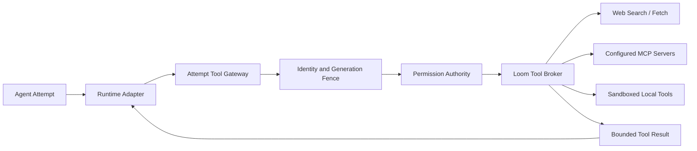
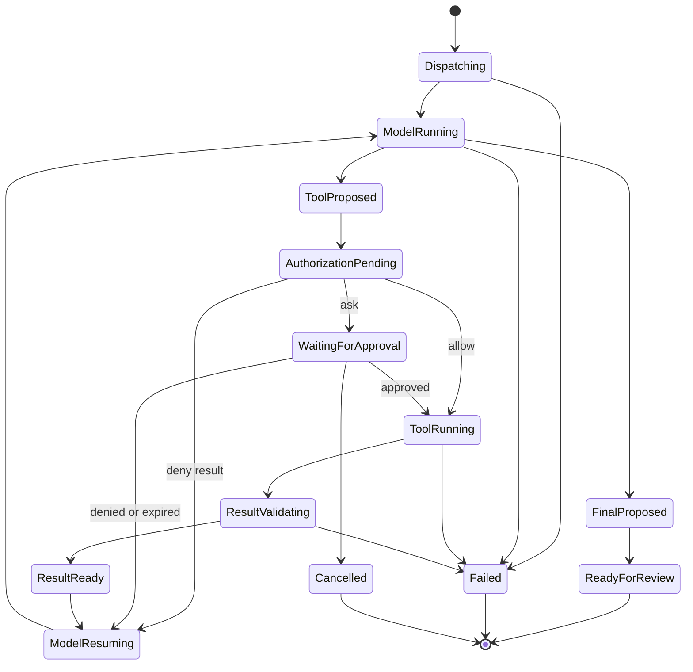
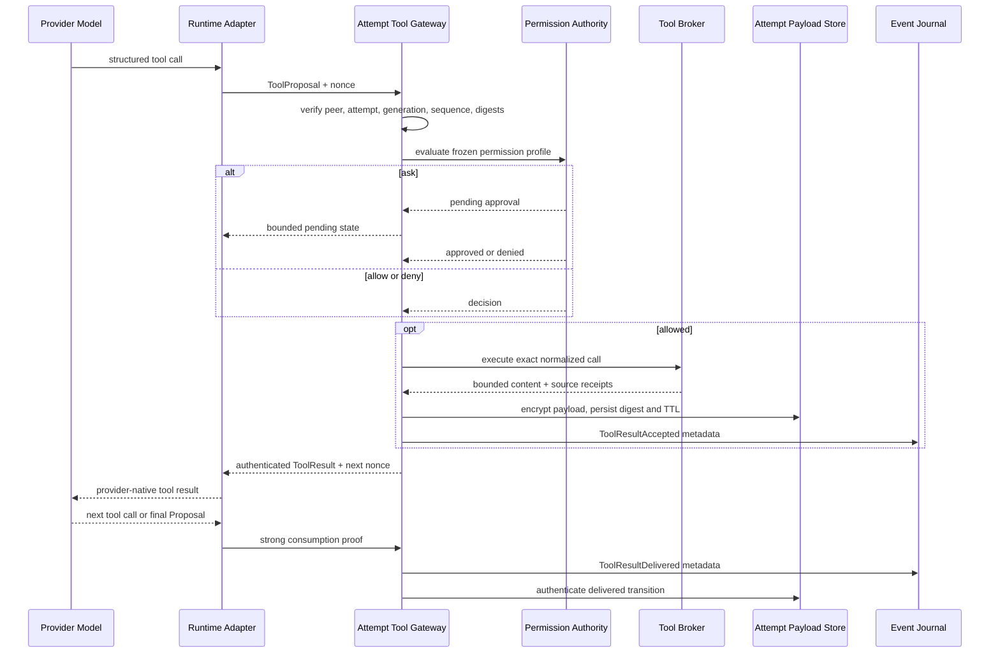

# Attempt Tool Loop：多 Provider、多 Agent 的受治理工具循环

**Status**: PARTIAL（Phase 2D）  
**Scope**: P2D-W2C / P2D-W2D  
**Product Goal**: 同一个 Team 中的不同 Agent 可以使用不同 Harness、Provider Account 和 Model，并在权限、失败隔离和审计约束下完成多轮 Web、MCP、文件与执行工具调用。

## 用户结果

Agent 不再只是生成一次文本或一次工具提议。一次 Agent Attempt 可以在预算内重复执行以下闭环：

1. 模型提出结构化工具调用；
2. Loom 校验 Attempt 身份、冻结 binding 和调用序列；
3. 权限层返回 allow、ask 或 deny；
4. Loom Tool Broker 执行已允许的 Web、MCP 或本地工具；
5. 经过验证和裁剪的结果只返回原始 Attempt；
6. 同一个模型继续推理，直到给出最终 Proposal、失败或达到限制。

这套循环同时支持：

- 一个 Team 中 Claude Code + Anthropic、Codex + OpenAI、Loom Native + DeepSeek/Kimi/MiniMax；
- 同一个 Agent 的显式 RouteSet 和多个 sibling Attempts；
- 单个 Agent/Provider Account 故障隔离；
- MCP、WebSearch、WebFetch 与本地工具使用同一套授权和可观测性；
- App/daemon 重启后的确定性恢复。

## 当前基础与缺口

| 状态 | 能力 |
|---|---|
| CURRENT | `permissions.ToolKind` 已声明 Bash、Read、Edit、Grep、MCPTool、WebFetch、WebSearch |
| CURRENT | Pi Bridge 可以把单次本地工具 Proposal 交给 daemon 权限与执行适配器 |
| CURRENT | Tool Broker 已具备受限 WebFetch、Search Backend、MCP allowlist 和结果边界 |
| CURRENT | 每个 Agent Attempt 已冻结 Harness、Provider Account、Model、credential revision、limits 与 capabilities |
| CURRENT | 受限 `loom_read_context` 结果可通过 Pi、Claude Code、Codex 或 Loom Native 回灌同一 Attempt；Loom Native 已支持最多 4 次严格顺序 continuation |
| CURRENT | 结果先进入 Conversation-DEK 加密 Attempt Payload Store；Journal 只保存 accepted/delivered digest 事实 |
| CURRENT | Loom Native 使用 Provider continuation，Pi/Codex/Claude 使用已校验 Harness final output 作为消费证明 |
| CURRENT | 重启可重投同一 Context 结果且不重新读取；终态 Run 可从强证明修复 Vault delivery 状态 |
| CURRENT | ATL1/ATL2 已有严格 Attempt/Turn/Step/ToolCall authority、并行/独占冲突范围、call-scoped result facts 与 dispatch causation |
| CURRENT | 带 Role Context Capsule 的产品 Attempt 在 `RunStarted` 后进入 Runtime 装饰层；Pi、Codex、Claude Code 与 Loom Native 的 `loom_read_context` 已产生完整 admission、dispatch、accepted、delivered 与 Step/Turn 事实 |
| CURRENT | 一次性审批消费已绑定精确 approval/call/consumer/operation；并发复用只能有一个执行者，新 execution/permission Journal v2 事实不保存工具参数或原始错误 |
| CURRENT | Tool Proposal 详情以每 Conversation DEK 加密保存；Pi ask 写入 exact Attempt binding，Attention 以 approval/continuation digest 解密并禁止无详情 Allow |
| CURRENT | Pi 的已允许 Bash/Edit 调用在 executor 前提交 exact Attempt ToolCall/dispatch；digest-only 结果进入 Conversation-DEK Attempt Payload，RunStream 接收后写独立 receipt |
| CURRENT | Pi Bash/Edit 发出内容无关的 ToolCall 阶段诊断，并携带精确 Attempt、Provider Account、Model、Run、Agent、Binding、Capsule 和 Incident 身份 |
| CURRENT | daemon 重启把 Allowed 且无终态的执行投影为 `recovery_required`，从不自动重放；Proposed-only ask 保持待审批 |
| CURRENT | Queue/Steer/Inject authority core 使用 generation-bound Inbox、Conversation-DEK 加密正文、原子 Turn/Step 消费与 crash reconciliation；admission 本身不唤醒执行 |
| CURRENT | Loom Native 已消费精确 Step/Turn 输入；Pi 已在同一 managed child 中消费后续文本输入；认证 UDS 与 Swift per-Agent Queue/Steer/Inject 控制已接通，并共享 Incident 与内容无关诊断 |
| PARTIAL | RunStream receipt 不是 Provider continuation；恢复决策命令、ask 暂停/恢复、通用 exactly-once execution、crash-mid-transition、Pi Context/Tool+输入组合、Codex/Claude 输入消费与完整沙箱恢复仍开放 |
| TARGET | Provider 无关的 Attempt Tool State Machine、受鉴权结果传输、恢复和多 Runtime Result Adapter |

在 TARGET 完成前，UI 和系统提示不得宣称 Web/MCP 已对某个 Harness 可用。

## 核心决定

### 1. Attempt 是工具循环的最小隔离单元

工具权限和结果不绑定 Conversation、Team 或全局 Provider client。每次调用必须属于一个冻结的 Agent Attempt：

```text
TeamRole
  -> AgentInstance
    -> AgentAttempt
      -> FrozenExecutionBinding
      -> ToolLoopBudget
      -> ToolCall 1..N
```

Provider、Model 或 Provider Account 变化必须创建新 Attempt。Fallback 也创建新 Attempt，不得在原 Attempt 内静默改写 binding。

### 2. Loom Tool Gateway 是唯一工具入口

外部 Runtime 不直接获得任意网络或 MCP 配置。每个 Attempt 获得一个受限 `AttemptToolGateway`，它只发布冻结 capabilities 允许的工具 schema。



Tool Gateway 不拥有授权决策，也不信任 Runtime 提交的 Team、Agent、Provider 或 credential 信息。它从 daemon 保存的 Attempt Context 解析这些字段。

### 3. Runtime Adapter 只负责协议转换

| Runtime | Tool transport | Result delivery |
|---|---|---|
| Pi | Loom 固定扩展连接每 Attempt 私有 UDS | 扩展返回 Pi 原生 `toolResult`，Pi Agent Core 继续当前 turn |
| Claude Code | 每 Attempt 的 Loom MCP transport | MCP `tools/call` result 由 Claude Code 原生循环消费 |
| Codex | 每 Attempt 的 Loom MCP transport | MCP tool output 由 Codex 原生循环消费 |
| Loom Native | daemon 进程内调用 | ContextAdapter 转换为目标 Provider 的 tool result wire format，再发起下一次 Provider 请求 |

Runtime Adapter 不能自行执行 Web/MCP，也不能自行判定 allow。Provider 原生工具、Codex web search 或 Claude 内置 Web 工具默认关闭，除非它们明确路由回 Loom Tool Gateway。

### 4. MCP 是 transport，不是授权边界

Claude Code 和 Codex 可以使用 MCP 接入 Loom，但 MCP server 只是一层协议适配。真正的权限、Account policy、预算、超时和审计仍由 Loom 决定。

外部 MCP Server 通过 Loom MCP Registry 注册：

```text
MCPServerID
  + Transport fingerprint
  + Allowed tool names and schemas
  + CredentialReference / revision（如需要）
  + Disclosure policy
  + Network policy
  + Timeout / result limit
```

模型只能提交 `MCPServerID + ToolName + Arguments`，不能提交 command、endpoint、Authorization Header 或任意 MCP 启动参数。

## 冻结 Attempt Tool Context

`AttemptToolContext` 由 daemon 创建并持有，不作为模型输入：

```text
schema_version
team_instance_id
agent_instance_id
work_item_id
run_id
attempt_id
claim_generation
execution_binding_digest
harness_adapter
provider_id
provider_account_id
model_id
credential_reference_digest
credential_revision
permission_profile_id / generation / digest
capability_set_digest
tool_schema_set_digest
context_capsule_digest
budget_policy_version
correlation_id
```

密钥正文、Provider Authorization Header、Prompt、网页正文、MCP 原始结果和隐藏 reasoning 不进入该 Context。

## 传输协议

### Tool Proposal

```json
{
  "schema_version": 1,
  "call_id": "opaque-id",
  "attempt_id": "opaque-id",
  "attempt_generation": 3,
  "sequence": 7,
  "tool": "MCPTool",
  "target": "github/get_issue",
  "arguments": {"owner": "example", "number": 42},
  "binding_digest": "sha256:...",
  "tool_schema_digest": "sha256:...",
  "continuation_nonce": "opaque-one-time-value"
}
```

约束：

- `call_id + attempt_generation + proposal_digest` 是幂等键；
- sequence 单调递增，旧 generation、重复 nonce 和跨 Attempt call fail closed；
- arguments 严格按冻结 schema 解码，拒绝未知字段、重复 JSON key 和超限载荷；
- Tool target 使用非秘密稳定 ID，不接受模型提供 endpoint 或 credential。

### Authorization Decision

```json
{
  "call_id": "opaque-id",
  "verdict": "allow | ask | deny",
  "approval_id": "opaque-id",
  "authorization_digest": "sha256:...",
  "reason_code": "approval_required",
  "retryable": false
}
```

`ask` 可以暂停工具响应等待用户决定。批准只对原始 call digest、Attempt generation 和有效期生效。

### Tool Result

```json
{
  "schema_version": 1,
  "call_id": "opaque-id",
  "attempt_id": "opaque-id",
  "attempt_generation": 3,
  "sequence": 7,
  "verdict": "allow",
  "status": "succeeded",
  "content_type": "text/plain",
  "content": "bounded result for the model",
  "content_digest": "sha256:...",
  "source_receipts": ["opaque-source-receipt"],
  "truncated": false,
  "elapsed_ms": 183,
  "continuation_nonce": "next-one-time-value"
}
```

`content` 只存在于受限结果通道和加密 Attempt Payload Store。Journal、diagnostics 和 Evidence 只保存 digest、大小、阶段、结果和非秘密来源 receipt。

## 多轮状态机



终态只能由 daemon 提交。模型或 Harness 不能自行写 `ready_for_review`、`done` 或权威失败原因。

## 执行时序



## Transport 与进程安全

### 外部 Harness

- 每个 Attempt 创建独立 owner-only `0700` 目录和 `0600` UDS；
- 使用 peer PID/UID、受监督进程身份、Attempt generation 和 executable identity 做 attestation；
- capability token 通过继承的受限 FD 或等价一次性通道交付，不进入 argv、Prompt、普通环境变量或日志；
- UDS 请求携带单调 sequence、一次性 nonce 和 binding digest；
- Harness 退出、Attempt 终态、credential revoke 或 generation 变化立即关闭 Gateway 并吊销 nonce；
- 禁止连接全局 Tool socket，禁止跨 Attempt 复用 token。

### Loom Native

进程内调用仍必须经过相同的 `AttemptToolGateway` 接口，不能因为没有 IPC 而绕过 generation fence、权限或预算。

## 结果持久化与恢复

Event Journal 只保存权威事实：

```text
ToolCallProposed
ToolAuthorizationRequested
ToolAuthorizationResolved
ToolExecutionStarted
ToolResultAccepted
ToolResultDelivered
AttemptResumed
AttemptTerminalized
```

事实载荷仅包含 ID、digest、bytes、stage、elapsed、verdict、retryable 和安全错误码。

需要在 daemon 独占状态下增加 `AttemptPayloadStore`：

- Tool result、待恢复 continuation 和必要的 Provider-native handle 加密保存；
- 每 Run/Conversation 独立 DEK，由设备 KEK 包装；
- 记录 TTL、attempt generation、binding digest 和 content digest；
- Journal commit 与 payload commit 使用 pending/commit 协议；
- 缺失密钥、digest 不匹配、generation drift 或解密失败时 fail closed；
- Attempt 终态或删除时执行 crypto-erasure。

App/daemon 重启后从 Journal 重建状态机，再从加密 Payload Store 恢复尚未交付的结果。不得通过重新执行具有副作用的工具来“恢复”。当前 bounded Context-read slice 已实现该顺序：Vault `pending` 先于 `ToolResultAccepted`，Loom Native 的有效 Provider continuation 或 Pi/Codex/Claude 的已校验 final output 才能写 `ToolResultDelivered`。HTTP/UDS 写成功不是消费证明；证明前崩溃允许重投同一密文结果，因此当前语义是 at-least-once delivery，不是通用 exactly-once execution。

execution runtime 启动时还会严格重放专用 Attempt Payload fact stream。若
`ToolResultDelivered` 已成为权威事实、但崩溃发生在 Vault 状态提交前，
reconciler 会在精确 Run、claim generation、Agent、binding、Capsule、call 和
digest 校验后把同一密文记录修复为 `delivered`。Conversation 已执行
crypto-erasure 时缺失记录是合法终态；单条 Vault 记录损坏只阻塞并诊断该
Attempt，不能停止其他 Agent 的修复。

## 多 Agent 与多 Provider 隔离

1. 每个 Agent Attempt 拥有独立 Gateway、nonce 序列、预算和结果队列。
2. Tool Broker 可共享进程，但所有调用都携带 daemon 注入的 Attempt Context。
3. MCP session key 至少绑定 `server_id + agent_attempt_id + provider_account_id + credential_revision`。
4. Provider-native session handle 不能跨 Provider、账号、Model、Segment 或 Attempt 复用。
5. 一个账户撤销、限流或超时，只阻塞引用该账户的 Attempt。
6. 同一 Agent 并行多 Provider 使用 sibling Attempts；每个 sibling 独立计费和审计。
7. Aggregation Attempt 只能读取被授权的结果 digest/内容 scope，不能获得其他 Agent 私有 scratchpad。
8. Fallback 创建新 Attempt，并记录显式批准的 Route Transition。

## 预算和限制

每个 Attempt 冻结：

- `max_tool_calls`；
- `max_tool_rounds`；
- `max_parallel_read_calls`；
- 单次和总 `tool_timeout`；
- `max_result_bytes` 和总 context 注入预算；
- Web domain/disclosure policy；
- MCP server/tool allowlist；
- Provider Account token/cost budget；
- 人工审批等待期限。

超限必须返回确定的 tool result error，让模型可以收敛为最终 Proposal；不能无限重试。

## 错误与可观测性

安全阶段至少包括：

```text
tool_input_admission
tool_peer_attestation
tool_binding_validation
tool_authorization
tool_approval_wait
tool_dispatch
web_dns / web_tls / web_http / web_content_validation
mcp_connect / mcp_initialize / mcp_schema / mcp_call / mcp_result_validation
tool_payload_commit
tool_result_delivery
model_resume
attempt_terminalize
```

用户界面显示 Agent、Harness、Provider Account、Model、Tool、阶段、恢复动作、retryable 和 Incident ID。不得显示密钥、Authorization Header、Prompt、网页全文、MCP 原始正文或 Provider 原始响应。

## Runtime 兼容性声明

每个 Runtime Adapter 必须声明版本化能力，不能通过模型名称推断：

```text
supports_tool_loop
supports_parallel_tool_calls
supports_mcp_transport
supports_native_tool_result
supports_pause_for_approval
supports_resume_after_restart
supports_web_search
supports_web_fetch
max_tool_schema_bytes
max_tool_result_bytes
```

缺失能力时预检阻塞对应 Agent，不把整个 Team 标记为 offline。

## Phase 2D 实施切片

这些切片属于现有 Phase 2D，不创建新产品 Goal：

| Slice | 落位 | 交付 |
|---|---|---|
| ATL1 | P2D-W2C | CURRENT：冻结 Attempt Tool Context、Turn/Step/ToolCall 状态机、并行/独占冲突、幂等与预算 authority 已通过 RED/green/replay/race |
| ATL2 | P2D-W2C | CURRENT / PARTIAL RUNTIME INTEGRATION：call-scoped result facts、generation/binding/dispatch fence、多调用 sequence index 与 runtime-neutral Tool Gateway contract 已完成；Context 及 Codex/Claude Read/Grep 已接入，副作用与 Web/MCP 仍开放 |
| ATL3 | P2D-W2C | CURRENT / SOURCE VERIFIED：Broker 严格预检，远程结果在 execution terminal 前加密提交到 Attempt Payload；精确 capability 广告、Pi native continuation 和 `loom-work` 内建 Broker 构造/撤销已完成，production backend enrollment/live 仍开放 |
| ATL4 | P2D-W2C | PARTIAL：Pi 私有 Context extension、两轮回灌和 final-output ACK 已完成；通用工具仍开放 |
| ATL5 | P2D-W2C | CURRENT / PARTIAL：Claude Code/Codex 每 Attempt 私有 MCP 已支持最多 4 个 Context/Read/Grep pending 结果，并只在 validated final output 后按序 ACK；Bash/Edit/Web/MCP 与安装版 live 仍开放 |
| ATL6 | P2D-W2C | CURRENT / PARTIAL：Loom Native 已支持单次 Provider exchange 最多 4 次严格顺序 Context tool/result、逐次 Provider-continuation ACK 与跨轮 usage 汇总；通用 Web/MCP、并行工具和安装版 live 仍开放 |
| ATL7 | P2D-W2D | CURRENT / PARTIAL：加密 Payload Store、bounded restart/terminal reconciliation、单 Attempt 故障隔离、crypto-erasure、精确一次性审批消费、content-free Journal v2、unknown-side-effect 投影与 V20 ToolCall 恢复决策已完成；可信观察/替代 Attempt resolver 与通用工具 TTL/compaction 仍开放 |
| ATL8 | P2D-W2D | CURRENT / PARTIAL：Pi Bash/Edit ToolCall 阶段诊断、V19C Agent Attempt 恢复治理和 V20 ToolCall Preview/Resolve + Swift Inspector 已完成；observed-result continuation、replacement dispatch、sandbox report、accounting、并发与完整失败隔离仍开放 |
| ATL9 | P2D-W2D | 安装版多 Provider、多 Agent live acceptance |

实施顺序不得跳过 ATL1/ATL2 直接开放 Harness 内置网络能力。

## 当前 Runtime 纵切

**Status**: SOURCE VERIFIED / CONTEXT TOOL PRODUCTION-INTEGRATED

产品 daemon 已在 `RunStarted` 之后、Runtime Adapter 调用之前组合 Attempt
Loop。装饰层校验精确 dispatch、claim、Incident、Agent、Runtime、Execution
Binding、Provider route 与 Role Context Capsule，并记录 Turn、Step 和 model
request。当前首个真实 ToolCall 是 `loom_read_context`：公共加密 Context
delivery seam 会依次提交 admission、scoped system-policy authorization、
dispatch、result accepted/delivered 与 Step/Turn 终态，因此 Pi、Codex、
Claude Code 和 Loom Native 不再通过 Context transport 绕过 Loop authority。

Prompt、Context 正文、参数、credential、Provider body 和 result body 不进入
Journal。绑定替换在 delegate Runtime 之前失败；超限 payload 不能成为 accepted
fact；已 dispatch 但未 delivery 的调用保持开放，等待后续显式恢复。由于 v1 尚
无完整 Step/Tool cancellation 和 uncertain-side-effect recovery transition，
`TurnCancelled` 暂时 fail closed。

这不是通用 Tool Gateway 已启用的声明。无 Capsule Attempt、Bash/Edit/Read/
Grep、Web/MCP、加密审批详情、sandbox enforcement report、Queue/Steer/Inject、
Swift 治理投影和安装版 live matrix 仍开放。精确证据见
[`P2D-W2C-product-attempt-loop-runtime-context-v1.md`](../../.loom-evidence/phase2d/P2D-W2C-product-attempt-loop-runtime-context-v1.md)。

## 一次性审批与内容无关事实

**Status**: SOURCE VERIFIED / GENERAL TOOL GATEWAY OPEN

`PermissionApprovalConsumed` 现在是 approval stream 的第三个权威事实，并
严格绑定 approval digest、Job、call digest、consumer execution、operation 和
Incident/correlation。相同 consumer 的重放幂等，不同 consumer 或并发竞争
fail closed；因此同一批准不能授权两个副作用。

新的 execution/permission decision 事实使用 schema v2，只保存 call digest、
工具类型、受控 reason/error/recovery code 和 lineage。命令、路径、自由文本
denial、executor 原始错误、Prompt 和结果正文不进入 Journal；旧 schema v1
仍可重放。没有受认证 proposal 详情时，TUI 禁止 Allow、只允许 Reject，避免
盲批。加密 proposal detail store 和 Pi ask/Attention 读取纵切已经完成；原生
App 可操作 approval sheet、dispatch 与 approval 的跨流恢复仍是通用 Tool
Gateway 上线前门槛。精确证据见
[`P2D-W2D-one-shot-approval-content-free-journal-v1.md`](../../.loom-evidence/phase2d/P2D-W2D-one-shot-approval-content-free-journal-v1.md)。

加密详情的 exact binding、AAD、重启、tamper、rotation、并发和 Swift 展示
证据见
[`P2D-W2D-encrypted-tool-proposal-approval-inspection-v1.md`](../../.loom-evidence/phase2d/P2D-W2D-encrypted-tool-proposal-approval-inspection-v1.md)。

## Pi 本地执行 Tool Gateway 纵切

**Status**: SOURCE VERIFIED / PI BASH-EDIT-READ-GREP CONTINUATION VERIFIED

带 Context Capsule 的产品 Attempt 现在把可信 `AttemptLoopBinding + TurnID +
StepID` 放入 daemon 内部调用上下文。Pi 的已允许 Bash/Edit Proposal 通过
per-proposal dispatch gate，在本地 executor 调用前依次提交
`ToolCallAdmitted` 与 `ToolDispatchCommitted`；dispatch authority 失败会形成
受控 `dispatch_not_committed` 终态且 executor 零调用。one-shot approved resume
把 exact approval ID/digest 带入同一 dispatch authorization digest。

执行成功后的 digest-only metadata 先写入加密 Attempt Payload，再写
`ToolResultAccepted`。Pi bridge 的结果 frame 只包含 call digest、Tool 与结果
摘要，不再复制含 command/path 的 Envelope；RunStream sink 接收 frame 后写
`run_stream_tool_result` receipt 并把 Vault payload 标为 delivered。该 receipt
只证明 Loom RunStream 接收，不证明 Provider 或 Harness 模型已消费结果。

Pi Bash/Edit 现已完成下一纵切：每 Attempt 私有 extension 通过 owner-only UDS
返回原生 Pi `toolResult`，ask 保持同一个 deterministic operation 等待一次性决定，
并在 Pi 第二轮 final output 严格通过后写 `harness_final_output` proof。Context 与
治理工具可以同时存在，首个 ToolCall 锁定 route；跨 route 和结果替换 fail
closed。子进程结果不含 command/path、approval authority reference、payload
binding、Prompt 或 Provider body。

Read/Grep 现已复用同一条 dispatch、Attempt Payload 和 final-output proof 链。
文件访问使用 descriptor-relative `openat`、`O_NOFOLLOW`、regular-file identity
revalidation、UTF-8/control 检查以及文件/匹配/输出上限；无效路径和 Grep pattern
在 dispatch 前拒绝。正文只进入 Conversation-DEK Payload 和 Pi 私有 native
`toolResult`，Journal、Evidence、diagnostics、RunStream 与 Adapter cache 仅保留
digest。缓存或重启重放只允许重新读取并匹配已提交 digest，内容漂移 fail closed。

真实 managed Pi-compatible child 的 Read canary和有界两次顺序 ToolCall canary
已通过；后者在同一子进程内冻结独立 sequence/execution/payload lineage，并在
最终输出后分别 ACK。COMP2-D V5 独立证明 sequence 推进 Attempt-owned Turn
1→2→3。官方 Pi 0.82.1、产品 daemon 真实 Tool hook 的双调用单体 canary、
Web/MCP live、Codex、Claude Code 与 Loom Native 路径仍需相同 continuation proof
才能满足完整验收。
Web/MCP 现在复用同一 Pi continuation，但使用不同的 crash boundary：Broker 在
dispatch 后返回 bounded UTF-8 bytes，Attempt Payload 与 `ToolResultAccepted` 在
execution terminal fact 前提交。提交失败时远端调用不会重放。Broker 发布的
精确工具集合同时驱动 Adapter 预检、daemon Hook、Pi schema、系统提示和严格
transcript parser；未配置 MCP 不会被展示，结果替换 fail closed。Broker 现在由
`loom-work` Bundle 从显式 typed ports 构建并随 Composition 撤销；默认无配置时
仍不发布远程工具。production Search/MCP enrollment 与安装版 live 仍开放。精确证据见
[`P2D-W2D-pi-native-tool-continuation-v1.md`](../../.loom-evidence/phase2d/P2D-W2D-pi-native-tool-continuation-v1.md)。
Read/Grep 的增量证据见
[`P2D-W2D-pi-governed-read-grep-content-v1.md`](../../.loom-evidence/phase2d/P2D-W2D-pi-governed-read-grep-content-v1.md)。
Web/MCP 的增量证据见
[`P2D-W2C-W2D-crash-safe-web-mcp-result-commit-v1.md`](../../.loom-evidence/phase2d/P2D-W2C-W2D-crash-safe-web-mcp-result-commit-v1.md)。
生产组合增量证据见
[`P2D-W2C-W2D-production-remote-tool-broker-composition-v29.md`](../../.loom-evidence/phase2d/P2D-W2C-W2D-production-remote-tool-broker-composition-v29.md)。
顺序双调用 managed-child 增量证据见
[`P2D-W2C-W2D-pi-sequential-tool-continuation-v2.md`](../../.loom-evidence/phase2d/P2D-W2C-W2D-pi-sequential-tool-continuation-v2.md)。

## ToolCall 诊断与未知副作用恢复纵切

**Status**: SOURCE VERIFIED / TRUSTED RESOLVERS AND INSTALLED LIVE OPEN

Pi Bash/Edit 的执行边界现在按顺序记录 authorization、sandbox prepare、binding
validation、dispatch、result validation、result commit、payload commit 和 result
delivery。每条 operational diagnostic 都绑定同一 Incident，以及精确 Provider
Account、Model、Attempt、Run、Agent、Execution Binding、Capsule、call digest 和
operation；数据结构不包含 command、path、Prompt、result body、credential 或
Provider response。Edit 的 owned-path/content preflight 在 dispatch commit 之前，
所以无效调用不会留下“已 dispatch”假事实。

daemon 启动时调用 execution recovery reconciler。只有已经 `Allowed` 且没有
completed/failed/denied/recovery 终态的执行会追加固定的
`ToolExecutionRecoveryRequired(side_effect_unknown, resolve_tool_recovery)`；它不会
再次执行工具。仅 `Proposed` 的 ask 保持原状态。全局 Projection 只允许专用
execution/permission stream 的已知 schema-v2 事实，未知类型和错误 stream 仍
fail closed，因此内容无关事实不会导致 App 重启失败，也不会扩大 v2 接受面。

V20 新增独立于 Agent restart recovery 的内容无关 ToolCall 恢复权威。它以
domain-separated candidate digest 冻结精确执行身份，并用 stream-head CAS 写入
一次 `ToolExecutionRecoveryResolved`。`abort_attempt`、
`accept_observed_effect`、`retry_in_new_attempt` 都会使原执行进入终态；任何动作
都不会重跑原 ToolCall。观察结果和新 Attempt 必须分别来自可信 resolver，不能
由客户端提交。

生产当前未注入观察或替代 Attempt resolver，因此 Preview 只广告 Abort。Swift
Store 只接受 daemon 广告的动作，Resolve 失败后丢弃本地候选并要求重新 Preview。
Mission Inspector 单独显示非秘密 Tool/Job/Incident，动作前均需确认，并明确原
ToolCall 不会重跑。App/daemon 诊断共享 Incident，且不记录 candidate、decision、
principal、command、path、Prompt、result body、Provider body 或 secret。

基础 recovery-required 证据见
[`P2D-W2D-tool-diagnostics-recovery-required-v1.md`](../../.loom-evidence/phase2d/P2D-W2D-tool-diagnostics-recovery-required-v1.md)，
V20 决策治理证据见
[`P2D-W2C-W2D-tool-recovery-decision-governance-v20.md`](../../.loom-evidence/phase2d/P2D-W2C-W2D-tool-recovery-decision-governance-v20.md)。

## 验收矩阵

1. Pi + DeepSeek 连续执行 `WebSearch -> WebFetch -> final`，模型真实消费两个结果。
2. Claude Code + Anthropic 通过 Loom MCP transport 调用批准的 MCP tool。
3. Codex + OpenAI 调用同一 MCP Server，但使用独立 Attempt、预算和 result lineage。
4. Loom Native + Kimi/MiniMax 使用 Provider-native tool result wire format继续同一 Attempt。
5. 一个 Team 四个 Agent、四个 Provider 并行运行，结果不串 Agent、不串 Account。
6. 撤销 DeepSeek credential 只阻塞对应 Agent；其他 Agent 的工具循环继续。
7. WebFetch 指向 loopback、私网、link-local、DNS rebinding 或危险 redirect 时 fail closed。
8. 未注册 MCP Server/Tool、schema drift、重复 JSON key 和非文本超限结果被拒绝。
9. ask 在 UI 显示明确原因；批准后只恢复原 call digest，过期批准不能执行。
10. daemon 在 ToolResult commit 后、delivery 前崩溃；重启后只投递一次，不重新执行工具。
11. Provider fallback 创建新 Attempt，旧 tool result 和 native session handle 不复用。
12. Journal、Evidence、diagnostics、argv、普通环境和导出包中不存在 secret、Prompt 或结果正文。
13. 每次失败都能通过 Incident ID 定位到明确阶段，并提供 Retry、Approve、Reconfigure 或 Start new Attempt。

## 非目标

- 不允许模型动态安装 MCP Server；
- 不提供任意 URL、任意 Header 的通用 HTTP 工具；
- 不把 Provider 内置 Web Search 当作绕过 Loom 权限的捷径；
- 不跨 Agent 共享完整工具结果或私有上下文；
- 不在一个 Attempt 内静默切换 Provider、Account、Model 或 credential revision；
- 不保存或传递隐藏 chain-of-thought。

## 完成标准

只有安装版 App 完成 ATL9 的真实矩阵，并证明工具结果确实被目标模型消费、权限和失败保持 Agent-local、重启不重复副作用后，Phase 2D 才能宣称多 Provider、多 Agent Tool Loop 可用。

## Loom Harness Platform Core absorption

**Status**: ACTIVE / PARTIAL

The Loom-owned Turn/Step authority, governed ToolCall slices, and durable
Queue/Steer/Inject Inbox core are source verified. Inbox authority metadata is
Journaled while input bytes are authenticated and encrypted with the
Conversation DEK. The real Vault Bundle now exposes the bounded Inbox store and
the mission executor composes its coordinator over the existing Attempt Loop
authority. A revocable runtime projection resolves exact active
Conversation/Agent/Run generations without accepting client-supplied internal
bindings. A separate versioned Route Segment mapping is now frozen and replayed
beside every Team Attempt Capsule and Execution Binding, carried through
Supervisor, and projected to the strict Swift board without changing persisted
Capsule v1. Loom Native now closes the first Runtime-consumption vertical
slice: its daemon-owned input source advances exact Step and Turn authority,
supplies zeroizable ordered payloads, retains the frozen Provider binding and
credential lease across model rounds, and publishes only one final Bridge
terminal. Authenticated product ingress, Swift controls, crash-mid-transition
recovery, Pi/Codex/Claude conformance and installed ATL9 remain open; the
platform is not yet product-complete. Evidence:
[`P2D-W2C-W2D-loom-native-agent-input-consumption-v5.md`](../../.loom-evidence/phase2d/P2D-W2C-W2D-loom-native-agent-input-consumption-v5.md).

Loom 是 Harness Platform，不是多个 Harness 外面的适配壳。Loom Harness
Core 拥有统一 Agent 语义、执行状态机、治理入口和可重建投影；Pi、Codex、
Claude Code、DeepSeek Harness 与 Loom Native 是可选择的 Runtime。

```text
Loom Harness Platform
  -> Harness Core
     - Agent/Attempt/Turn/Step/ToolCall lifecycle
     - durable Agent Inbox: Queue/Steer/Inject
     - capability registry and scoped composition
     - model/tool loop and concurrency scheduler
     - cancellation, resume and recovery coordination
     - context assembly and compaction transaction
  -> Runtime Contract
  -> Runtime Adapter
  -> Concrete Runtime
```

DeepSeek Harness `packages/core` 的 agent-loop、agent inbox、scope、tools、
session lifecycle 和 capability seam 是选择性移植的主要参考。参考源冻结为
`deepseek-ai/deepseek-harness@47f943859bef60e4160492346772ded9b24f765a`；
任何实质代码移植都必须保留 MIT copyright/permission notice 和来源记录。

选择性移植的边界如下：

- 移植 Turn/Step loop、统一 Inbox、parallel/exclusive barrier、取消收敛、
  rollback-covered create/resume 和 Service Definition/Provider/Consumer 分层；
- 用 Go/Loom 原生 authority contract 重写，不引入 Cordis 作为 daemon 基础；
- Event Journal 仅保存非秘密权威事实和 digest，模型可见正文仍放在认证加密
  Payload/Capsule Store，不复制 DeepSeek Harness 的明文 Session Log 边界；
- Runtime Adapter 只桥接生命周期、消息、ToolCall/ToolResult、取消与消费证明；
- Team、Run、Attempt、审批、sandbox、Vault、Provider Account、Capsule、Journal
  和恢复 authority 始终属于 Loom Harness Core；
- Loom Native 是 Core 内原生 Runtime，不制造一个虚假的 Harness Adapter；
- DeepSeek Harness 后续可以成为受版本锁定的外部 Runtime，但不能成为第二
  Harness authority，也不能绕过 Loom Tool Gateway。

第一实现门槛是行为一致性测试，而不是包依赖：相同的 Turn/Step、Inbox、
并发 barrier、取消 race、恢复和 ToolCall 序列必须在 Loom Native 与至少一个
外部 Runtime 上通过同一 Runtime Contract conformance suite。

## Governed Composition Kernel

**Status**: SOURCE VERIFIED / COMP1 AND COMP2-A-D / COMP2-E OPEN

Harness Core 使用 Loom 自有 Composition Kernel 组合能力，而不是把 Cordis
作为 daemon 基础。组合链为：

```text
Launch Profile
  -> Bundle Compiler
  -> immutable Composition Snapshot + digest
  -> Root / Product Capability Context
  -> Conversation -> Team -> Agent -> Attempt -> Turn scopes
  -> Runtime Contract / Provider Adapter / Tool and governance ports
```

`CapabilityContext` 只保存受限服务能力；`AttemptContext` 保存冻结执行身份；
`ContextCapsule` 保存经过披露治理后交给模型的内容。三者不得合并。API Key、
Vault VMK、Prompt、transcript、工具结果正文、Provider body、Journal writer 和
可写 authority 都不能成为普通共享能力。

Bundle 采用 `Register -> Validate -> Start -> Ready -> Stop -> Dispose` 生命周期。
启动失败按已启动 Effect 的严格逆序清理，但 Effect 不能撤销 Journal 事实或
宣称外部副作用已经回滚。相同 Profile/Bundle 输入必须产生相同 Bundle 顺序、
能力图、RouteDescriptor 表、规范字节和 snapshot digest。

P2D-COMP2 先用内建 Bundle 包装当前 product daemon，不改变行为；再用声明式
RouteDescriptor 替换十五参数 handler 和条件式可用性路由；最后逐步迁移 Vault、
Conversation、Runtime、Governance、Work、Assets、Observability 与 IPC 构造。
完整合同见
[`P2D-COMP1`](../../.loom-evidence/phase2d/contracts/P2D-COMP1-composition-kernel.md)
和
[`P2D-COMP2`](../../.loom-evidence/phase2d/contracts/P2D-COMP2-product-daemon-strangler.md)。

## Authenticated Agent input ingress v6 status

`SOURCE VERIFIED / INSTALLED LIVE OPEN`: the product `agent_input` route is a
strict private-UDS admission boundary, not a direct Inbox writer. It accepts
only public active identity, mode, scope, and bounded UTF-8 content. The daemon
resolves the exact registered Attempt, computes all internal IDs/order/targets,
and commits through the encrypted Inbox coordinator. Request ID is both the
Incident and deterministic idempotency anchor; identity/content/mode drift
fails closed and request plaintext is zeroized.

Swift presents Queue, Steer, and Inject per active Agent only after Board and
timeline identities agree. The row retains Harness, Provider Account, Model,
status, Agent-local draft/progress/receipt/failure, and a copyable Incident ID.
Operational diagnostics carry non-content identity, stage, timing and result;
submitted text is excluded by structure and regression test.

Exact evidence is
`../../.loom-evidence/phase2d/P2D-W2C-W2D-authenticated-agent-input-ipc-swift-v6.md`.
Crash-mid-transition recovery, Pi/Codex/Claude input consumption, installed
CV6, ATL9 and COMP2-E remain open, so Phase 2D stays `ACTIVE / PARTIAL`.

## Agent input pre-model recovery v7 status

`SOURCE VERIFIED / DAEMON RESTART ORCHESTRATION OPEN`: after an atomic
`StepStarted/TurnStarted + AgentInputConsumed` commit, Loom may recover the
exact encrypted input only while the target has no `ModelRequestAdmitted`.
Recovery binds the previous model-output checkpoint, exact target and content
digest, then admits one deterministic ModelRequest and returns zeroizable
bytes. A wrong checkpoint or any later model-request state fails closed.

This separates a safely replayable local ciphertext delivery from an uncertain
Provider call. It does not automatically repeat a Provider request and does not
claim daemon restart checkpoint reconstruction. Exact evidence is
`../../.loom-evidence/phase2d/P2D-W2C-W2D-agent-input-pre-model-crash-recovery-v7.md`.

## Pi Agent input continuation v8 status

`SOURCE VERIFIED / MANAGED PI-COMPATIBLE CHILD`: after one strict Pi assistant
checkpoint, the Runtime may consume Queue/Steer/Inject and write another native
RPC prompt to the same managed child. The same Execution Binding, Route Segment,
process, Bridge sequence and Attempt terminal remain frozen. Only the first
prompt emits ACK; accounting spans all prompts and final Evidence/Result appears
once.

The shared Agent-input renderer, JSON wire, Inbox batch and round snapshots use
owned mutable bytes and are cleared at their bounded lifetime. Later prompts
currently accept the strict text lifecycle only; another Context/Tool event
fails closed. Official Pi 0.82.1, Codex/Claude, restart and installed gates stay
open. Exact evidence is
`../../.loom-evidence/phase2d/P2D-W2C-W2D-pi-agent-input-continuation-v8.md`.

## Codex/Claude continuation prerequisite v9 status

`SOURCE VERIFIED PREREQUISITE / CONTINUATION OPEN`: Harness prompt and command
stdin are mutable owned bytes and are cleared after Codex/Claude process return.
Current production commands remain intentionally one-shot: Codex uses
`exec --ephemeral`; Claude Code uses `--print --no-session-persistence`.

Loom does not advertise Queue/Steer/Inject for either Adapter and does not
restart a CLI to imitate continuation. A version-locked persistent app-server
or stream-json protocol must prove native session identity, checkpoint binding,
cancellation, accounting and privacy first. Exact evidence is
`../../.loom-evidence/phase2d/P2D-W2C-W2D-harness-mutable-prompt-prerequisite-v9.md`.

## Daemon restart Attempt reconstruction v10 status

`SOURCE VERIFIED / EXPLICIT RESUME OPEN`: startup derives the complete frozen
Attempt Loop binding from the strict first Journal event, verifies its stream
identity, replays Loop and Inbox authority, and rechecks the current Run,
generation, Runtime, Agent, Execution Binding, Capsule, capabilities and budget.

Consumed input before ModelRequest produces a content-free checkpoint candidate.
An open admitted ModelRequest is uncertain and cannot be replayed. Neither is an
active process or execution authority. Protected authority corruption stops
startup; a single missing encrypted Inbox payload blocks only its Agent and
produces a safe `agent_attempt_reconcile` diagnostic. Explicit resume/UI and
persistent Harness reconstruction remain open. Exact evidence is
`../../.loom-evidence/phase2d/P2D-W2C-W2D-daemon-restart-attempt-reconstruction-v10.md`.

## Recovered Attempt governance projection v13 status

`SOURCE VERIFIED / READ-ONLY`: the Team board now carries the closed
`agent_attempt_reconcile` diagnostic to the exact affected Agent row, and the
Swift inspector renders its controlled recovery outcome with diagnostics and
Incident ID access. V10 outcomes remain non-retryable, so no Retry or Resume
action is exposed. This projection does not create execution authority,
reinsert an Attempt into the active registry, replay a Provider request, or
reattach a native Harness session. Exact evidence is
`../../.loom-evidence/phase2d/P2D-W2C-W2D-agent-attempt-recovery-projection-v13.md`.

## Recovered Attempt decision authority v14 status

`SOURCE VERIFIED / DISPATCH OPEN`: Loom may now persist one explicit
`resume_pre_model` approval for the exact reconstructed candidate. The authority
resolves restart capability through a trusted Runtime port, not caller data,
and atomically fences recovery, Attempt Loop, and Run stream heads. Candidate
and capability digests are domain-separated. `provider_outcome_uncertain`,
binding drift, capability drift, Run/Loop progress, and a competing decision
fail closed.

The content-free approval fact is not an execution token. Decision consumption,
active registry insertion, restart-safe native-session reattachment, Runtime
dispatch and UI remain separate gates. Exact evidence is
`../../.loom-evidence/phase2d/P2D-W2C-W2D-agent-attempt-recovery-decision-authority-v14.md`.

## Recovered Attempt one-use consumption v15 status

`SOURCE VERIFIED / RUNTIME REATTACH OPEN`: the explicit V14 approval can now be
closed by one authority-generated consumed fact. Candidate, capability, Run and
Attempt Loop identity are revalidated around the CAS. The winning caller
receives one process-local lease, and trusted composition can take its cloned
frozen grant once. All concurrent and later consumers receive no lease.

This is not native-session recovery or dispatch. The next composition slice
must attach a version-locked Runtime session, register the active Attempt only
after attachment, and revoke it on failure/close. Automatic Provider replay
remains forbidden. Exact evidence is
`../../.loom-evidence/phase2d/P2D-W2C-W2D-agent-attempt-recovery-consumption-v15.md`.

## Codex app-server Agent input continuation v11 status

`SOURCE VERIFIED / SAME-PROCESS ONLY`: Codex 0.144.1 now uses one managed
app-server process and one ephemeral native thread for every Loom input in the
Attempt. Loom sends a new `turn/start` only after the prior final checkpoint;
it does not misuse active-Turn steering. Thread, Turn, response and token-usage
identity remain exact, and accounting is combined.

The Adapter capability is conditional on a persistent runner plus exact
executable digest. Without Agent Inputs, the existing one-shot exec path remains
unchanged. Native-thread persistence, restart reattachment and installed live
remain open. Evidence:
`../../.loom-evidence/phase2d/P2D-W2C-W2D-codex-app-server-agent-input-v11.md`.

## Claude stream-json Agent input continuation v12 status

`SOURCE VERIFIED / SAME-PROCESS ONLY`: Claude Code 2.1.196 now reads repeated
stream-json user records in one non-persisted process. One emitted session ID
binds initialization, replayed input, internal ToolCall/ToolResult events,
compaction and final result. Internal tool activity cannot create a Loom input
checkpoint; only the successful result can. Usage and reported cost span all
rounds.

The exact executable digest and persistent runner gate capability publication.
ExternalSessionHandle encryption, restart reattachment and installed live
remain open. Evidence:
`../../.loom-evidence/phase2d/P2D-W2C-W2D-claude-stream-json-agent-input-v12.md`.

## Recovered Attempt Runtime attachment v16 status

`SOURCE VERIFIED / PRODUCTION ADAPTER OPEN`: a resumable outcome now obtains
its exact Route Segment from the consumed Inbox records selected by its frozen
input IDs. Cross-Segment or missing identity becomes an isolated recovery
conflict. The v2 candidate digest and consumed grant bind this Segment; the
grant also carries the recovery operation Incident ID.

Product composition may take the grant once, ask a trusted reattacher for an
identity-only session, validate the exact Runtime instance and session-binding
digest, then register the recovered active Attempt. Registration never precedes
attachment. Failure closes the session; attachment close removes the registry
entry before closing the session. The port cannot dispatch a model request.

Production still has no restart-safe resolver/reattacher or encrypted native
session persistence, so this creates no user-visible Resume action and no
Provider replay. Exact evidence is
`../../.loom-evidence/phase2d/P2D-W2C-W2D-agent-attempt-recovery-runtime-attachment-v16.md`.

## Loom Native restart capability v17 status

`SOURCE VERIFIED / CONTINUATION DISPATCH OPEN`: Loom Native is the first
Runtime to declare an explicit Loom-owned checkpoint restart contract. The
trusted resolver does not claim a Provider-native session survived. It
revalidates the exact frozen Execution Binding and content-free encrypted
Capsule authority, then binds the candidate, disclosure receipt, Route Segment,
checkpoint and input IDs into a domain-separated session digest.

V16 may attach this identity-only session and register the recovered Attempt,
but neither capability resolution nor attachment can call the adapter or a
Provider. Production daemon wiring, reconstructed AgentInputSource/Context
dispatch, authenticated IPC and UI remain separate gates. Codex, Claude Code
and Pi do not advertise restart conformance. Exact evidence is
`../../.loom-evidence/phase2d/P2D-W2C-W2D-loom-native-restart-capability-v17.md`.

## Loom Native encrypted restart continuation v18 status

`SOURCE VERIFIED / PRODUCTION ROUTE AND UI OPEN`: Loom Native now writes its
authenticated final-output checkpoint to a dedicated Conversation-DEK store
before consuming the next Agent Input. Restart recovery resolves exactly one
checkpoint for the frozen Conversation, Segment, Attempt, Agent, Run,
generation, Runtime, Execution Binding, Capsule, Turn and Step. Zero or multiple
matches fail closed.

After explicit V14/V15 authority, the trusted local continuation path attaches
and registers the recovered Attempt, restores the frozen Capsule plus exact
consumed input, admits one ModelRequest and executes the existing credential and
Provider pipeline. Completion terminalizes Step/Turn and removes the checkpoint.
Uncertain Provider outcome remains non-resumable, and no checkpoint, input,
Prompt or Provider body enters the Journal.

This is a local source fixture, not a daemon-exposed action. Authenticated IPC,
Swift confirmation, installed live and restart support for Codex, Claude Code
and Pi remain open. Exact evidence is
`../../.loom-evidence/phase2d/P2D-W2C-W2D-encrypted-agent-checkpoint-continuation-v18.md`.

## Recovered Attempt frame and terminal authority v19a status

`SOURCE VERIFIED / PRODUCTION LIFECYCLE OPEN`: resumed Loom Native execution
now uses a dedicated recovery frame authority rather than a raw FrameSink. The
authority accepts only the consumed recovery grant plus the exact non-secret
identity and operation set of one unrevoked original grant. It binds every
frame to the recovery Incident, frozen Run stream and deterministic dispatch
ACK, and requires the AdapterResult transcript to exactly match accepted frames
before the Attempt Loop can record success.

After a valid terminal Result, product composition resolves usage/cost against
the authoritative Run and frozen Provider/Model Rate Card, commits Run terminal
state, and revokes the exact original grant. The bearer token is never
recovered. Malformed/substituted frames, observer failure, missing or ambiguous
grant identity, and transcript mismatch stop before Run terminal authority.

The production daemon does not yet own this coordinator or reconstruct the Team
frame observer. Run terminal commit followed by grant revoke is an idempotent
two-authority saga; startup reconciliation for the crash window between those
operations remains mandatory and must never redispatch a Provider request.
Authenticated preview/confirm/resume IPC and Swift governance remain open.
Exact evidence is
`../../.loom-evidence/phase2d/P2D-W2C-W2D-recovery-frame-terminal-closure-v19a.md`.

## Production recovery lifecycle v19b

The mission Bundle now constructs and owns the V19A recovery authority and
completion coordinator when durable Agent Inbox recovery is present. Its
observer factory rebuilds projection state and restores the existing Team
evidence/NodeOutput observer for exactly one frozen node Attempt before resumed
frames can reach terminal authority.

Startup also repairs the only deliberate V19A saga window: a terminal Run with
one still-active original grant. Reconciliation compares the complete
WorkItem/Run/Claim/generation/Runtime/Agent tuple, revokes the exact grant, and
is idempotent. It has no Provider-dispatch dependency, so restart repair cannot
repeat model work. Ambiguous or mismatched authority stops startup.

Successful repair is recorded as a content-free
`authorization_reconcile`/`agent_attempt_reconcile` operational event. It is an
audit success, not a Team failure projection. Authenticated preview, confirm and
one-use resume commands plus Swift governance remain V19C. Exact evidence is
`../../.loom-evidence/phase2d/P2D-W2C-W2D-production-recovery-lifecycle-v19b.md`.

## Authenticated recovery governance v19c

Recovery is now available through one typed authenticated local-IPC route with
three intentionally separate operations. Preview reconstructs current
candidates without authority. Confirm binds the authenticated principal to the
exact candidate and Runtime-capability digests. Resume consumes that decision
once and enters the production completion coordinator.

The Swift client treats the daemon as authoritative. It requires a fresh
Preview, never converts confirmation into automatic execution, suppresses a
duplicate in-flight Resume, and discards potentially consumed local authority
after a failed or uncertain Resume. Strict decoding rejects schema drift and
malformed identities before Store state changes.

Mission Inspector projects recovery onto the affected Agent rather than the
Team. It shows non-secret frozen route identity and keeps Confirm and Resume as
separate actions. App and daemon operational records share one Incident ID but
exclude content, secret, candidate/capability digest and principal fields.

Installed App and real Provider recovery remain unverified. Exact source
evidence is
`../../.loom-evidence/phase2d/P2D-W2C-W2D-authenticated-recovery-ipc-swift-governance-v19c.md`.

## Loom Native sequential Context continuation v21

**Status**: `SOURCE VERIFIED / GENERAL TOOLS AND INSTALLED LIVE OPEN`

One Loom Native Provider exchange can now complete up to four strictly
sequential `loom_read_context` calls. Every continuation keeps the same frozen
Attempt, Route Segment, Execution Binding and credential lease, while each
ToolCall receives a distinct monotonic sequence and encrypted payload fact.
The next call is admitted only after the preceding result has an authoritative
delivery proof; `accepted` alone does not release the exclusive slot.

The Provider adapter retains prior assistant tool-call and tool-result messages
only for the bounded exchange, zeroes owned mutable result buffers afterward,
and aggregates usage across every Provider round. Once the four-call budget is
exhausted, the following request omits the tool schema and a Provider that still
returns a tool call is rejected as `context_retrieval_denied`.

Product integration proves two real Loom Native Provider continuations produce
two admitted/dispatched/accepted/delivered lineages and one successful terminal
Step/Turn. Context content and credentials appear in neither Journal nor Bridge
frames. This does not enable arbitrary tools, parallel calls, Web/MCP live
backends, other Runtime transports or installed Provider execution. Exact
evidence is
`../../.loom-evidence/phase2d/P2D-W2C-W2D-loom-native-sequential-context-tools-v21.md`.

## Codex and Claude bounded multi-Context v22

**Status**: `SOURCE VERIFIED / GENERAL TOOLS AND INSTALLED LIVE OPEN`

Codex and Claude Code use a different delivery proof boundary from Loom Native.
Their Attempt-scoped private MCP can prepare at most four distinct Context
results, but every result remains pending while the Harness process continues.
A later MCP call is not a consumption proof. Only a validated Harness final
output seals the service and delivers all exact bindings in sequence with
`harness_final_output` proof.

Product Attempt Loop admission therefore permits four `parallel` pending
Context calls for Codex/Claude while retaining per-item conflict scopes. Loom
Native, Pi and unknown Runtime types remain `exclusive` with one pending slot.
The MCP state machine rejects duplicate, fifth, concurrent and post-seal calls,
rejects ACK during Prepare, and resumes a failed acknowledgement batch without
duplicating completed deliveries.

Adapter tests cross the real private MCP HTTP boundary for both Harnesses;
product tests observe two accepted Codex payloads before final output and two
delivered facts afterward. This does not grant arbitrary tools, parallel
effects, restart reattachment or installed Provider execution. Exact evidence
is
`../../.loom-evidence/phase2d/P2D-W2C-W2D-codex-claude-bounded-multi-context-v22.md`.

## Codex and Claude governed Read/Grep v23

**Status**: `SOURCE VERIFIED / READ+GREP ONLY / WEB+MCP+INSTALLED LIVE OPEN`

ToolCall envelope, frozen binding, result, encrypted delivery and ACK contracts
are now Runtime-neutral. Pi preserves source and `errors.Is` compatibility
through aliases, while the production bridge consumes the common contract
directly. Codex and Claude expose only governed Context, Read and Grep through
one Attempt-scoped private MCP; their exec/app-server and one-shot/stream-json
transports derive exact allowlists from the same lease.

Read/Grep require a separately audited exact executable conformance and the
complete Attempt, claim, generation, Route Segment, Execution Binding, Capsule
and Incident lineage. HTTP cancellation is merged into the daemon's outer
Attempt authority context, so a loopback request cannot invent execution
authority. Results enter the encrypted Attempt Payload store and remain pending
until validated final output delivers them in sequence.

Production reuses the existing permission/execution bridge and Attempt Loop
authority. Read-only calls are parallel only across content-free path conflict
digests; the same path conflicts across Read and Grep. Bash, Edit, Web and
arbitrary MCP are not exposed through this Harness slice. Restart reattachment,
TTL/compaction, accounting/UI and installed acceptance remain open. Exact
evidence is
`../../.loom-evidence/phase2d/P2D-W2C-W2D-codex-claude-governed-read-grep-v23.md`.

## Codex and Claude native-tool bypass closure v24 status

`SOURCE VERIFIED / EXACT EXECUTABLE COMPONENT RECHECK OPEN`: the Provider
gateway now receives a per-Attempt `AttemptProviderToolPolicy` derived from the
same private MCP lease as Harness startup. It copies and validates only the
closed Loom Context/Read/Grep tool set. OpenAI/Anthropic request catalogs and
successful response tool calls must match that exact set; native, mixed,
dynamic-search, duplicate-key and unknown call shapes fail before crossing the
next trust boundary.

Codex exec/app-server use the private Attempt temp directory, read-only
sandboxing and disabled native shell/exec/apply-patch/tool-search features.
Claude one-shot/stream-json use the private temp directory, `dontAsk`, exact
MCP-only tools and an explicit native denylist. Prompt capability text no
longer implies direct native authority.

This closes the source-level V23 residual without rewriting V23 evidence.
Actual locked executable startup with the new strict arguments is intentionally
not claimed; its component gate remains required before installed/live status.
Evidence:
`../../.loom-evidence/phase2d/P2D-W2C-W2D-codex-claude-native-tool-bypass-closure-v24.md`.
