# C4 Level 3：Loom Daemon Components

这些 Component 位于同一个 Go daemon 中，通过进程内接口协作；它们不是可独立部署的微服务。

```mermaid
C4Component
  title Component Diagram - Loom Daemon

  Container(client, "CLI / TUI Client", "Go", "Submits commands and reads projections")
  ContainerDb(stateStore, "Loom State Store", "SQLite WAL", "Events, projections, approvals and evidence metadata")
  ContainerDb(artifactStore, "Evidence Artifact Store", "Content-addressed filesystem", "Immutable evidence bytes")
  ContainerDb(workspaceStore, "Managed Workspaces", "Filesystem worktrees", "Per-Run source and bounded outputs")
  Container(sidecar, "Evolution Sidecar", "Local process", "Evaluates personal improvement candidates")
  System_Ext(agentRuntimes, "Agent Runtimes", "External supervised Agent processes")
  System_Ext(providers, "Model Providers", "External model APIs")
  System_Ext(osSecurity, "OS Security Services", "Keychain and process APIs")

  Container_Boundary(daemon, "Loom Daemon") {
    Component(localApi, "Local API", "Versioned command/query API", "Authenticates clients and validates envelopes")
    Component(modeRouter, "Mode Router", "Application service", "Separates conversation from explicit Agent mode")
    Component(teamResolver, "Team Resolver", "Domain service", "Loads teams or manages Team Draft revisions")
    Component(mainCoordinator, "Main Agent Coordinator", "Domain service", "Compiles task graphs and routes bounded work")
    Component(scheduler, "Scheduler and Workspace Supervisor", "Process service", "Owns claims, leases, workspaces, processes and cleanup")
    Component(ruleEngine, "Rule and Approval Engine", "Policy service", "Evaluates customer rules and persists approvals")
    Component(acceptance, "Acceptance and Verifier Router", "Verification service", "Checks evidence and selects independent review")
    Component(evidenceRepository, "Evidence Repository", "Persistence component", "Stages, hashes and atomically publishes artifacts")
    Component(runtimeAdapters, "Runtime Registry and Adapter Manager", "Adapter layer", "Discovers RuntimeInstances and translates Bridge messages")
    Component(agentGrant, "AgentGrant Authorizer", "Security service", "Binds local API operations to Run claim generations")
    Component(credentialBroker, "Credential Broker", "Security service", "Validates local grants and proxies Provider requests")
    Component(eventJournal, "Event Journal", "Persistence component", "Appends idempotent facts")
    Component(projections, "Projection Builder", "Persistence component", "Builds team, task, cost and governance read models")
  }

  Rel(client, localApi, "Submits commands and decisions", "Local API")
  Rel(localApi, modeRouter, "Routes validated intent")
  Rel(modeRouter, teamResolver, "Starts explicit Agent resolution")
  Rel(teamResolver, mainCoordinator, "Creates accepted TeamInstance")
  Rel(mainCoordinator, scheduler, "Submits dependency-aware WorkItems")
  Rel(scheduler, ruleEngine, "Checks proposed actions")
  Rel(ruleEngine, scheduler, "Returns continue, pause or reject decision")
  Rel(scheduler, agentGrant, "Requests generation-bound local authorization")
  Rel(agentGrant, runtimeAdapters, "Returns scoped AgentGrant for dispatch")
  Rel(scheduler, workspaceStore, "Creates worktree and verifies original source digest")
  Rel(scheduler, runtimeAdapters, "Selects compatible RuntimeInstance and starts Run")
  Rel(runtimeAdapters, agentRuntimes, "Dispatches and receives ordered messages", "JSONL/stdio")
  Rel(agentRuntimes, workspaceStore, "Accesses only assigned Run workspace", "Scoped filesystem")
  Rel(runtimeAdapters, agentGrant, "Validates every Run message and local operation")
  Rel(scheduler, acceptance, "Requests acceptance for submitted evidence")
  Rel(runtimeAdapters, evidenceRepository, "Submits bounded evidence streams")
  Rel(acceptance, evidenceRepository, "Reads immutable evidence by digest")
  Rel(evidenceRepository, artifactStore, "Publishes and reads artifacts", "Atomic filesystem operations")
  Rel(evidenceRepository, eventJournal, "Records artifact metadata after publish")
  Rel(runtimeAdapters, credentialBroker, "Requests brokered model access", "Local API")
  Rel(credentialBroker, osSecurity, "Resolves Provider credentials", "OS APIs")
  Rel(credentialBroker, providers, "Sends authenticated model requests", "HTTPS")
  Rel(localApi, eventJournal, "Records accepted commands")
  Rel(teamResolver, eventJournal, "Records team lifecycle facts")
  Rel(scheduler, eventJournal, "Records run and terminal facts")
  Rel(agentGrant, eventJournal, "Records grant issue and revocation facts")
  Rel(ruleEngine, eventJournal, "Records approval facts")
  Rel(acceptance, eventJournal, "Records verification facts")
  Rel(eventJournal, stateStore, "Appends events", "SQLite transaction")
  Rel(eventJournal, projections, "Publishes committed facts")
  Rel(projections, stateStore, "Updates read models", "SQLite transaction")
  Rel(localApi, projections, "Queries current projections")
  Rel(sidecar, localApi, "Reads redacted terminal traces and submits candidates", "Restricted local API")

  UpdateLayoutConfig($c4ShapeInRow="4", $c4BoundaryInRow="1")
```

## Dependency direction

Domain services depend on interfaces, not Runtime or SQLite implementations. Adapter、security 和 persistence components 实现这些接口，防止产品合同被具体 Agent CLI 或 Provider SDK 反向控制。Runtime Registry 只是 daemon 内 Component；发现一个 CLI 不会自动授权或启动它。
