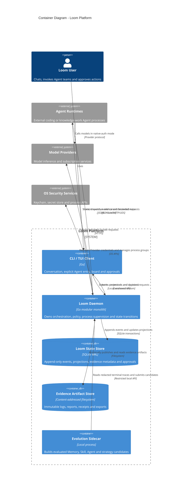

# C4 Level 2：Containers

Container 表示独立运行或持久化的单元，不等同于 Go package。

## Container boundary

- Daemon 是唯一可以提交权威状态转移的进程。
- Client 只提交命令和读取投影。
- Sidecar 不能直接写 SQLite。
- Client、Agent Runtime 和 Sidecar 不能直接写 Artifact Store。
- Agent Runtime 不直接访问 Loom State Store。
