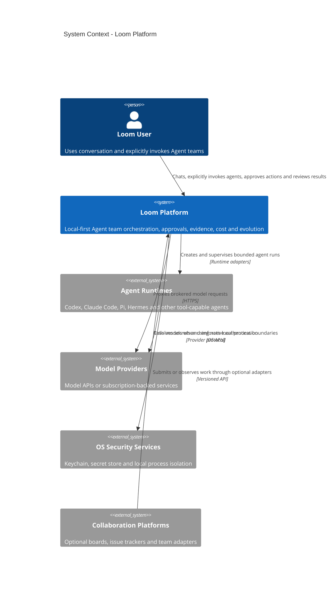

# C4 Level 1：System Context

这张图说明 Loom 在用户本机 Agent 生态中的位置。外部 Agent Runtime 和 Provider 都是黑盒系统，Loom 不假设其内部实现。

## Scope

Loom owns the orchestration and evidence lifecycle around Agent Runtime execution. It does not implement the Runtime's internal reasoning loop and does not require a specific Provider.
