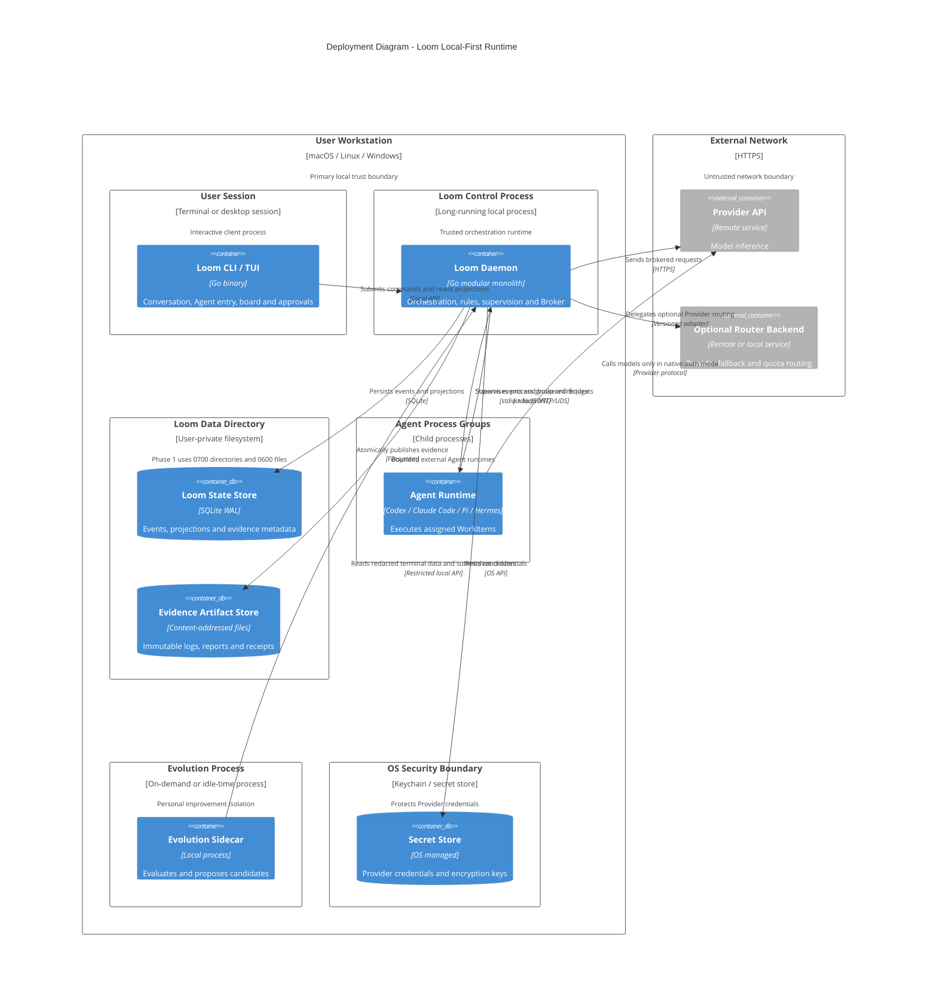

# C4 Deployment：本地运行拓扑

Phase 1 是单机部署。进程隔离仍然重要：Loom daemon、Agent 子进程和 Sidecar 具有不同信任等级。

## Process ownership

- Daemon 为每个 Run 创建独立 process group，并负责 timeout、cancel 和 cleanup。
- SQLite、Artifact Store 与 Secret Store 目录不挂载到 Agent process group。
- Phase 1 的 Loom State 和 Artifact Store 是用户私有文件，不宣称应用层加密；磁盘加密由 OS 提供。
- Sidecar 默认不常驻；即使崩溃也不能改变正在运行的任务。
- Provider 网络请求必须携带实际认证模式，便于 UI 和 Evidence 如实展示隔离等级。
