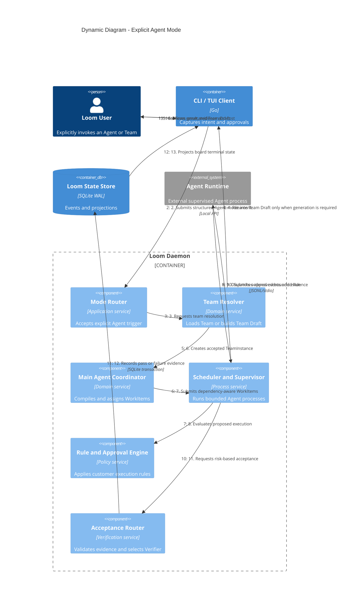

# C4 Dynamic：显式 Agent 模式

这张图只描述用户明确使用 Agent 后的主成功路径。普通对话不会进入第 2 步。

```mermaid
C4Dynamic
  title Dynamic Diagram - Explicit Agent Mode

  Person(user, "Loom User", "Explicitly invokes an Agent or Team")
  Container(client, "CLI / TUI Client", "Go", "Captures intent and approvals")
  ContainerDb(stateStore, "Loom State Store", "SQLite WAL", "Events and projections")
  System_Ext(agentRuntime, "Agent Runtime", "External supervised Agent process")

  Container_Boundary(daemon, "Loom Daemon") {
    Component(modeRouter, "Mode Router", "Application service", "Accepts explicit Agent trigger")
    Component(teamResolver, "Team Resolver", "Domain service", "Loads Team or builds Team Draft")
    Component(mainCoordinator, "Main Agent Coordinator", "Domain service", "Compiles and assigns WorkItems")
    Component(scheduler, "Scheduler and Supervisor", "Process service", "Runs bounded Agent processes")
    Component(ruleEngine, "Rule and Approval Engine", "Policy service", "Applies customer execution rules")
    Component(acceptance, "Acceptance Router", "Verification service", "Validates evidence and selects Verifier")
  }

  Rel(user, client, "1. Explicitly selects Use Agent, Agent or Team")
  Rel(client, modeRouter, "2. Submits structured Agent-mode intent", "Local API")
  Rel(modeRouter, teamResolver, "3. Requests team resolution")
  Rel(teamResolver, client, "4. Returns Team Draft only when generation is required")
  Rel(user, client, "5. Confirms generated Team Draft")
  Rel(teamResolver, mainCoordinator, "6. Creates accepted TeamInstance")
  Rel(mainCoordinator, scheduler, "7. Submits dependency-aware WorkItems")
  Rel(scheduler, ruleEngine, "8. Evaluates proposed execution")
  Rel(scheduler, agentRuntime, "9. Dispatches approved bounded Run", "JSONL/stdio")
  Rel(agentRuntime, scheduler, "10. Submits ordered events and evidence")
  Rel(scheduler, acceptance, "11. Requests risk-based acceptance")
  Rel(acceptance, stateStore, "12. Records pass or failure evidence", "SQLite transaction")
  Rel(stateStore, client, "13. Projects board terminal state")
  Rel(client, user, "14. Shows result, evidence and cost")
```

## Alternate paths

- 用户选择完整 Team 时跳过 Team Draft。
- `require_approval` 在第 8 步暂停 Run，客户决定后恢复或终止。
- 验收失败返回可重试状态，不产生 Done。
