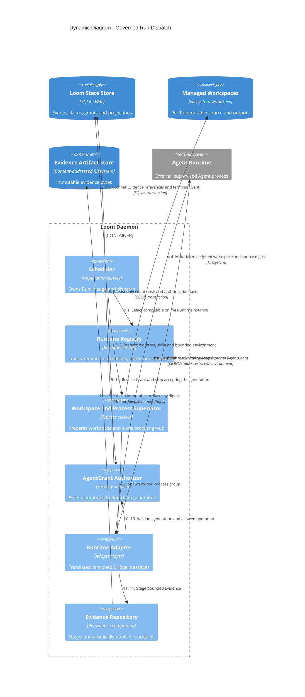

# C4 Dynamic：Run 认领与终态提交

这张图描述一个已批准 WorkItem 从 Runtime 选择到本地权威终态的执行链。它不描述 Team Draft。

## Recovery rules

- prepare lease 过期时，恢复器递增 generation 后重新认领；旧进程不能恢复授权。
- RuntimeInstance 离线只阻止新认领；已有 Run 根据进程、heartbeat 和 Journal 事实收敛。
- Agent 返回的 terminal result 不是权威状态；第 14 步的本地事务才是权威 terminal。
- Client 断开、通知失败或未来协作 Adapter 回调失败不会回滚已提交 terminal。
- Evidence publish 失败时不提交有效 Evidence 引用，也不把 WorkItem 投影为 Done。
