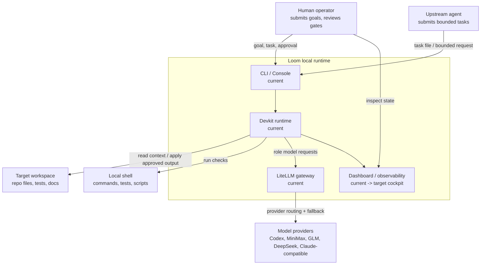
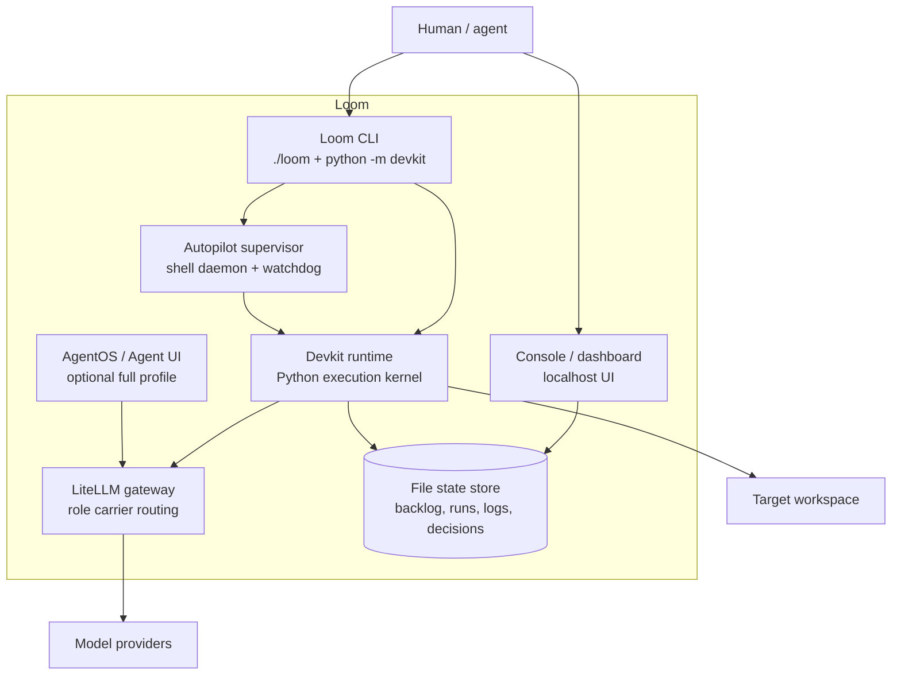
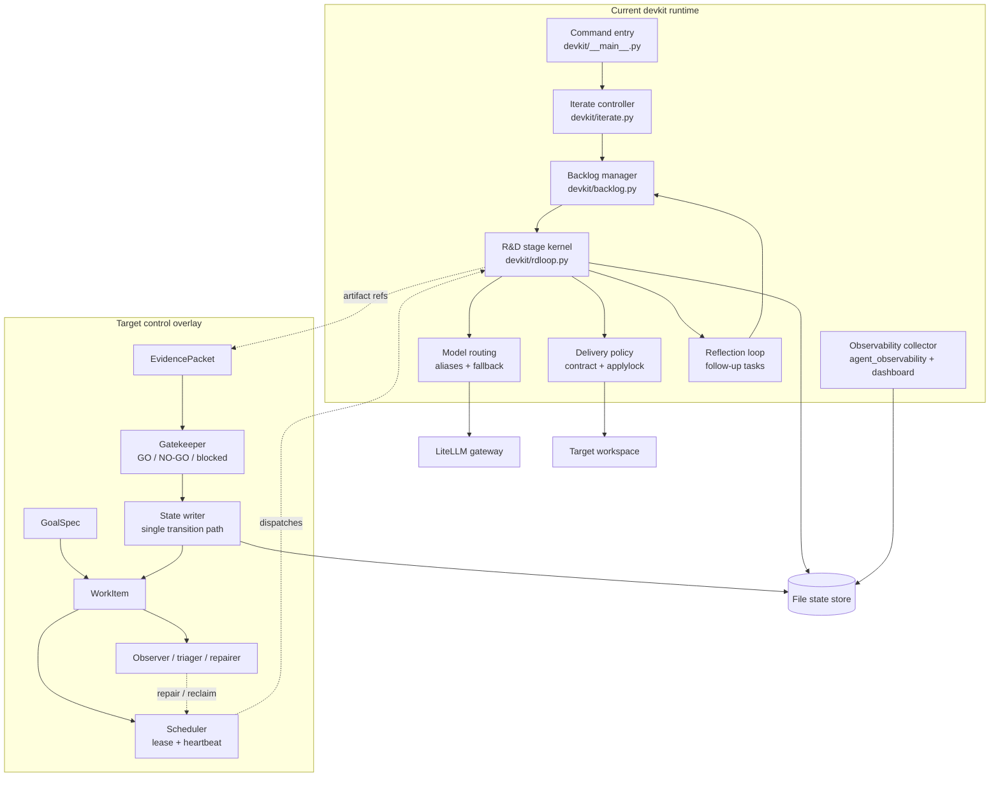
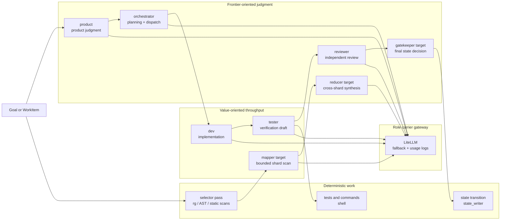
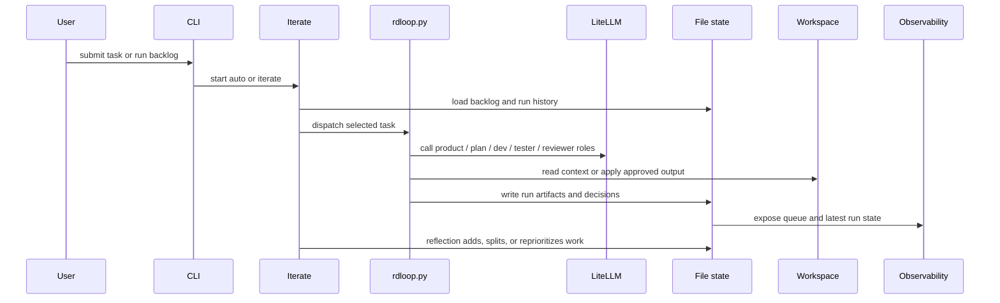
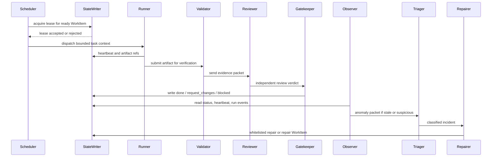
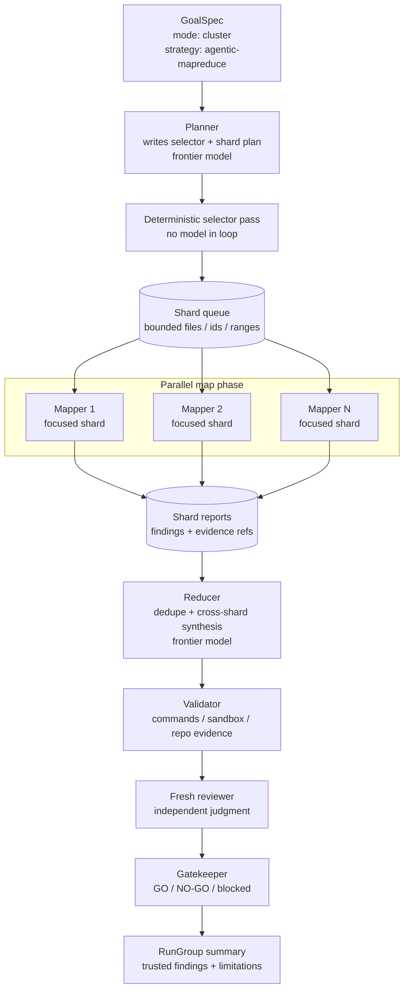
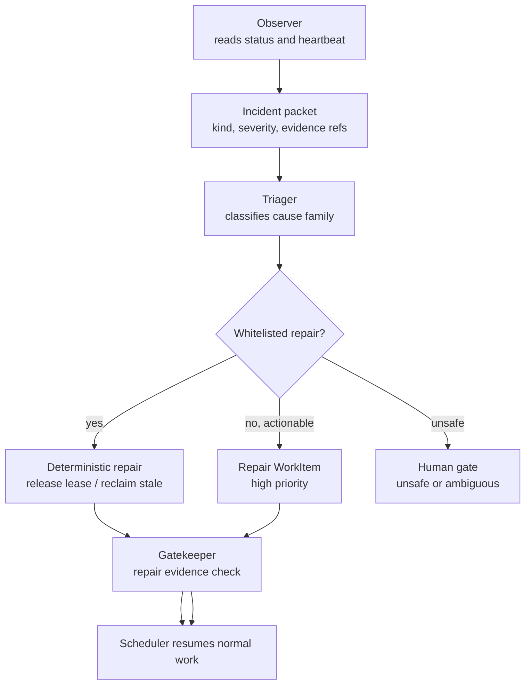
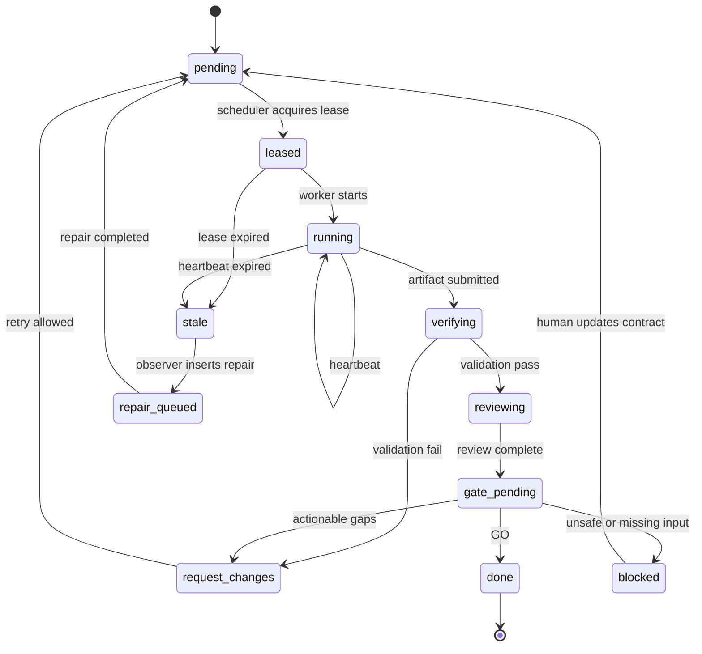

# Loom Architecture

> Language: [中文](./loom-architecture.md) | English

## Status

Current architecture snapshot with proposed stable-runtime overlays.

Last reviewed: 2026-07-03.

## Audience

This document is for contributors, maintainers, and agents that need to understand how Loom works before changing it.

It uses C4-style levels with standard Mermaid diagrams:

- **Context**: what Loom is, and what is outside it.
- **Containers**: local processes, services, and stores.
- **Components**: important modules inside the `devkit` runtime.
- **Runtime flows**: the main execution, repair, and Agentic MapReduce paths.

Legend:

- `current`: present in the repo today.
- `target`: planned stable-runtime overlay.
- `optional`: enabled only in expanded profiles or future modes.

## Architecture Summary

Loom is a local, quota-aware agent runtime for code and repository work. Today it runs a file-backed R&D loop over `backlog.json`, `devkit/runs/`, model carriers, and stage artifacts. The intended evolution is to keep `rdloop.py` as the execution kernel while adding a stable control layer around it.

The most important boundary is this:

**Execution agents produce artifacts. Control-plane components decide scheduling, repair, and final state.**

That boundary is what turns Loom from a prompt chain into a stable local agent runtime.

## Context View

This is the highest-level map. Loom sits between humans/upstream agents, local workspaces, model providers, and local verification tools.

Why this matters:

- Loom owns local orchestration and evidence.
- Model providers are replaceable execution backends, not the architecture.
- The workspace remains outside Loom and should only be changed through policy.

## Container View

This view shows Loom's current local containers. A container here means a runnable process, service, or persistent store, not a Python class.

Current control surfaces:

| Surface | Main files | Role |
| --- | --- | --- |
| Entry | `loom`, `devkit/__main__.py` | Start runs, inspect status, launch autopilot |
| Execution kernel | `devkit/rdloop.py` | Run staged agent workflow |
| Queue | `devkit/backlog.json`, `devkit/backlog.py`, `devkit/iterate.py` | Select and update work |
| Delivery policy | `devkit/delivery_mode.py`, `devkit/task_contract.py`, `devkit/applylock.py` | Control report-only vs apply behavior |
| Model routing | `devkit/model_aliases.py`, `devkit/carrier_fallback.py`, LiteLLM config | Map roles to model carriers and fallback |
| Observability | `devkit/agent_observability.py`, `devkit/dashboard.py`, task queue scripts | Project queue and run health |
| Background loop | `scripts/loom-iterate-daemon.sh`, `scripts/loom-iterate-supervisor.sh`, `./loom autopilot` | Keep local autonomy running |

## Component View: Devkit Runtime

This view zooms into the `devkit` runtime. The upper row is current. The lower row shows the target stable-runtime components that should be added without rewriting `rdloop.py`.

Design rule:

**Do not let implementation agents be the final authority for completion.**

They can submit artifacts. Completion should go through evidence, review, and a gatekeeper transition.

## Mixed-Model Execution Strategy

Loom already uses different model classes for different kinds of work. That is the same architectural idea behind Agentic MapReduce: spend frontier-model tokens on high-leverage judgment and cheaper-model tokens on bounded local work.

Policy implication:

- Planning, review, reduction, and gates should prefer stronger or independent models.
- Mapping, local implementation drafts, and routine verification can prefer value models.
- Selector passes, test runs, and state transitions should be deterministic whenever possible.

## Runtime Flow: Current R&D Run

This is the current happy path for a normal task.

## Runtime Flow: Target Stable Control Loop

This is the target shape for reliable local autonomy.

Key difference from today:

- The runner does not own the final state.
- The scheduler owns leases.
- The observer owns anomaly detection.
- The gatekeeper owns final status transitions.

## Runtime Flow: Target Agentic MapReduce

Agentic MapReduce is a target `cluster` strategy, not the default mode for every task. Use it when the result only becomes trustworthy after broad coverage: repo-wide audits, backlog health analysis, failure-pattern mining, migration planning, or later security-style scans.

Invariants:

- The selector must be saved as an artifact.
- Each shard must have explicit boundaries.
- Mapper agents should be read-only by default.
- Reducer must preserve evidence references.
- Verifier must distinguish `inner_sandbox`, `materialized_repo`, and `unknown`.
- Gatekeeper must report limitations instead of fabricating certainty.

## Runtime Flow: Target Repair Lane

Repair is intentionally narrow. A repair agent should not freely mutate the system. It either performs a whitelisted deterministic action or inserts a repair work item that still passes gates.

Whitelisted examples:

- reclaim stale `running` work after lease expiry
- release orphaned lease
- insert follow-up task for missing evidence
- pause a noisy retry loop
- mark unrecoverable work as `blocked` with evidence

Not whitelisted:

- arbitrary code edits
- deleting failed work to make the queue look healthy
- bypassing review
- marking `done` without evidence

## WorkItem State Machine

This is the target state model that should replace ad hoc status mutation.

## Current Versus Target

| Area | Current Loom | Target Loom |
| --- | --- | --- |
| Entry | CLI flags and backlog items | `GoalSpec` plus policy |
| Unit of work | Task / run | `WorkItem` inside `RunGroup` |
| State | JSON, Markdown, JSONL files | Object-centric status plus event log |
| Scheduling | Iterate selects next task | Scheduler with lease and heartbeat |
| Execution | `rdloop.py` stages | `rdloop.py` as kernel under control plane |
| Completion | Stage output plus gate text | `EvidencePacket` plus gatekeeper transition |
| Repair | Supervisor scripts and reflection | Observer, triager, repairer, repair work items |
| Parallelism | Limited and mostly ad hoc | `cluster` strategies such as Agentic MapReduce |
| Model mix | Role carrier defaults | Role and risk based `model_policy` |

## Reading Order

For a first pass:

1. `README.md`
2. `docs/autonomous-agent-team.md`
3. `docs/architecture/loom-architecture.md` for Chinese or `docs/architecture/loom-architecture.en.md` for English

For implementation planning:

1. `docs/loom-stable-agent-runtime-blueprint.md`
2. `docs/loom-control-plane-evolution.md`
3. `docs/pending-decisions/2026-06-29-loom-agent-cluster-platform-target.md`
4. `docs/pending-decisions/2026-07-01-parallel-agent-team-iteration.md`
