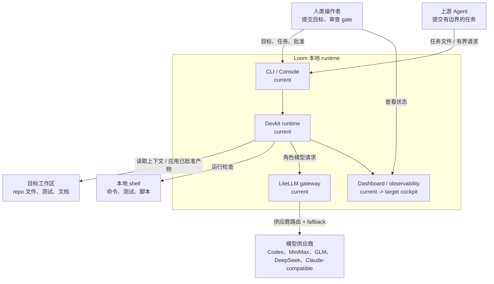
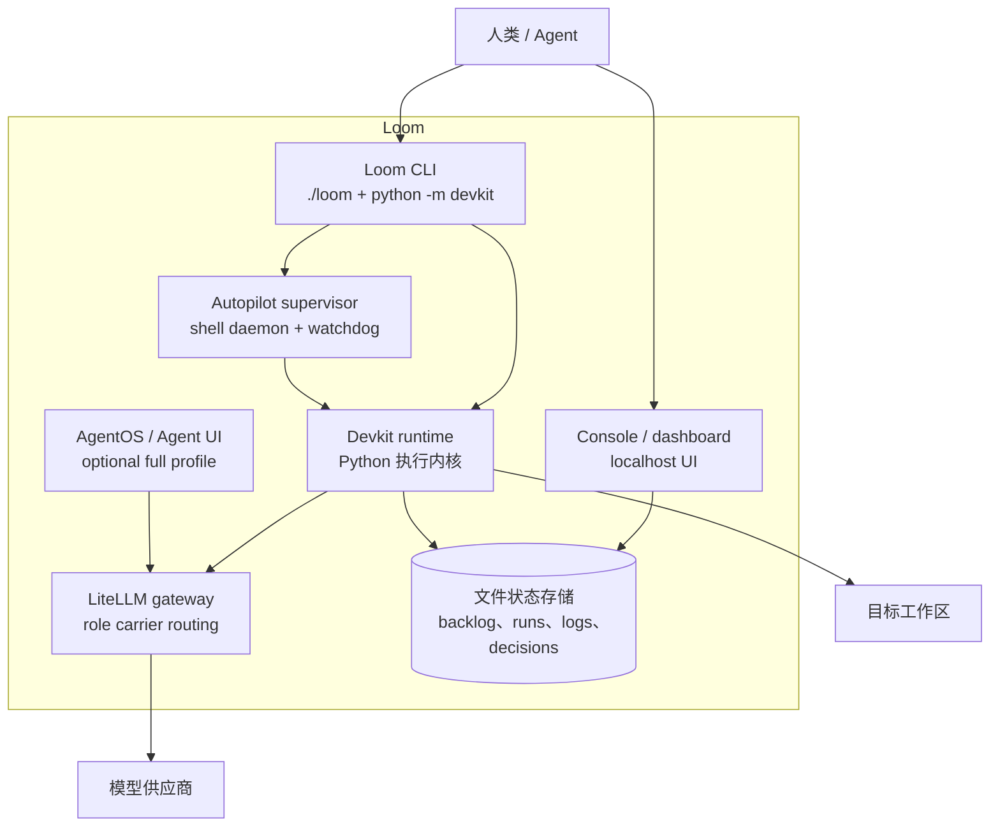
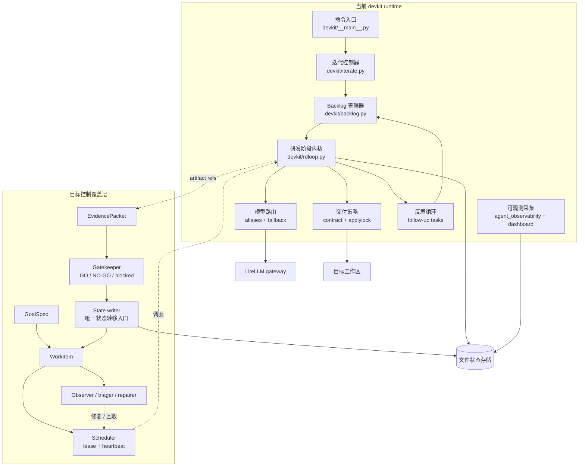
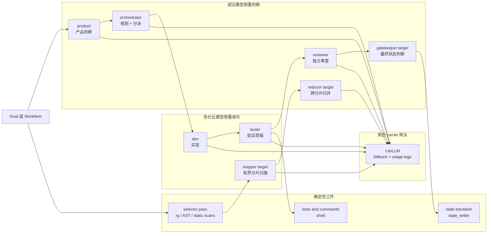
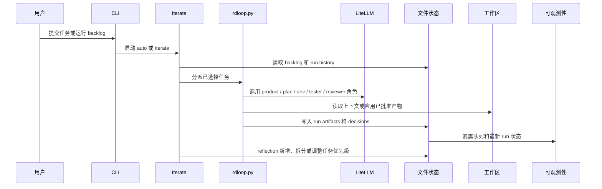
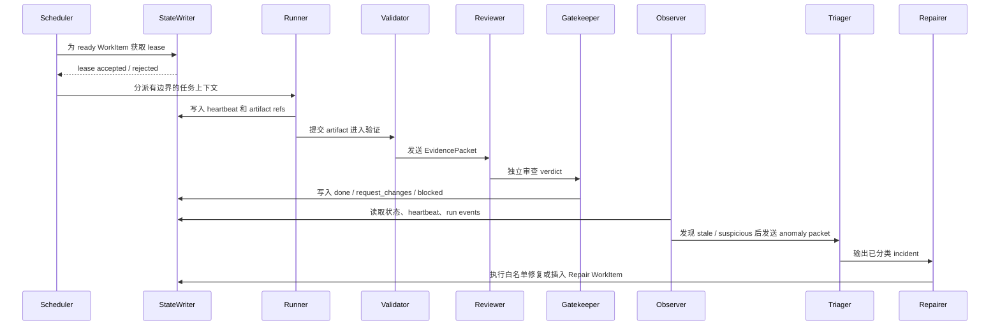
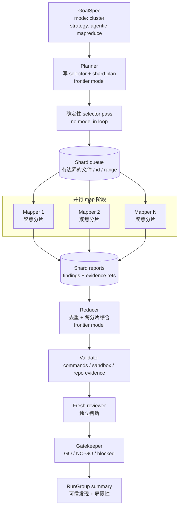
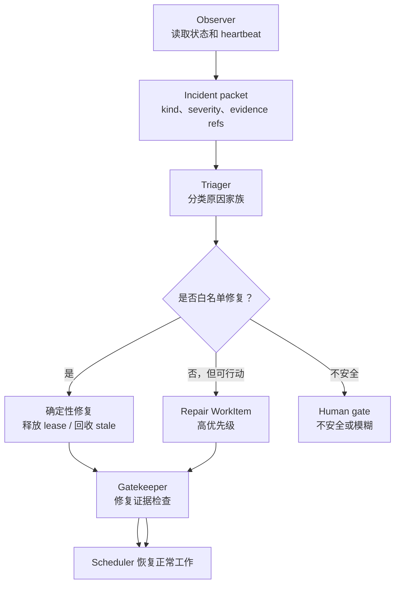
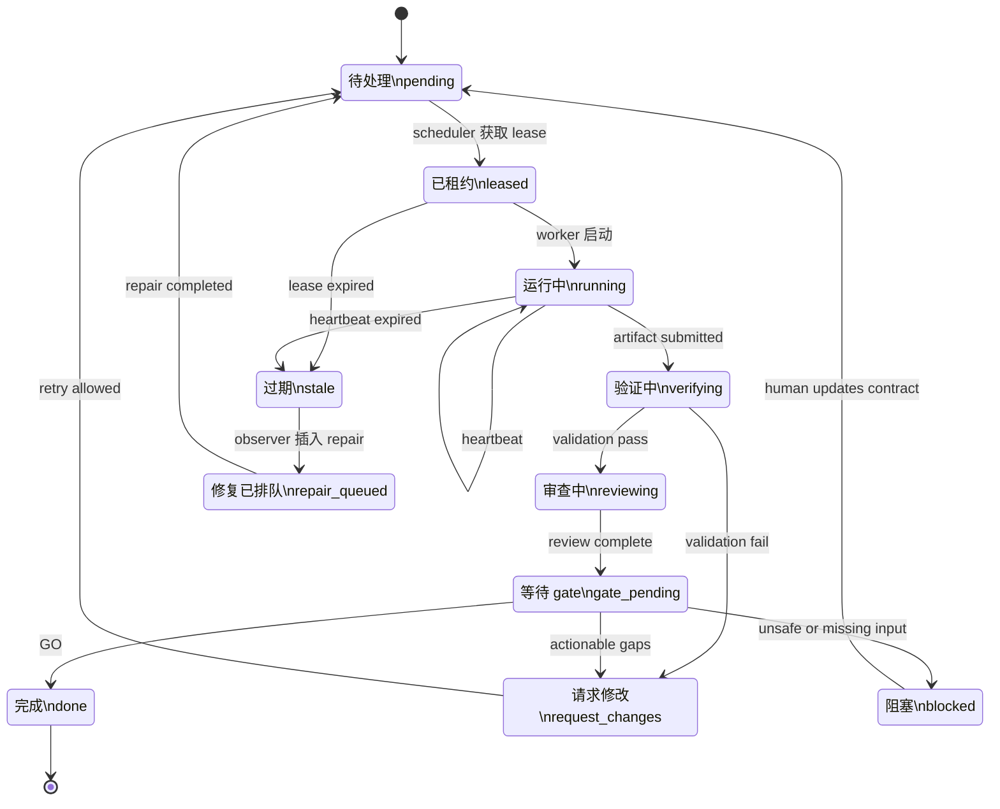

# Loom 架构说明

> Language: 中文 | [English](./loom-architecture.en.md)

## 状态

这是 Loom 当前架构快照，并叠加了“稳定 Agent Runtime”目标态。

最后审阅日期：2026-07-03。

## 读者

这份文档面向需要理解 Loom 后再修改它的贡献者、维护者和 Agent。

它采用 C4 风格的分层视图，并使用标准 Mermaid 图：

- **上下文视图**：Loom 是什么，哪些东西在 Loom 外部。
- **容器视图**：本地进程、服务和持久化存储。
- **组件视图**：`devkit` runtime 内部的关键模块。
- **运行时流程**：主执行链路、修复链路和 Agentic MapReduce 链路。

图例：

- `current`：当前仓库已经存在。
- `target`：计划中的稳定 runtime 覆盖层。
- `optional`：只在扩展 profile 或未来模式中启用。

## 架构摘要

Loom 是一个本地优先、额度感知的 Agent Runtime，主要服务代码和仓库研发任务。当前它围绕 `backlog.json`、`devkit/runs/`、模型 carrier 和阶段产物运行一条文件驱动的研发闭环。目标演进方向是保留 `rdloop.py` 作为执行内核，在外层补上更稳定的控制面。

最重要的边界是：

**执行 Agent 只负责产出 artifact；控制面组件负责调度、修复和最终状态。**

这个边界决定了 Loom 是一条 prompt chain，还是一个稳定的本地 Agent Runtime。

## 上下文视图

这是最高层地图。Loom 位于人类 / 上游 Agent、本地工作区、模型供应商和本地验证工具之间。

这个视图的含义：

- Loom 拥有本地编排和证据链。
- 模型供应商是可替换的执行后端，不是系统架构本身。
- 工作区在 Loom 外部，必须通过策略和 gate 控制写入。

## 容器视图

这里的“容器”指可运行进程、服务或持久化存储，不是 Python class。

当前控制面入口：

| 控制面 | 主要文件 | 职责 |
| --- | --- | --- |
| 入口 | `loom`, `devkit/__main__.py` | 启动 run、查看状态、启动 autopilot |
| 执行内核 | `devkit/rdloop.py` | 运行分阶段 Agent workflow |
| 队列 | `devkit/backlog.json`, `devkit/backlog.py`, `devkit/iterate.py` | 选择和更新任务 |
| 交付策略 | `devkit/delivery_mode.py`, `devkit/task_contract.py`, `devkit/applylock.py` | 控制 report-only 与 apply 行为 |
| 模型路由 | `devkit/model_aliases.py`, `devkit/carrier_fallback.py`, LiteLLM config | 将角色映射到 model carrier 和 fallback |
| 可观测性 | `devkit/agent_observability.py`, `devkit/dashboard.py`, task queue scripts | 展示队列、运行健康和最近状态 |
| 后台循环 | `scripts/loom-iterate-daemon.sh`, `scripts/loom-iterate-supervisor.sh`, `./loom autopilot` | 维持本地自治运行 |

## 组件视图：Devkit Runtime

这一层放大 `devkit` runtime。上半部分是当前结构；下半部分是目标稳定 runtime 组件。目标是“外加控制层”，不是重写 `rdloop.py`。

设计规则：

**不要让实现 Agent 成为“是否完成”的最终裁判。**

实现 Agent 可以提交 artifact；完成状态必须经过 evidence、review 和 gatekeeper 的状态转移。

## 混合模型执行策略

Loom 已经在不同工作类型上使用不同模型层级。这和 Agentic MapReduce 的核心思想一致：把前沿模型 token 花在高杠杆判断上，把性价比模型 token 花在有边界、可并行、可复核的局部工作上。

策略含义：

- 规划、审查、归并和 gate 应优先使用更强或独立的模型。
- 分片扫描、局部实现草稿、常规验证可优先使用性价比模型。
- 文件选择、测试运行、状态转移应尽量确定性执行，不交给模型自由发挥。

## 运行时流程：当前研发任务

这是普通任务在当前 Loom 中的 happy path。

## 运行时流程：目标稳定控制回路

这是可靠本地自治的目标形态。

和当前实现相比，关键差异是：

- Runner 不拥有最终状态。
- Scheduler 拥有 lease。
- Observer 负责异常发现。
- Gatekeeper 负责最终状态转移。

## 运行时流程：目标 Agentic MapReduce

Agentic MapReduce 是目标 `cluster` 策略，不是每个任务的默认模式。它适合需要广覆盖后才可信的任务：全仓审计、backlog 健康分析、失败模式挖掘、迁移规划，以及后续安全扫描类任务。

不可破坏的约束：

- selector 必须保存为 artifact。
- 每个 shard 必须有明确边界。
- Mapper Agent 默认应只读。
- Reducer 必须保留 evidence references。
- Verifier 必须区分 `inner_sandbox`、`materialized_repo` 和 `unknown`。
- Gatekeeper 必须报告局限性，不能伪造确定性。

## 运行时流程：目标修复通道

修复通道必须刻意保持狭窄。Repair Agent 不应自由修改系统。它只能执行白名单内的确定性动作，或插入仍然需要通过 gate 的 repair WorkItem。

白名单示例：

- lease 过期后回收 stale `running` work。
- 释放 orphaned lease。
- 为缺失证据插入 follow-up task。
- 暂停高噪声 retry loop。
- 在有证据时将不可恢复任务标记为 `blocked`。

不在白名单内：

- 任意代码修改。
- 删除失败任务来伪造队列健康。
- 绕过 review。
- 没有证据就标记 `done`。

## WorkItem 状态机

这是目标状态模型，用来替代分散的临时状态修改。

## 当前与目标对照

| 领域 | 当前 Loom | 目标 Loom |
| --- | --- | --- |
| 入口 | CLI flags 和 backlog items | `GoalSpec` + policy |
| 工作单元 | Task / run | `RunGroup` 内的 `WorkItem` |
| 状态 | JSON、Markdown、JSONL 文件 | 面向对象的状态 + event log |
| 调度 | Iterate 选择下一条任务 | 带 lease 和 heartbeat 的 Scheduler |
| 执行 | `rdloop.py` stages | `rdloop.py` 作为控制面下的执行内核 |
| 完成判断 | 阶段输出 + gate 文本 | `EvidencePacket` + gatekeeper 状态转移 |
| 修复 | Supervisor scripts 和 reflection | Observer、triager、repairer、repair work items |
| 并行 | 有限且偏临时 | `cluster` 策略，例如 Agentic MapReduce |
| 模型混用 | 角色 carrier 默认值 | 基于角色和风险的 `model_policy` |

## 阅读顺序

第一次阅读：

1. `README.md`
2. `docs/autonomous-agent-team.md`
3. 中文读 `docs/architecture/loom-architecture.md`，英文读 `docs/architecture/loom-architecture.en.md`

做实现规划：

1. `docs/loom-stable-agent-runtime-blueprint.md`
2. `docs/loom-control-plane-evolution.md`
3. `docs/pending-decisions/2026-06-29-loom-agent-cluster-platform-target.md`
4. `docs/pending-decisions/2026-07-01-parallel-agent-team-iteration.md`
