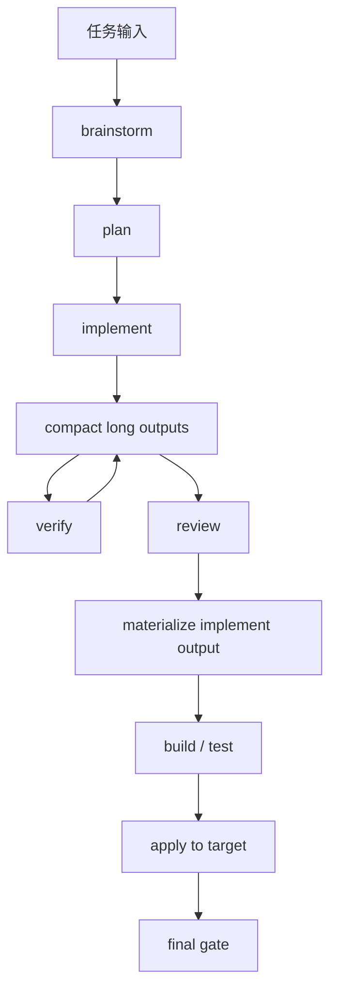
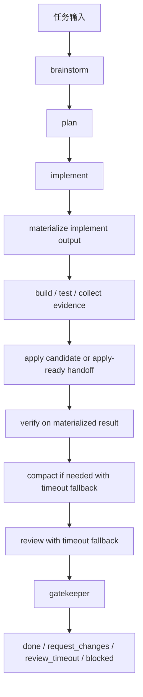
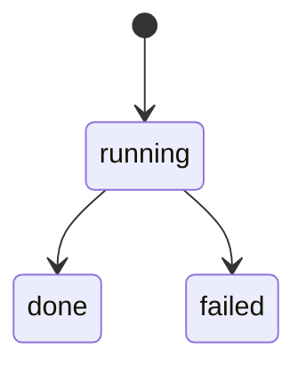
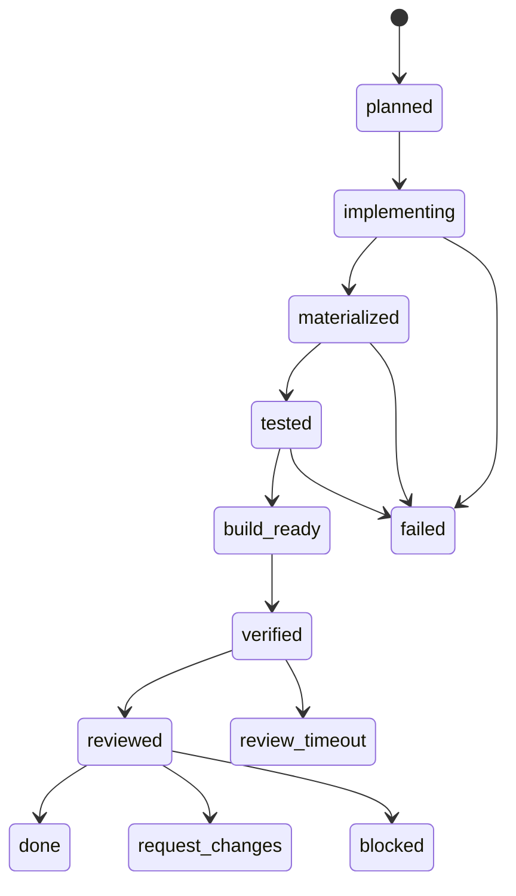
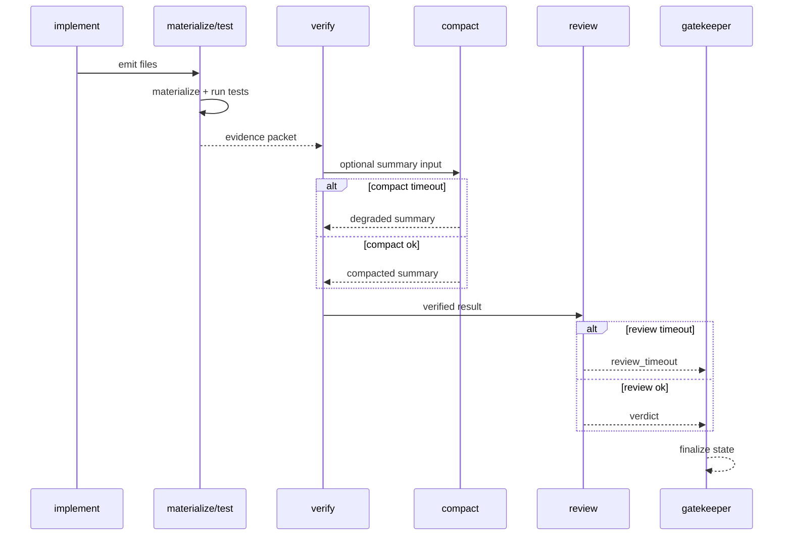
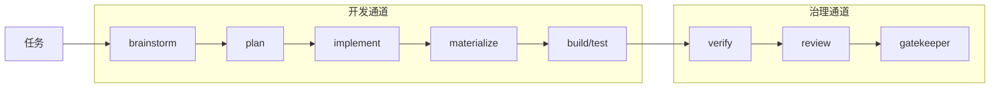

# Loom Review Blocking Optimization

## 状态

Draft proposal.

## 日期

2026-07-03

## 目的

这份文档聚焦一个具体 runtime 问题：

**后段控制面阶段（尤其 `compact` / `review`）卡住时，会阻断前段已经完成的开发成果进入物化、测试和 apply。**

本文采用你确认的 **方案 A** 作为近期落地方案，并把 **方案 C** 保留为后续演进目标。

---

## 1. 当前问题总结

最近几次 live run 暴露的是同一个结构性问题，而不是单一模型故障：

1. `brainstorm / plan / implement / verify` 已经完成
2. `review` 或 `compact` 的网关调用发生长尾阻塞
3. 因为当前 `build/test/apply` 在所有阶段之后才执行
4. 所以前段开发成果无法进入真正的物化与测试提交点

结果是：

- 已经生成的代码无法及时落地
- 真实测试无法及时执行
- 最终看起来像“自治开发没完成”，但实际是**控制面后段卡住**

---

## 2. 当前流程（Before）

当前 `rdloop.py` 的关键顺序可以概括为：

这个流程的问题不在“阶段多”，而在**提交点过晚**：

- `implement` 的真实成果直到 `review` 之后才会正式进入 `materialize -> test -> apply`
- `compact` 是同步阻塞调用
- `review` 是同步阻塞调用
- 任何一个后段长尾都能拖死整轮 run

---

## 3. 根因分析

### 3.1 基础设施层

- 本地 LiteLLM 网关到上游 provider 存在长尾响应
- 当前 `_request_json_with_retry` 只能覆盖短暂错误，不能解决“长时间不回包”的同步阻塞

### 3.2 编排层

- `compact_text` 是内联同步调用
- `review` 是内联同步调用
- 两者都没有清晰的阶段熔断和降级出口

### 3.3 事务边界层

- 当前真正的提交点在流程尾部
- 这导致 `implement` 的产物没有在最早可验证时机就进入“候选提交状态”

---

## 4. 方案 A：提交点前移 + 后置 Gate + 控制面熔断

近期落地方案的原则：

1. **尽早提交候选结果**
2. **把治理阶段从开发提交点后移**
3. **允许控制面失败，但不允许它吞掉前段成果**

### 4.1 新流程（After）

### 4.2 关键变化

#### 变化 1：`implement` 后立即进入真实提交候选

旧逻辑：

- `implement` 只产生文本 artifact
- 直到 `review` 后才物化

新逻辑：

- `implement` 一完成就立刻：
  - `materialize`
  - `build/test`
  - 产出 `EvidencePacket` 候选
  - 形成 `apply candidate` 或 `apply-ready handoff`

收益：

- 开发成果不会因为后段控制面卡住而悬空

#### 变化 2：`verify` 检查的是已物化结果，不是上游 prose

旧逻辑里，`verify` 更接近“文本审阅 + 推演”。

新逻辑里，`verify` 要基于：

- 已写入的文件
- 已跑过的测试
- 已收集的输出
- 已知物化协议

收益：

- `verify` 从“前置阶段”变成“证据阶段”

#### 变化 3：`review` 不再阻塞前段提交点

旧逻辑：

- `review` 是进入 build/test/apply 的前置门

新逻辑：

- `review` 是治理 gate
- 它可以把状态从 `verified` 推到：
  - `done`
  - `request_changes`
  - `review_timeout`
  - `blocked`

收益：

- 即使 `review` 慢，也不再吞掉开发和测试成果

#### 变化 4：`compact` 和 `review` 引入熔断降级

新规则：

- `compact` 超时：
  - 退回到截断摘要
  - 标记 `compact_degraded`
- `review` 超时：
  - 标记 `review_timeout`
  - run 结束，不无限挂起

收益：

- 让 run “可结束”，而不是永远等待“理想控制面”

---

## 5. 前后职责对比

| 阶段 | 当前职责 | 方案 A 职责 |
| --- | --- | --- |
| `implement` | 产出实现草案文本 | 产出文本，并立刻进入物化候选 |
| `materialize` | 后置、依赖所有阶段完成 | 前移，成为开发完成后的第一真实提交点 |
| `build/test` | 后置 | 前移，尽早形成证据 |
| `verify` | 较偏文本审阅 | 基于已物化结果做证据核查 |
| `compact` | 内联同步、无熔断 | 可降级的辅助阶段 |
| `review` | 阻塞提交点 | 后置治理 gate |
| `gate` | 基于所有阶段成功后给建议 | 基于“已提交候选 + verify + review”给最终状态 |

---

## 6. 新状态机建议

### 当前隐含状态

### 方案 A 建议状态

说明：

- `build_ready` 表示：代码已经真实写出并通过基础测试
- `review_timeout` 表示：开发成果和验证证据都在，但治理阶段未及时完成

---

## 7. 失败与降级流程

---

## 8. 方案 A 的实现边界

近期实现不需要一次性引入整个控制面重构。

建议分三步：

### Step 1

把 `materialize -> build/test` 从尾部前移到 `implement` 之后。

### Step 2

把 `verify` 改为读取：

- `materialization`
- `output_protocol`
- `test_collection`
- `_test-output.txt`

### Step 3

给 `compact` / `review` / 控制面请求增加：

- 超时上限
- 明确 failure code
- 阶段级降级状态

---

## 9. 验收标准

方案 A 落地后，至少满足下面 5 条：

1. `implement` 完成后，无论 `review` 是否卡住，run 目录都必须出现：
   - `build/`
   - `materialization`
   - `test_collection`
2. `review` 超时不得阻断 `materialize -> build/test`
3. `compact` 超时不得阻断阶段收尾
4. run 最终必须可结束，不能因为控制面长尾无限悬挂
5. 状态必须能区分：
   - `build_ready`
   - `verified`
   - `review_timeout`
   - `request_changes`

---

## 10. 为什么不选方案 B

方案 B 只是给 `compact/review` 加 watchdog。

问题是：

- 阻塞点会变少
- 但提交点仍然在尾部
- `review` 卡住时，前段成果仍然没有真正落地

所以它只能算缓解，不算结构修正。

---

## 11. 后续演进：方案 C

方案 C 保留为下一阶段目标：

**双通道 runtime**

- 开发通道：
  - `brainstorm -> plan -> implement -> materialize -> build/test`
- 治理通道：
  - `verify -> review -> gatekeeper`

### 方案 C 目标图

### 方案 C 适用时机

当 Loom 后续准备引入这些能力时，再进入方案 C：

- `GoalSpec`
- `WorkItem`
- `state_writer`
- `review_timeout` 可恢复队列
- `observer / triager / repairer`

也就是：**方案 A 先救当前主线，方案 C 再做平台化。**

---

## 12. 推荐结论

近期结论：

- 立刻按 **方案 A** 落地
- 不再让 `review` 成为开发成果进入物化与测试的前置阻塞门
- 把 `compact` 和 `review` 都纳入明确熔断与降级语义

中期结论：

- 用 **方案 C** 作为 Loom 稳定 runtime 的下一阶段演进方向
