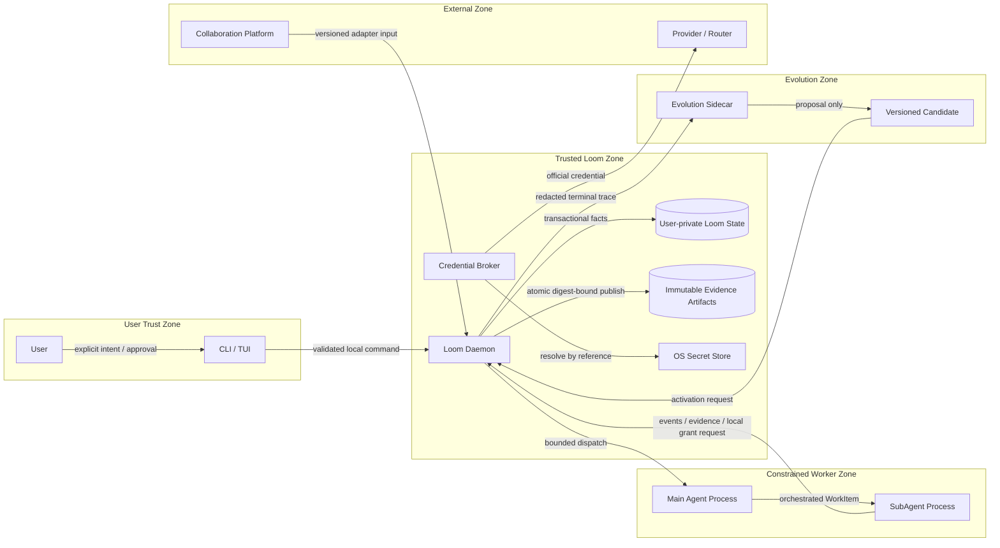

# 信任边界与数据流

Loom 是本地优先系统，但“运行在同一台机器”不等于“处于同一信任域”。

## 数据分类

| 数据 | 允许位置 | 禁止位置 |
|---|---|---|
| Provider Key / refresh token | OS Secret Store、Broker 短期内存 | Prompt、Bridge、Event、Evidence、Sidecar |
| Loom local Grant 明文 | 对应 Run 的受限 IPC 或环境 | SQLite、日志、Sidecar |
| AgentDefinition / RuntimeProfile | Loom State、Team Draft | Provider 请求正文，除非任务明确需要 |
| 执行 Event / Evidence metadata | Loom State、按需投影 | 未经脱敏的 Sidecar 输入 |
| Evidence artifact bytes | daemon-owned 内容寻址目录 | Agent、Client 或 Sidecar 直接写入 |
| 个人记忆 | 加密 Sidecar 分区、受限检索结果 | 自动完整注入所有 Agent |
| 外部动作批准 | Event 与 Approval projection | 仅存在 UI 内存 |

## Fail-closed 边界

- 未知协议版本、重复 terminal、无效 Grant 和越权模型请求直接拒绝。
- Daemon 是唯一可以写权威 terminal 状态的进程。
- Agent、Client 和 Sidecar 都不能直接写 SQLite 或 Artifact Store。
- Sidecar Candidate 未经激活不能改变 AgentDefinition、Skill 或客户规则。
- Phase 1 状态目录和文件必须保持 `0700`/`0600`；应用层静态加密只在实现后声明。
