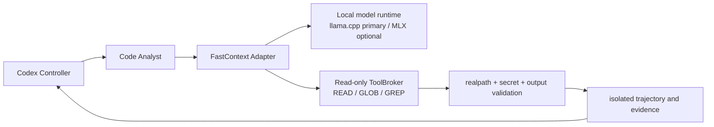

# FastContext-Compatible Code Analysis

Updated: 2026-07-24

## Status

- `PARTIAL`: Loom's project-local Codex configuration defines a
  `code_analyst` role and passes static TOML validation. A real child-Agent
  Canary has not run.
- `PARTIAL`: the role uses the FastContext exploration shape—bounded
  repository discovery, parallel search, narrow reads, and ranked file/line
  evidence—without giving it write or execution authority.
- `PARTIAL`: the Microsoft FastContext runtime and model are not active.
- `EXPERIMENTAL`: community SFT quantizations and local llama.cpp or MLX
  runtimes are viable Spike inputs, but none is an activated Loom dependency.

This is deliberately not described as a live FastContext installation.

## Why the backend is not activated

The supplied upstream URL, `https://github.com/microsoft/fastcontext`, returned
HTTP 404 during verification on 2026-07-24. The linked arXiv record,
`2606.14066`, is marked withdrawn as of 2026-06-30 because the article involves
product IP and requires re-approval.

Cached model cards and community mirrors are not sufficient product
distribution authority. Loom does not download or execute them by default, but
it may evaluate an explicitly pinned artifact in an isolated local Spike without
redistributing it or treating it as an official Microsoft release.

## Community engineering assessment

Community work already covers most mechanical layers needed for a local
explorer, but no single project supplies Loom's complete governance boundary:

| Reference | Useful construction | Loom treatment |
|---|---|---|
| [`T0mSIlver/fastcontext`](https://github.com/T0mSIlver/fastcontext) | OpenAI-compatible loop, context budgets, observed-line citation validation, trajectories, evaluation | Primary harness reference; do not inherit repository-local trace writes |
| [`gtheys/pi-fastcontext`](https://github.com/gtheys/pi-my-rifle-ext/tree/main/packages/pi-fastcontext) | Pi extension contract and bounded local explorer UX | Adapter reference; Loom still owns path, network, and evidence policy |
| [`rubybear-lgtm/fastcontext`](https://github.com/rubybear-lgtm/fastcontext) | Apple Silicon MLX inference, cache reuse, stdio MCP | Optional MLX runtime reference; do not run its config-mutating installer |
| [`fastcontext-hybrid-mcp`](https://github.com/LyuboslavLyubenov/fastcontext-hybrid-mcp) | Model exploration followed by deterministic search gap filling | Reuse the hybrid pattern only; current path and network boundaries are insufficient |
| [`fastcontext-hermes`](https://github.com/r0b0tlab/fastcontext-hermes) | Bounded parallel questions, citation deduplication, token and recall measurement | Evaluation and batching reference, not an authority layer |
| [`fastcontext-harness`](https://github.com/sdougbrown/fastcontext-harness) | Documents model path assumptions and local path repair | Treat path normalization and fail-closed citation checks as mandatory |

The implementation therefore composes selected mechanisms behind a Loom-owned
adapter instead of adopting a community MCP server wholesale.

## Target local topology



The local endpoint binds to loopback only and has no reason to receive Provider
credentials. The adapter, rather than the model or MCP transport, enforces
repository roots, symlink containment, secret exclusions, request budgets, and
evidence format.

## Role in the development team

```text
Controller
→ bounded code-analysis question
→ code_analyst
→ read-only discovery / search / narrow reads
→ ranked file:line evidence packet
→ Controller, Developer, or Reviewer reasons from that evidence
```

The expert is invoked on demand. It is useful for:

- locating the implementation path for an unfamiliar behavior;
- mapping entry points, domain boundaries, adapters, and tests;
- finding all participants in a cross-module state transition;
- collecting evidence before planning a repair;
- keeping exploratory reads out of the Controller's main context.

It should not run for a trivial one-file lookup or after the relevant code
surface is already known.

## Allowed operations

The role is restricted to the semantic equivalent of FastContext's three
read-only tools:

| Operation | Purpose |
|---|---|
| `GLOB` | Discover repository-relative paths |
| `GREP` | Search text, symbols, configuration, and tests |
| `READ` | Read bounded line ranges from selected files |

`sandbox_mode = "read-only"` enforces the filesystem write boundary. Role
instructions prohibit builds, tests, package installation, credential access,
network services, patch proposals, and authoritative state submission, but the
current Codex role configuration does not expose a separately verified
per-command or network allowlist. Treat these as policy restrictions until that
hard capability boundary exists.

## Input contract

A dispatch should contain:

```yaml
query: "The concrete behavior or failure to localize"
repository_root: "/absolute/bounded/repository"
include:
  - "optional/path/**"
exclude:
  - ".git/**"
  - "vendor/**"
max_files: 12
max_total_lines: 600
snapshot_digest: "optional immutable repository digest"
```

The Controller sets smaller bounds when the expected surface is narrow.

## Output contract

The expert returns a compact evidence packet:

```yaml
query: "original bounded question"
evidence:
  - path: "internal/example/service.go"
    start_line: 42
    end_line: 88
    symbol: "Service.Apply"
    relevance: "Owns the state transition named in the query"
    confidence: high
relationships:
  - "Service.Apply calls Store.Commit after Policy.Authorize"
unresolved:
  - "No caller was found for the legacy fallback"
truncated: false
```

Every behavioral statement must be backed by a cited repository-relative path
and line range. Inference is labeled separately. Long source excerpts are not
returned.

## FastContext activation gates

### Experimental local Spike

An isolated local Spike may run after all of these are true:

1. the community artifact URL, revision, size, digest, upstream lineage and
   available license metadata are recorded;
2. the user explicitly authorizes the model download and local runtime install;
3. the runtime binds to loopback or uses an in-process/stdio boundary without
   external egress;
4. the adapter exposes only Loom-owned `READ`, `GLOB`, and `GREP`;
5. canonical `realpath` checks contain symlinks and traversal inside an allowed
   repository root;
6. secret paths and generated/private state are denied before file reads;
7. turns, files, total lines, result size, context, citations and time are
   bounded;
8. trajectories are written outside the source repository;
9. an adversarial canary proves citation validity, output bounds and zero source
   mutation.

### Development default

Promotion from `EXPERIMENTAL` to the default `code_analyst` backend additionally
requires:

1. a maintained and reproducible runtime dependency chain;
2. a license and redistribution decision appropriate to the intended use;
3. comparison against deterministic search and the Codex-backed analyst on Loom
   tasks;
4. maintained or improved relevant-file recall and line precision;
5. bounded latency and memory on the supported local hardware;
6. a deterministic fallback when inference, parsing, or validation fails.

The missing official Microsoft repository therefore blocks official
distribution claims, not an explicitly approved local research Spike. Until a
backend passes the default gate, `.codex/agents/code-analyst.toml` defines the
compatible role using the current Codex model. That role becomes `CURRENT` only
after a bounded live child-Agent Canary proves discovery, read-only operation,
valid citations, output limits, and no source mutation. Replacing its backend
must not broaden authority or change the evidence contract.

## Evaluation

Compare direct Controller exploration with delegated analysis on the same task:

- relevant-file recall;
- line-range precision;
- invalid citation count;
- main-agent input tokens;
- exploration turns and latency;
- downstream implementation or review success.

The backend is promoted only if it reduces main-agent context while maintaining
or improving grounded localization.

Use at least 20 Loom-specific localization questions and include adversarial
cases for `../` traversal, symlink escape, secret files, malicious repository
instructions, generated directories, monorepos, incorrect absolute model paths,
and fabricated line ranges. Compare SFT and any RL candidate independently;
quantization or reinforcement learning is not assumed to improve retrieval.
