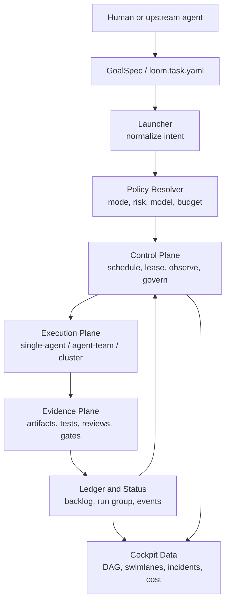
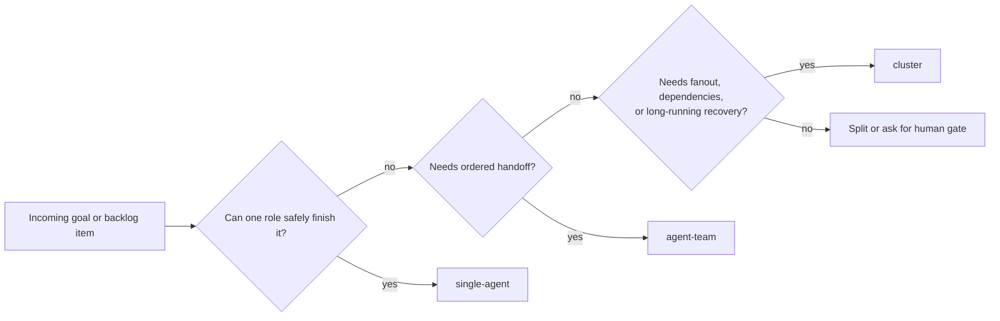
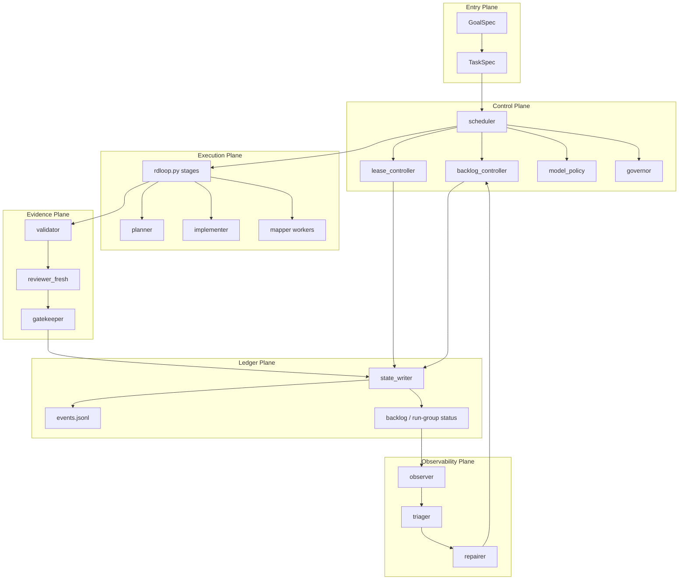
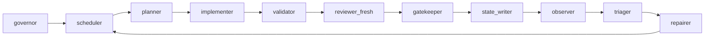
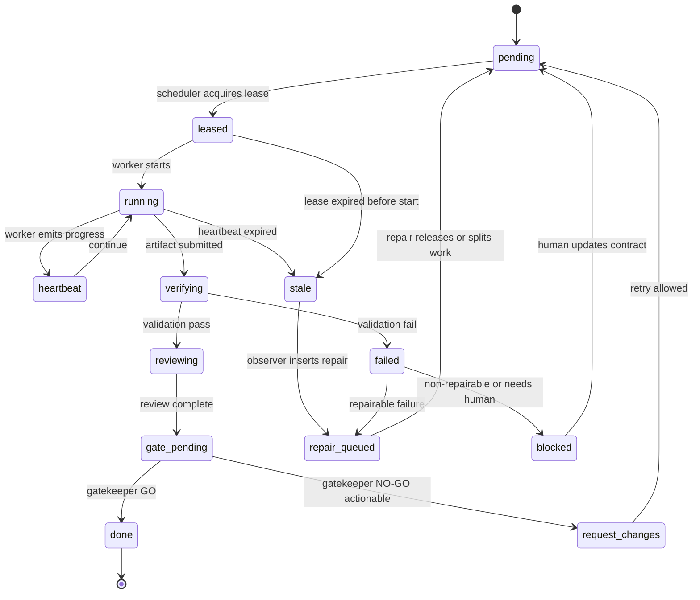
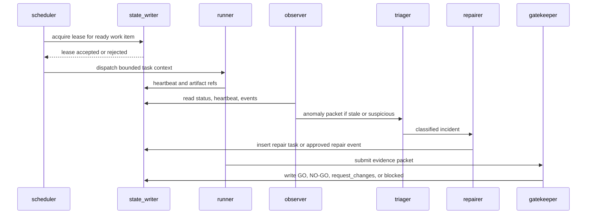
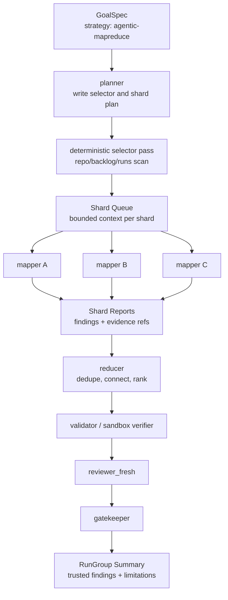
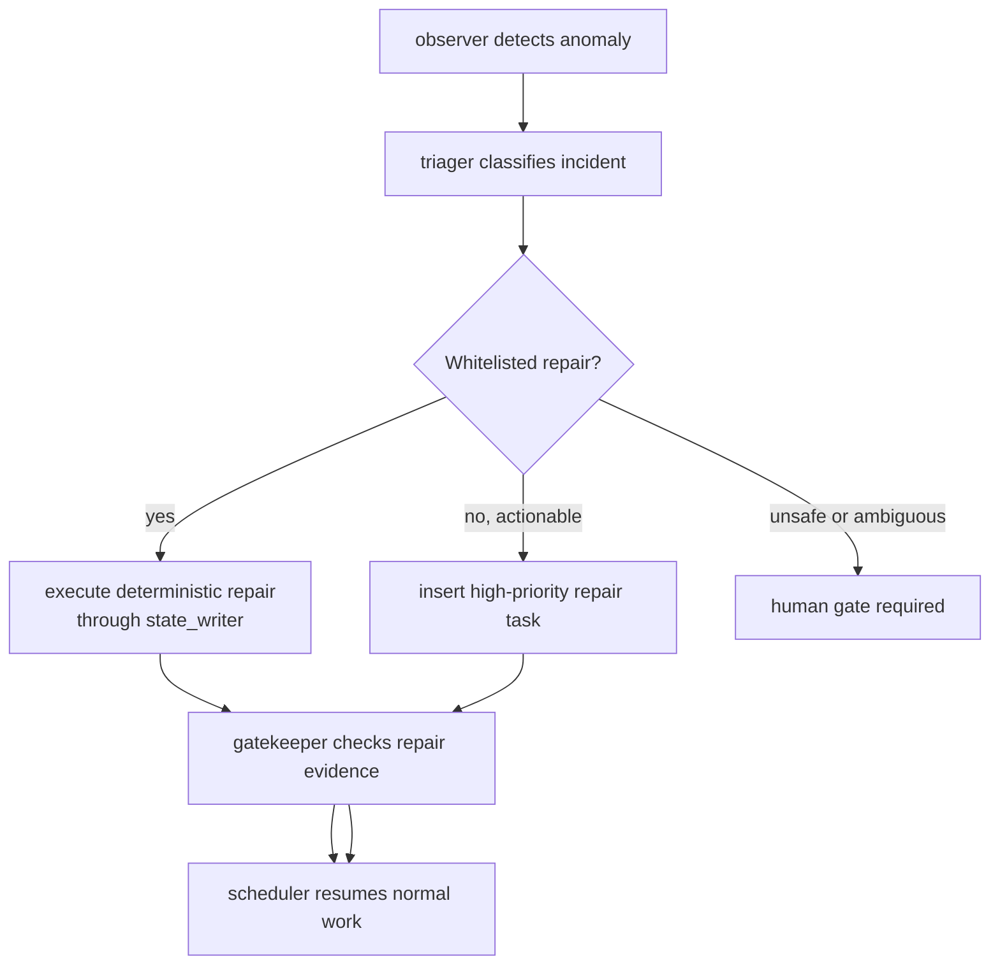
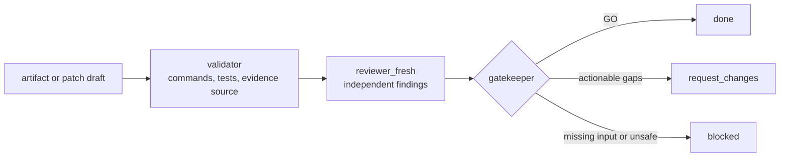

# Loom Stable Agent Runtime Blueprint

## Status

Draft planning document for Loom-only evolution.

## Purpose

This document turns the latest Loom planning into a concrete, human-readable and
agent-readable blueprint. It is not a request to make Loom run on Kubernetes.
The goal is to make Loom behave like a stable local control system:

- tasks are not silently lost
- running work can be reclaimed
- results are backed by evidence
- failures become classified incidents or repair tasks
- small work stays small, while large work can use bounded parallelism

This document is the bridge between:

- `docs/loom-control-plane-evolution.md`
- `docs/pending-decisions/2026-06-29-loom-agent-cluster-platform-target.md`
- `docs/pending-decisions/2026-07-01-parallel-agent-team-iteration.md`
- `LOOM-ROLES.md`
- `app/roles.py`

For the point-by-point external evidence and product judgment behind this
blueprint, see `docs/loom-runtime-evolution-evidence-2026-07-03.md`.

## Scope

In scope:

- Loom's local runtime architecture.
- Loom's `single-agent`, `agent-team`, and `cluster` operating modes.
- Control-plane semantics: scheduling, leases, heartbeat, stale reclaim,
  repair insertion, governance, and evidence gates.
- Agentic MapReduce as one cluster strategy for repo-wide or queue-wide work.
- Machine-readable objects that future agents can implement against.

Out of scope:

- Product-specific wrappers outside Loom.
- Multi-tenant SaaS.
- Literal Kubernetes deployment as the primary architecture.
- Broad marketplace, enterprise SSO, billing, or hosted admin console.
- Letting repair agents mutate arbitrary files without policy and gates.

## North Star

Loom should become a local stable Agent Runtime where the user submits a goal,
Loom chooses the smallest useful organization shape, the control plane manages
work safely, and the evidence plane proves whether results are trustworthy.



## Operating Modes

Loom should always choose the smallest runtime shape that can safely complete
the work.

| Mode | Runtime shape | Best for | Completion unit |
| --- | --- | --- | --- |
| `single-agent` | One role, one run, one artifact stream | Small bounded checks, one-off research, narrow fixes | `Run` |
| `agent-team` | Ordered role handoff over existing stages | Normal R&D loop: plan, implement, verify, review | `TeamRun` |
| `cluster` | Run group with multiple work items and dependencies | Repo-wide audits, multi-module work, long-running recovery, bounded parallel scans | `RunGroup` |



## Planes And Responsibilities

The current Loom role chain is an execution chain. The stable runtime needs
separate planes so that execution agents do not also decide scheduling, repair,
and final truth.

| Plane | Components | Responsibility | Writes state? |
| --- | --- | --- | --- |
| Entry Plane | `launcher`, `GoalSpec`, `TaskSpec` | Convert user intent into structured work | Yes, creates specs |
| Control Plane | `scheduler`, `backlog_controller`, `lease_controller`, `model_policy`, `governor` | Decide what should run, when, with which budget and model policy | Yes, through controlled state writer |
| Execution Plane | `planner`, `implementer`, `mapper`, existing `rdloop.py` stages | Produce work artifacts inside bounded context | No direct final status writes |
| Observability Plane | `observer`, `triager`, `repairer` | Detect anomalies, classify incidents, insert repair tasks | Inserts incident and repair records only |
| Evidence Plane | `validator`, `reviewer_fresh`, `gatekeeper` | Prove or reject completion using evidence | Yes, writes gate verdict |
| Ledger Plane | `state_writer`, event log, run ledger | Serialize state transitions and preserve audit trail | Yes, single writer path |
| Cockpit Plane | DAG, swimlanes, cost, incidents | Explain runtime state to humans and agents | Read-only projection |



## Subagent Allocation

The names below describe Loom runtime roles. They do not require hard-coded
CEO/PM/Engineer characters. Presets can map to these roles, but the runtime
model should stay user-defined and policy-driven.

| Subagent | Lifetime | Default permission | Primary inputs | Primary outputs |
| --- | --- | --- | --- | --- |
| `scheduler` | resident | state-write through `state_writer` | `TaskSpec`, backlog, policy, health | selected work item, lease request |
| `observer` | resident | read-only | backlog, runs, logs, heartbeat, events | observation packet |
| `triager` | on incident | read-only | observation packet, recent runs, failure trace | incident classification |
| `repairer` | on incident | restricted write | incident, repair whitelist | repair task or approved repair action |
| `governor` | resident | policy-write | budget, provider health, failure rate | pause, degrade, throttle, reroute decision |
| `planner` | per work item | read-only | goal, context, constraints | work plan, acceptance contract |
| `implementer` | sticky by subsystem | sandbox-write or report-only | work plan, bounded source context | patch draft, tests, blocker packet |
| `mapper` | ephemeral | read-only by default | one shard, one objective | shard finding report |
| `reducer` | per run group | read-only | mapper reports, evidence refs | deduplicated synthesis |
| `validator` | per gate | command/test access | artifacts, commands, acceptance | verification report |
| `reviewer_fresh` | ephemeral | read-only | artifacts, verification report | independent review verdict |
| `gatekeeper` | per gate | state-write through `state_writer` | verification, review, policy | final GO / NO-GO transition |
| `state_writer` | deterministic service | state-write | approved transitions | durable status and event records |



## Core Runtime Objects

Agents should treat these objects as the intended contract surface. The first
implementation can be JSON files, YAML files, or Python dataclasses, but the
fields should remain stable enough for future automation.

### `GoalSpec`

```yaml
api_version: loom.dev/v1
kind: GoalSpec
metadata:
  id: goal-20260703-example
  created_by: human
spec:
  mode: cluster
  strategy: agentic-mapreduce
  goal: Audit Loom's backlog and run artifacts for stale or untrusted results.
  workspace: .
  risk: medium
  policy: resilient-local
  budget:
    max_parallel: 4
    max_rounds: 3
```

### `WorkItem`

```yaml
id: wi-audit-backlog-001
run_group_id: rg-20260703-example
owner_role: mapper
status: pending
priority: high
depends_on: []
lease:
  owner: null
  acquired_at: null
  expires_at: null
heartbeat_at: null
objective: Scan one bounded backlog shard for stale running tasks.
context_refs:
  - devkit/backlog.json#items[0:100]
acceptance:
  - Reports stale running candidates with evidence refs.
  - Does not mutate backlog directly.
```

### `EvidencePacket`

```yaml
work_item_id: wi-audit-backlog-001
source: materialized_repo
commands:
  - python3 -m devkit task-queue devkit/backlog.json
evidence_paths:
  - devkit/runs/rg-20260703-example/shards/backlog-001.md
verdict: pass
confidence: medium
limitations:
  - Static scan only; no live daemon restart attempted.
```

### `Incident`

```yaml
id: incident-stale-running-001
kind: stale_running
severity: high
detected_by: observer
affected_object: wi-audit-backlog-001
evidence_refs:
  - devkit/backlog.json
recommended_action: insert_repair_task
repair_whitelist_key: recover_stale_running
```

## Work Item State Machine

Every work item should move through explicit states. Agents may recommend
transitions, but only the state writer should persist accepted transitions.



## Control Loop

The control loop should be deterministic first. LLM agents can summarize,
triage, or propose, but core status transitions should be reproducible.



## Agentic MapReduce Strategy

Agentic MapReduce is a `cluster` strategy, not the default shape for every
task. Use it when Loom needs broad coverage without stuffing the whole repo or
queue into one agent context.

Best fits:

- repo-wide consistency audit
- backlog health audit
- run artifact trust review
- failure-pattern mining
- large documentation/codebase scan
- security-style scan, later, once sandbox verification is strong

Not a fit:

- one small bugfix
- a narrow doc edit
- any task where parallel writes would conflict
- any task that cannot define bounded shards



### MapReduce Invariants

- The selector must be deterministic and saved as an artifact.
- Each shard must declare exact bounds: files, line ranges, IDs, or query
  filters.
- Mapper agents must not see the whole repo by default.
- Mapper agents should be read-only unless the strategy explicitly creates
  isolated write sandboxes.
- Reducer must preserve evidence refs and dedupe duplicates.
- Verifier must distinguish `inner_sandbox`, `materialized_repo`, and
  `unknown` evidence source.
- Gatekeeper must report limitations instead of fabricating certainty.

### Minimal Local MVP

Use Agentic MapReduce first on Loom itself:

```yaml
mode: cluster
strategy: agentic-mapreduce
goal: Audit Loom backlog, run artifacts, docs, and role config for stale state,
  missing evidence, duplicate failures, and planning drift.
max_parallel: 3
write_policy: report-only
```

Expected outputs:

- `run-group.json`
- `selector.json`
- `shards.jsonl`
- `mapper-reports/*.md`
- `reducer-summary.md`
- `verification-report.md`
- `review.md`
- `summary.md`

## Repair Flow

Repair should not mean "an agent freely changes the system." Repair is a
controlled lane. The observer detects a condition, the triager classifies it,
and the repairer either executes a whitelisted deterministic action or inserts
a high-priority repair work item.



Whitelisted repair candidates:

- reclaim stale `running` work item after lease expiry
- release orphaned lease
- insert follow-up task for missing evidence
- throttle or pause a noisy failure loop
- mark unrecoverable item `blocked` with evidence and next human action

Not whitelisted:

- arbitrary code edits
- changing model policy to bypass review
- marking work `done` without validator and reviewer evidence
- deleting failed tasks to make the queue look healthy

## Evidence And Trust Rules

Completion is a claim. Loom should only accept the claim after evidence passes
through validation and review.



Hard rules:

- Implementer cannot self-declare final completion.
- Validator records evidence; reviewer judges independently.
- Reviewer should be fresh by default for meaningful changes.
- Sandbox success is not repo truth unless materialized and verified.
- Unknown evidence source must remain `unknown`.
- `done` requires artifact refs, verification result, review verdict, and gate
  transition.

## Model Policy

Loom should route by role and risk, not by scattered CLI flags.

| Role family | Recommended default | Why |
| --- | --- | --- |
| Control decisions | strong, reliable model | Bad scheduling or gate decisions corrupt the runtime |
| Mapper scans | lower-cost model allowed | Many bounded read-only shards can tolerate cheaper workers |
| Implementer | coding-capable model, risk-tiered | Quality matters, but cost can be managed per task |
| Validator | deterministic commands first, model second | Tests and evidence should lead |
| Reviewer and reducer | stronger or independent model | Synthesis and trust decisions need higher judgment |

Required routing trace:

- requested role
- requested model policy
- requested carrier
- actual carrier
- fallback reason
- cost or unknown cost
- degraded mode if any

## Short-Term Implementation Roadmap

The first local version should be boring and durable. Avoid a heavy scheduler
until the object contracts are proven.

### Phase 1: Machine-Readable Control Policy

Deliver:

- `control-policy-v1`
- status transition rules
- repair whitelist
- role lifetime policy: resident, sticky, ephemeral

Acceptance:

- An agent can read policy and know which roles may write state.
- Repair actions are explicit and limited.

### Phase 2: Lease, Heartbeat, And Stale Reclaim

Deliver:

- work item lease metadata
- heartbeat update contract
- stale reclaim event
- reclaim limit

Acceptance:

- Active lease cannot be acquired twice.
- Heartbeat prevents accidental reclaim.
- Expired work can return to `pending` or `repair_queued` with trace.

### Phase 3: Evidence Source Of Truth

Deliver:

- `EvidencePacket`
- `source` classification: `inner_sandbox`, `materialized_repo`, `unknown`
- gatekeeper transition requirements

Acceptance:

- Sandbox-only proof cannot be reported as repo truth.
- Missing evidence becomes `request_changes` or `blocked`, not `done`.

### Phase 4: Observer, Triager, Repair Insertion

Deliver:

- observer snapshot
- incident schema
- triage classification
- high-priority repair task insertion

Acceptance:

- Stale running work creates a visible incident.
- Repair tasks cannot bypass evidence gates.

### Phase 5: Agentic MapReduce MVP

Deliver:

- `strategy: agentic-mapreduce`
- selector artifact
- bounded shard queue
- read-only mapper workers
- reducer synthesis
- validator and reviewer gate

Acceptance:

- A repo-wide Loom audit runs with at least two shards.
- Final summary preserves evidence refs and limitations.
- No mapper mutates shared state directly.

## Agent Reading Guide

If you are an agent implementing this blueprint:

1. Stay inside Loom core documentation and code unless the task explicitly says
   otherwise.
2. Do not replace the existing R&D loop. Treat `rdloop.py` as the execution
   kernel under a new control layer.
3. Prefer JSON/YAML/dataclass contracts before UI work.
4. Add tests around state transitions before adding background automation.
5. Never mark a task complete only because an agent produced plausible prose.
6. Preserve `single-agent` and `agent-team` as first-class modes; cluster is
   composition, not replacement.
7. For parallel work, start read-only. Parallel writes need isolated worktrees,
   merge gates, and evidence.

## Glossary

| Term | Meaning |
| --- | --- |
| GoalSpec | Declarative user intent and runtime policy |
| TaskSpec | Normalized internal task package |
| WorkItem | A schedulable unit with owner role, status, lease, and evidence |
| RunGroup | A group of related work items under one goal |
| Lease | Temporary ownership record that prevents duplicate execution |
| Heartbeat | Progress signal used to distinguish active work from stale work |
| Incident | Observed abnormal runtime condition |
| Repair task | High-priority work item created to restore runtime health |
| EvidencePacket | Verifiable proof package for a work item |
| Gatekeeper | Final authority for `done`, `request_changes`, or `blocked` |
| Agentic MapReduce | Cluster strategy: deterministic selection, bounded shards, parallel mappers, reducer synthesis, verification |
