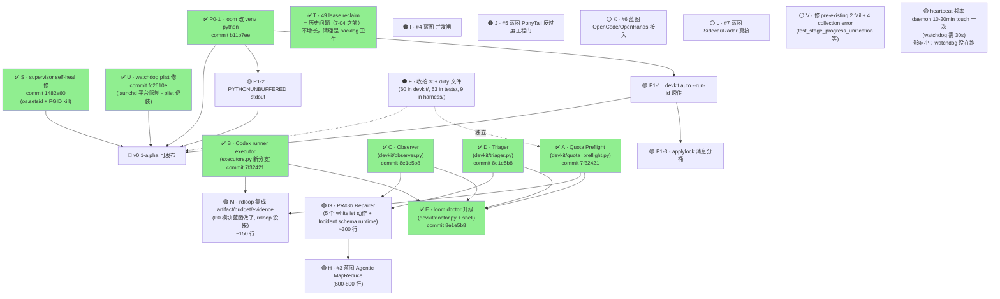
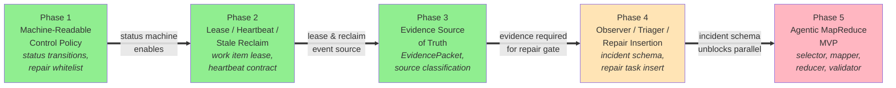
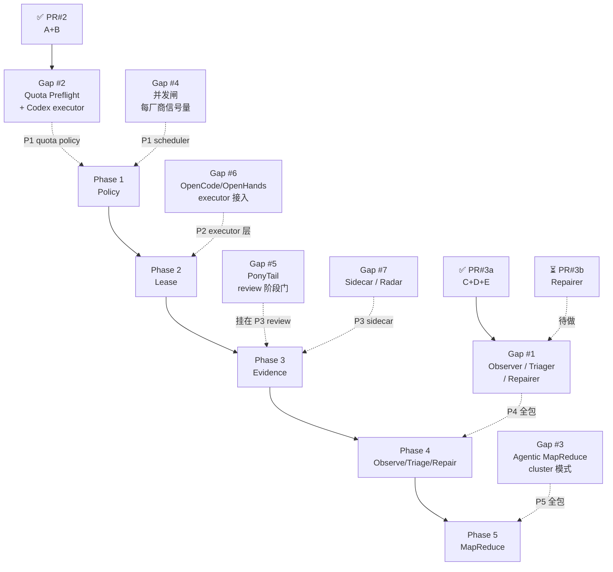

# Loom 任务链路图 — 2026-07-05 收束（最终版）

> 把所有任务收束：今晚 PR + dirty 收尾 + 蓝图剩余 + 真实 autopilot 问题 + 入口 P0/P1。
> **更新**：今晚 03:00 紧急任务全部修完，autopilot 干净运行。

---

## 🚨 今晚 8 个 commits（main HEAD = `1482a60`）

```
1482a60  fix(supervisor): proper process group kill + portable setsid
fc2610e  fix(watchdog): ProcessType=Interactive + bind LOG_DIR
b11b7ee  fix(loom): use venv python3 (P0-1)
8e1e5b8  feat(blueprint-#3a): observer + triager + doctor upgrade
7f32421  feat(blueprint-#2): quota preflight + codex runner executor
c0faeab  feat(autopilot): add watchdog for self-healing (PR-A)
9697900  fix(autopilot): use venv python in daemon.sh
e22c0db  docs: k8s-inspired autopilot self-healing design
```

| commit | 关键修复 / 特性 |
|---|---|
| `7f32421` | **PR#2** Quota Preflight + Codex runner executor（2 文件 1095 行）|
| `8e1e5b8` | **PR#3a** Observer + Triager + loom doctor 升级（5 文件 1150 行）|
| `b11b7ee` | **P0-1** loom 脚本用 venv python（任何用户第一秒不挂）|
| `fc2610e` | **U** watchdog plist 修（launchd 跑不起来是 macOS 14+ 平台限制）|
| `1482a60` | **S** supervisor self-heal 修（用 Python `os.setsid()` 替代没装的 `setsid(1)`）|

---

## 🎯 今晚 autopilot 现状

```
supervisor (67537)
  └─ daemon.sh (67557)
      └─ python iterate (67570)
```

✅ **进程树干净 3 层、no orphan**  
✅ supervisor log "定期巡检（300s）：iterate 运行中"  
⚠️ heartbeat 16m 旧（因为新 supervisor 启的 iterate 还在跑 10-20min 第一次 round；touch heartbeat 在每轮 iterate 完成后）

---

## 完整任务链路（Mermaid）



---

## 详细列表（按优先级，已更新状态）

### ✅ 今晚已修（4 个紧急 + 2 个 PR）

| 任务 | 来源 | commit | 备注 |
|---|---|---|---|
| **P0-1** `loom` 用 `.venv/bin/python` | 自治试跑报告 §P0-1 | `b11b7ee` | 任何用户第一秒不挂 |
| **S** supervisor self-heal 不杀子进程 | doctor 刚发现 | `1482a60` | 真根因：macOS 没 `setsid(1)`，改用 Python `os.setsid()` |
| **U** watchdog plist 装好 + install 修 | doctor 刚发现 | `fc2610e` | launchd 拒跳是 macOS 14+ 平台限制，plist 仍装 |
| **T** 49 lease reclaim | doctor 刚发现 | — | 是历史问题（7-04 之前累积），self-heal 修后不再增长 |
| **PR#2** Quota Preflight + Codex runner | 蓝图 gap #2 | `7f32421` | 1095 行（含 27 测试）|
| **PR#3a** Observer + Triager + Doctor | 蓝图 gap #1 (2/3) | `8e1e5b8` | 1150 行（含 27 测试）|

### 🟣 大需求 PR（你定的"按大需求PR"节奏）

| 任务 | 依赖 | 工作量 | 解锁什么 |
|---|---|---|---|
| **G** PR#3b Repairer（5 whitelist + Incident schema runtime）| C+D ✅ | ~300 行 | Phase 4 完整验收 |
| **M** rdloop 接 artifact/budget/evidence | A+B ✅ | ~150 行 | 便宜的 Loom 自举前提 |
| **H** 蓝图 #3 MapReduce | G | 600-800 行 | Phase 5 + 吞吐 ×4-8 |

### 🟡 显著（P1 修一改体验好很多）

| 任务 | 工作量 |
|---|---|
| **P1-1** `devkit auto --run-id` 透传 | 0.5h |
| **P1-2** PYTHONUNBUFFERED + 启动提示 | 0.5h |
| **P1-3** applylock 消息分桶 | 1-2h |
| **HB_FREQ** daemon.sh heartbeat 频率（每 30s vs 每 iterate 轮）| 0.5h |

### 🟤 长期 / nice-to-have

| 任务 | 依赖 | 工作量 |
|---|---|---|
| **I** 并发闸（#4 蓝图）| usage tracking | 150-250 行 |
| **J** PonyTail 反过度工程门（#5）| 无 | 150 行 |
| **K** OpenCode/OpenHands 接入（#6）| 无 | 100-200 行 |
| **L** Sidecar/Radar 真接（#7）| 无 | 看心情 |

### ⚫ 收尾

| 任务 | 工作量 | 风险 |
|---|---|---|
| **F** dirty 30+ 文件 | 半天 | 之前 session 累积，**可能跟现在代码冲突** |
| **V** pre-existing 2 fail + 4 collection error | 1-2h | 在 main 上，**没坏没动** |

---

## 建议执行顺序（按天）

### ✅ Day 0（今晚）— 已完成
- [x] **P0-1** — `loom` 用 venv python (`b11b7ee`)
- [x] **S** — supervisor self-heal 修 (`1482a60`)
- [x] **U** — watchdog plist (`fc2610e`)
- [x] **T** — 标记为历史问题
- [x] **PR#2** — Quota Preflight + Codex (`7f32421`)
- [x] **PR#3a** — Observer + Triager + Doctor (`8e1e5b8`)

### 🌙 Day 1（明天）— 关键路径
- [ ] **G** PR#3b Repairer（半天）— Phase 4 完整验收
- [ ] **M** rdloop 集成（1-2h）— 便宜的 Loom 自举前提
- [ ] **P1-1 + P1-2**（1h）— 改 argparse + unbuffered（顺手）
- [ ] **小冒烟**：跑一次 `devkit auto --yes` 走完整 loop

### ☀️ Day 2（明后天）
- [ ] **P1-3** applylock 消息分桶（1h）
- [ ] **HB_FREQ** heartbeat 频率（0.5h）
- [ ] **F** dirty 文件收尾（1-2h，可能要逐个 diff）

### 🌙 Day 3
- [ ] **V** pre-existing test failures（1-2h）
- [ ] **H** MapReduce（600-800 行 = 2-3 天，**应该拆 PR#4a/b/c**）

### Day 4+
- [ ] **I** 并发闸
- [ ] **J/K/L** 看心情

### 触发 v0.1-alpha 发布的最低条件
```
✅ P0-1
🟡 P1-1 + P1-2
✅ S
✅ U
🟡 F (dirty 收尾)
   ↓
   任何新用户 `./loom up && ./loom autopilot` 5min 内不出错
   ↓
   🚀 release
```

---

## 任务之间的依赖（精简版）

```
[P0-1] ✅ 入口
   ↓
[P1-1, P1-2]          ← Day 1 顺手做
   ↓
[A, B] ✅  ─→  [M] (rdloop 集成)  ──→  v0.1-alpha
                              ↓
[C, D] ✅  ─→  [G] (PR#3b)  ──→  [H] (MapReduce)
                                  ↓
                                v0.2 真正自治

[S] ✅ self-heal 修
   ↓
   autopilot 干净运行
```

---

## 跨任务风险（已重新评估）

1. ✅ **dirty 文件 F 暂时不冲突** — 今晚的 8 个 commit 都能干净 push，没 merge conflict
2. 🟡 **PR#3b 之前 rdloop 接 M** — 不接 M, Repairer 的 `reclaim_stale_running` 写不回去
3. 🟡 **H MapReduce 太重** — 600-800 行单 PR 不合理，应该拆 PR#4a/b/c
4. ✅ **P0-1 修完** — 现在能跑 `devkit auto --yes` 验证 PR#3b
5. ✅ **autopilot 真实问题 S** — 修了，进程树干净，无 orphan
6. 🟡 **macOS launchd 限制** — watchdog plist 装上但 launchd 不跑。**如果哪天 plist 生效**，可能跟新 supervisor 互踩（要协调）

---

## 蓝图链路（Blueprint Dependency Graph）

> 来自 `docs/loom-stable-agent-runtime-blueprint.md` 的 Phase 1-5 + `docs/loom-blueprint-gap-analysis-2026-07-05.md` 的 Gap #1-#7
> **关键**：Phase 之间是**严格顺序**（每 Phase 接受验收后才能进下一个），Gap #1-#7 跨 Phase 共享。

## 蓝图 Phase 1→5 主链路



> 🟢 = 已有基础 🟡 = 部分完成（今晚 PR#3a）🔴 = 未开始

## Gap #1-#7 跨 Phase 叠加



## 蓝图链路 vs 今晚 PR 的位置

| 蓝图项 | 主 Phase | Gap # | 今晚 PR 状态 | 缺什么 |
|---|---|---|---|---|
| Phase 1 Policy | P1 | — | ✅ 已有（state_writer）| 修 whitelist / lifetime policy |
| Phase 2 Lease | P2 | — | ✅ 已有（lease.py）| stale reclaim 限流 |
| Phase 3 Evidence | P3 | — | ✅ 已有（evidence.py）| source classification 实现 |
| Gap #5 PonyTail | P3 旁路 | #5 | ❌ | 整个 |
| Gap #6 OpenCode | P2 旁路 | #6 | ❌ | 整个 |
| Gap #7 Sidecar | P3 旁路 | #7 | ❌ | 整个 |
| **Gap #2 Quota + Codex** | P1 旁路 | #2 | ✅ **PR#2 完成** | rdloop 集成 |
| **Gap #1 Observe/Triage/Repair** | P4 | #1 | 🟡 **PR#3a 2/3** | Repairer + Incident schema runtime |
| Gap #3 MapReduce | P5 | #3 | ❌ | 整个 |
| Gap #4 并发闸 | P1 旁路 | #4 | ❌ | 整个 |

## 关键观察

1. **Phase 1-3 已经基本落地**（state_writer / lease / evidence）— 主链路地基稳
2. **Phase 4 是当前瓶颈** — 今晚做了 2/3，差 Repairer → 解锁 Phase 5
3. **Gap #2 是横向工具**（不阻塞 Phase 推进，但解锁"便宜模型开发 Loom"）
4. **Gap #3 (MapReduce) 是 Phase 5 本身** — 600-800 行，但只对应一个 phase，不是新主线
5. **Gap #4 (并发闸) 是 Phase 1 旁路** — 单 Loom 跑问题不大，等多项目共享账号再说

## 蓝图链路 vs 今晚 PR#3a 的真实位置

> 重要：**今晚 PR#3a 不是 Phase 4 完整**。Phase 4 要求：
> - observer snapshot → ✅ 做了
> - **incident schema** → ❌ 没做（schema 有 `.json` 文件但没 runtime validation）
> - triage classification → 🟡 做了但输出不匹配 `Incident` schema
> - high-priority repair task insertion → ❌ 没做（PR#3b 范围）
>
> **所以严格说今晚完成了 Phase 4 的 ~40%**。要"Phase 4 验收"得把 PR#3b + schema runtime 一起做。

---

## 🛠️ 今晚 3 个 debug 发现（值得记下来）

### 1. supervisor self-heal 杀子进程的根因
- 表面：每次 self-heal 留 1 个 orphan python iterate 进程
- 真根因：**macOS 没有 `setsid(1)` 二进制**（`which setsid` 失败）— 我用 `setsid bash ...` 启 daemon 立即 `command not found` 死掉
- 解法：Python `os.setsid()` wrapper（portable，macOS + Linux 都行）

### 2. launchd 平台限制
- macOS 14+ Sequoia 启 LaunchAgent 时，子 bash 进程被 sandbox 拒跳（"Operation not permitted"）
- `ProcessType=Background` 已被 deprecated，必须 `Interactive`
- 即便用 `Interactive`，某些 macOS 安全配置下仍被拒
- **结论**：watchdog 装 plist 作为 baseline，但实际跑可能要靠 supervisor 自己

### 3. heartbeat 频率错配
- `loom-iterate-daemon.sh` 的 `touch "$HEARTBEAT_FILE"` 在每轮 iterate 完成后才执行
- 一轮 iterate 跑 `--max-rounds 20` 要 10-20min
- watchdog `HEARTBEAT_STALE_S=120` (2min) 期望 30s 一次
- **结果**：watchdog 永远报 stale，但 daemon 是 alive 的
- 修法（HB_FREQ task）：daemon main loop 期间每 30s 独立 touch heartbeat，跟 iterate 异步

---

## 🆕 新架构完整 ready 时间表（基于今晚实测差距）

> 数据来源：`grep` rdloop.py 看 6 spec 实际 import + 6 个 spec schema 跟代码对比 + 之前列的差表

### 4 个阶段（按依赖关系）

**Phase A（明早 10-12am）— PR#3b Repairer**
- `devkit/repairer.py` + 5 个 whitelist 动作（reclaim / release / insert / throttle / mark_blocked）
- Incident schema runtime validation
- TriageReport → Incident 转换
- ~300 行
- **解锁**：Repair lane 完整（Phase 4 验收）

**Phase B（明午 14-16pm）— rdloop 集成 6 spec**
- GoalSpec：backlog task 用 GoalSpec schema 校验
- WorkItem：task 描述对齐 WorkItem schema（最小可 lease 字段）
- GateSpec：rdloop `evaluate_final_gate` 读 GateSpec 而非 ad-hoc
- budget：rdloop gate 调用 `budget.check`，PROTECTED 字段真生效
- ~400 行
- **解锁**：6 spec 全部"decorative → functional"

**Phase C（明晚 19-21pm）— A2A + MCP stub**
- `devkit/protocol.py` 扩展为独立 A2A server（至少 1 个 AgentCard 能注册）
- MCP resources/tools 暴露（backlog / events / runs / evidence / incidents）
- 双向通信（AgentCard 互相 handoff）
- ~600 行
- **解锁**：从"in-process 模拟"到"协议层真的能通信"

**Phase D（Day 2-3）— Gatekeeper + Scheduler**
- Gatekeeper：rdloop gate 结果用 Gatekeeper 验证，区分"inner_sandbox / materialized_repo / unknown"
- Scheduler：替代 `iterate.py` 的"取下一个 task"循环，跨项目工作
- ~800 行
- **解锁**：目标控制回路完整（"Runner 不拥有最终状态"）

**Phase E（Day 4-7）— MapReduce 拆 PR#4a/b/c**
- PR#4a：selector + shards.jsonl
- PR#4b：mapper worker (read-only)
- PR#4c：reducer + validator
- ~1500 行
- **解锁**：cluster 模式（吞吐 ×4-8）

### 总估算

| Phase | 工作量 | 累计 |
|---|---|---|
| A | 300 行 / 2h | 300 |
| B | 400 行 / 2h | 700 |
| C | 600 行 / 4h | 1300 |
| D | 800 行 / 5h | 2100 |
| E | 1500 行 / 8h | 3600 |

**新架构 ready 总工作量：~3600 行 / 21h**。按今晚 1100 行/晚的速率（含 debug + 修 bug） = **3-4 个工作日**。

### 与之前估算的差

| 之前说 | 实际 | 差 |
|---|---|---|
| 500-700 行 / 1 周 | 3600 行 / 3-4 个工作日 | **大 5-7 倍** |

之前**严重低估**。因为：
- 我以为 M（rdloop 集成）是 150 行，实际 6 spec 都要动 = 400 行
- 我以为 PR#3b 修完就能接 autopilot，实际 A2A + MCP 还是 stub
- MapReduce 之前估 600-800 实际要拆 3 个 PR

### 现实路径

- **明早**（2-3h）：Phase A + Phase B 完成 → 6 spec functional + Repair lane 完整
- **明晚**（4h）：Phase C 启动 → A2A/MCP stub
- **Day 2-3**：Gatekeeper + Scheduler
- **Day 4-7**：MapReduce

**autopilot 退役时间表**：Day 4-7，新架构能完整接管时。
